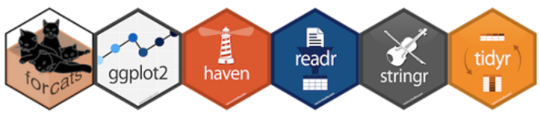

# Best practices


{width="230" align="right" style="margin-left: 20px; margin-right: 18px; margin-top: -24px;"}


<br>

This section includes some _best practices_ to promote consistent, efficient, and accurate data analysis with `R`.  


<br>

## Welcome to the Tidyverse

The  _Tidyverse_ consists of a group of R packages that work in harmony by sharing a common data format and syntax. Using packages within the _Tidyverse_ for your analysis will make your scripts easier to read for others and the _future you_.

{width="460"}

<br>


__Recommended packages__


> __Loading data__

`readr`     Load data from text files: tab, comma, and other delimited files.

`readxl`    Load data from Excel.

`RODBC`     Load data from Access and Oracle DBs such as DELTA/TEMPO.

`RPostgresSQL`, `RMySQL`, and `RSQLite`  Connect to SQL databases.

`rvest`     Read and scrape content from webpages.

`pdftools`  Read PDF documents.

`googledrive` Read and write files to your Google Drive.

`foreign`   Load data from Minitab and Systat.

`R.matlab`  Load data from Matlab.

`haven`     Load data from SAS, SPSS, and Stata.

<br>


> __Manipulate data__

`dplyr`        Essential shortcuts to subset, summarize, rearrange, and join data sets.

`tidyr`        Reshape tables and unpack multiple inputs stored in single cell.

`stringr`      Tools to edit and clean text and character strings.

`lubridate`    Tools to format dates and perform calculations based on time.

`forcats`      Set, re-order and change levels of _factors_ (ordered character variables).

`magrittr`     Simplify your scripts by chaining multiple commands together with the pipe `%>%`.

<br>


> __Charts and visuals__

`ggplot2`      Essential package for plots and charts.

`ggsave`       Export charts in various formats and sizes.

`xkcd`, `hrbrthemes` , `ggpomological`, `ggthemes`     Chart themes for ggplot.

`viridis`, `wesanderson`, `ghibli`     Color palettes.

`rmarkdown`    Write summary reports and save as PDF, Word document, presentation, or website.

`shiny`        Create interactive data exploration tools for the web.

`DT`           Create data tables for the web.

<br>


> __Maps__

`leaflet`      Display spatial data and make interactive maps.

`sf`           Simple features, a spatial format using data frames to perform spatial.

`tigris`       Download geography boundaries: States, Counties, Census tracts, Block groups.

`tidycensus`   Download Census and American Community Survey data.

<br>


> __Files and folders__

`here`         Simplify file paths in your scripts and functions.

`fs`           Command line functions for copying, moving, and deleting files.


<br>


> __Automation__

`cronR`     Schedule scripts to run and refresh data at a set time.

```{r include=F}
#`drake`     An automated data analysis workflow manager. Update charts automatically after change to data.
```

<br>


> __Create R packages__

`devtools`      Essential tools for creating your own R package.

`roxygen2`      A quick way to document your R packages.

`usethis`       Shortcuts for package development and Github integration.

`goodpractice`  Automated feedback on your R package.

<br>


> __Find new packages__

{width=23% align="right" style="margin-left: 8px; margin-right: 10px; margin-top: -60px; max-width: 23%;"}

- Install the Addin [CRANsearcher](https://github.com/RhoInc/CRANsearcher) to browse all published packages.

- Visit [rOpenSci](https://ropensci.org/packages/) to view a selection of peer reviewed science packages.

<br>


## Keep R updated

__Get the _installr_ package__
```{r, eval=F}
install.packages('installr') 
library('installr')
```

__Update your R version__
```{r, eval=F}
updateR()
```

- When a popup suggests closing RStudio and running the update from _RGUI_, 
click __NO__. 
- When asked whether to copy and update all of your packages. Click __Yes__. This will save you buckets of time.

To learn more about _installr_ see https://github.com/talgalili/installr/#readme.


## Script organization

The following tips will help make your R scripts easier to read and easier for others to use your code in their own projects.

- Add a description to the top of your script.
- Load all packages at the top of the script.
- Assign important file paths and parameters near the top of the script.
- Avoid changing working directories with `setwd()`.
- Save files to a local working directory such as `"~\results.csv"`, rather than to a fixed location, such as `X:\EAO\Air Data\Project1\results.csv`.
- Load usernames and passwords from a file such as `credentials.csv`.

<br>

> __An example R script__

```{r, eval = F}
# name_of_script.R

# Purpose: This script does amazing things.
# Assumptions: The monitoring data for the sites is from different years, 
#              but we compare them anyways. 
# Warning! Don't use this script for Kryptonite. It will break everything.

# Load packages
library(dplyr)
library(readr)

# Set parameters
year <- 2017

data_file <- "monitors 1 and 2.csv"


# Load data
air_data <- read_csv(data_file)

# My functions
calc_stat <- function(data) {
  
  new_stat <- step1(data) %>% step2() %>% step3()
  
}

# My analysis
results <- air_data %>% summarize(stat = calc_stat(concentration))

# Save results to local folder
write_csv(results, "results/summary_results.csv")

```


## Divide and conquer

For complex projects, many small components are often better than one big super script. Try to create small functions to perform each task within your analysis. If it's a function that you will use across multiple projects, it is helpful to save the function to it's own script. 

These functions will become reusable building blocks that both future you and others can apply to their own projects. 

Using an R Markdown document is an additional way to split your project into manageable steps. R Markdown makes it easier to add a short description of each step to your analysis. In fact, you are reading the output of an R Markdown document right now.

An example folder structure for a project is shown below:

`New_Project\` 

> - data  
>     - monitors 1 and 2.csv 
> - R    
>     - load_data.R 
>     - calc_ucl95.R   
>     - lil_boot_function.R  
>     - summary_report.RMD  
> - results  
>     - summary_results.csv  
>     - summary_report.pdf  
>  


## Codebooks, metadata, and data dictionaries

A __codebook__ provides essential technical details and references for the variables in a dataset. The codebook ensures someone unfamiliar with your data will have the necessary information to complete their analysis and help them to estimate the uncertainty of their results. An R package named `dataMaid` is available to assist with creating documentation for your data sets.

__An example codebook generated with _dataMaid_ __

```{r, eval = F}

library(dataMaid)
library(readr)

data <- read_csv('https://raw.githubusercontent.com/MPCA-air/air-methods/master/airtoxics_data_2009_2013.csv')

names(data) <- c("aqs_id", "poc", "param_code", "date", "conc", "null_code", "md_limit", "pollutant", "year", "cas")

attr(data$aqs_id, "labels") <- "Monitor ID"
attr(data$aqs_id, "shortDescription") <- "EPA assigned monitor ID for the national Air Quality System (AQS)."

makeCodebook(data, vol = 1, reportTitle = "Codebook for air toxics monitoring data", replace = TRUE)


```


## Data formatting

Performing similar analysis on multiple pollutants at multiple sites over multiple years becomes much easier when data is in a consistent format. MPCA prefers tidy data where each result has its own row in a table. More information on tidy data can be found here: https://cran.r-project.org/web/packages/tidyr/vignettes/tidy-data.html. 

For monitoring data, each row should contain a separate column for:

- `monitoring site ID`  Preferably the ASQ ID or other unique identifier

- `parameter code`      In some cases other identifiers for pollutants may be used such as CAS or the analyte name, but the identifier should be unique to each analyte in the data

- `POC`                 For collocated monitors; if there are no collocated monitors in your data then you can include a POC column with all values set to 1

- `sample date`         Recommended format is _yyyymmdd_ or _yyyy-mm-dd_; other formats can be converted using R's _lubridate_ package

 - `sample start time`   Format is _hh:mm:ss_

- `sample duration`     Code for duration or numeric value of duration

- `result`              Observed value

- `null data code` 


<br>

> __Example Tidy data__
```{r tidy_ex, echo = F, message=F, warning=F}
library(tidyverse)
library(DT)

dt_options <- list(scrollX = T, autoWidth = T, searching = F, ordering = F, lengthChange = F, paginate = F, info = F)

data <- read_csv('aqs_id,poc,param_code,date,duration,conc,null_code,md_limit
                  271231003,1,12101,"2004-01-04",NA,-999.99,NA,0.06
                  271231003,1,12101,"2004-01-10",NA,0.23,NA,0.06
                  271231003,1,12101,"2004-01-16",NA,0.35,NA,0.06
                  271231003,1,12101,"2004-01-22",NA,0.22,NA,0.06
                  271231003,1,12101,"2004-01-28",NA,NA,NA,0.08
                  271231003,1,12101,"2004-02-03",NA,0.07,NA,0.06
                  271231003,1,12101,"2004-02-09",NA,0.02,NA,0.06
                  271231003,1,12101,"2004-02-15",NA,0.06,NA,0.08')

datatable(data, options = dt_options, rownames = FALSE)

```


<br>

Additional columns may include qualifier codes and method detection limits. Fields directly associated with one or more of the columns above can be removed and stored in their own tables whenever possible. For example, the site address and site name are both fields that are directly associated with the monitor's AQS ID. If your data file already has the AQS ID column, you can perform all analysis based on AQS ID and then join the site information after the analysis is completed. EPA's AQS data is stored in a recommended format for air monitoring data, as it meets all of the requirements for tidy data.

The R functions shown in this guide often group and sort based on the columns identified above. Including these columns in your data will allow you to apply these functions in your own scripts as-is. Keep in mind that you may need to rearrange your data depending on its original format. For example, you may have multiple result columns (e.g. a separate column for each site's results) and you will want to reorganize the data so that all of the results are in a single column. 

The `gather()` function in R's _tidyr_ package works well for this purpose. The `mutate()` function in R's _dplyr_ package can add and manipulate columns. The functions `rename()` and `names(_)` can update column names to make data compatible with the examples in this guide.


## Pollutant names

Pollutants often go by different names depending on the context. To prevent confusion it helps to include a unique `CAS #` or parameter code in your analysis results and summary data. If you are working with monitoring data that is missing a unique identifier for each pollutant, an R package named `aircas` is available to help join CAS numbers to pollutant names.   


```{r db_store, include=F, eval = F}
## Storing data and databases

Create a PostgreSQL database.

library(dplyr)
library(DBI)

# Create temp database
con <- dbConnect(RPostgreSQL::PostgreSQL(), path = ":memory:")

# Connect to server
con <- dbConnect(RPostgreSQL::PostgreSQL(), 
                  host = "database.rstudio.com",
                  user = "hadley",
                  password = rstudioapi::askForPassword("Database password"))

copy_to(con, 
        nycflights13::flights, "flights",
        temporary = FALSE, 
        indexes   = list(c("year", "month", "day"), 
                         "carrier", 
                         "tailnum",
                         "dest"))

flights_db <- tbl(con, "flights")

tailnum_delay_db <- flights_db %>% 
                      group_by(tailnum) %>%
                      summarise(delay = mean(arr_delay),
                                n     = n()) %>% 
                      arrange(desc(delay)) %>%
                      filter(n > 100)

# Show SQL query
tailnum_delay_db %>% show_query()

```

<br>

> [Back to top](#best-practices)
