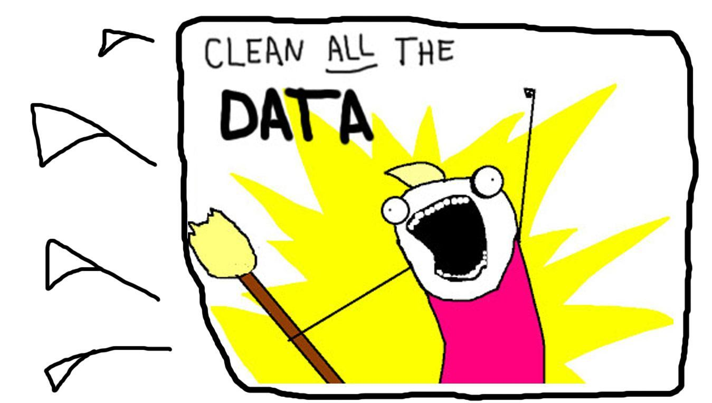

# Data cleaning (Dorian & Cassie)

```{r out.width='55%', echo=F}

```

Before jumping into your analysis you'll want to clean it up with some helpful quality checks and formatting procedures.  

These procedures include steps to:  

- \@ref(missing)  __Remove blank, invalid, NULL, and missing values__  
- \@ref(quals)    __Evaluate qualified data__     
- \@ref(dups)     __Remove duplicate observations__ 
 
 
__Text summary__


## Remove blank, `NULL`, and missing values {#missing}

__Description__  
Large monitoring data sets often contain observations with missing concentrations, detection limits or other labeling errors that can lead to incorrect summary statistics.  

<br> __Recommended steps__

1. Identify any blank, NULL, `-999`, and missing values.
1. Remove those observations.
1. Document your process.

<br> __Why not keep them?__

Unless the lab can confirm the meaning of the missing values for you, there is not a reliable means to interpret the values.  


<br> __Sample `R` script__ 

Click the button below to view a step by step example of the methods above.

<div class="toggle"><button class = "btn_code">Show __R__ code</button>


```{r echo=F, message=F, warning=F}  
library(knitr)
library(DT)
library(kableExtra)

options(knitr.table.format = "html") 

dt_options <- list(scrollX = T, autoWidth = T, searching = F, ordering=F, lengthChange = F, paginate=F, info=F)
```

<br> Load example monitoring data
```{r demo, eval=T, message=F, warning=F}
library(tidyverse)

data <- read_csv('aqs_id,poc,param_code,date,conc,null_code,md_limit,pollutant,cas
                  271231003,1,12101,"2004-01-04",-999.99,NA,0.06,"Aluminum","7429-90-5"
                  271231003,1,12101,"2004-01-10",0.23,NA,0.06,"Aluminum","7429-90-5"
                  271231003,1,12101,"2004-01-16",0.35,NA,0.06,"Aluminum","7429-90-5"
                  271231003,1,12101,"2004-01-22",0.22,NA,0.06,"Aluminum","7429-90-5"
                  271231003,1,12101,"2004-01-28",NA,NA,0.08,"Aluminum","7429-90-5"
                  271231003,1,12101,"2004-02-03",0.07,NA,0.06,"Aluminum","7429-90-5"
                  271231003,1,12101,"2004-02-09",0.02,NA,0.06,"Aluminum","7429-90-5"
                  271231003,1,12101,"2004-02-15"," ",NA,0.06,"Aluminum","7429-90-5"
                  271231003,1,12101,"2004-02-21",0.03,NA,0.06,"Aluminum","7429-90-5"
                  271231003,1,12101,"2004-02-27",0.21,NA,0.06,"Aluminum","7429-90-5"
                  271377001,1,12101,"2007-09-21",NULL,a,0.04,"Aluminum","7429-90-5"
                  271377001,1,12101,"2007-09-21",0.14,NA,0.04,"Aluminum","7429-90-5"')
```


```{r, eval=T, echo=F, message=F, warning=F, fig.width=4}
knitr::kable(head(data), caption = "Sample monitoring data.") %>%
         kable_styling() %>%
         scroll_box(width = "100%", box_css = "border: 0; ")
#datatable(data, options = dt_options)
```


<br> Create a function to test for missing concentration values.
```{r eval=T, message=F, warning=F}

# Test for missing concentrations, non-numeric values, and -999
missing_conc <- function(x) {
  
  is.na(as.numeric(x)) || as.numeric(x) < -900
  
}

```
 
  
<br> Use the function to add a column to your data `conc_missing` that tests for missing concentration values. 
```{r eval=T, message=F, warning=F}

# Create a new TRUE/FALSE column labeling each result as missing or not
data <- data %>% 
        rowwise() %>% 
        mutate(conc_missing = missing_conc(conc))

# Select all missing observations
missing_values <- filter(data, conc_missing == TRUE) 
```
  
  
<br> _Table: Missing values_
```{r, eval=T, echo=F, message=F, warning=F}
#kable(head(data), booktabs = T, caption = "Sample monitoring data.")
datatable(select(missing_values, -null_code), options = dt_options, rownames = FALSE)
```


<br> Filter the data to only non-missing observations.
```{r eval=T, message=F, warning=F}

data <- filter(data, conc_missing == FALSE)
```
  
  
<br> _Table: The new and improved cleaner data_   
```{r, eval=T, echo=F, message=F, warning=F}
#kable(head(data), booktabs = T, caption = "Sample monitoring data.")
datatable(select(data, -null_code), options = dt_options, rownames = FALSE)
```


<br> You can create similar functions to test for missing dates, site IDs, detection limits, and parameter codes.
```{r eval=T, message=F, warning=F}

# Test for missing dates
missing_dates <- function(x) {
  is.na(as.character(x)) || 
    nchar(as.character(x)) > 11 || nchar(as.character(x)) < 6
}

# Test for missing site IDs
missing_sites <- function(x) {
  is.na(as.character(x)) || nchar(as.character(x)) < 5 
}

# Test for missing detection limits
missing_dls <- function(x) {
  is.na(as.numeric(x)) || as.numeric(x) < -900
}

# Test for missing parameter codes
missing_param <- function(x) {
  is.na(as.numeric(x)) || as.numeric(x) < -900 || 
    nchar(as.character(x)) < 5 || nchar(as.character(x)) > 9
}

```
  
  
<br> You can apply these functions all at once by using `dplyr`'s great function called `mutate()`.
```{r eval=T, message=F, warning=F}

# Create new TRUE/FALSE columns labeling each result as missing or not
data <- data %>% 
        rowwise() %>% 
        mutate(conc_missing  = missing_conc(conc),
              date_missing   = missing_dates(date),
              site_missing   = missing_sites(aqs_id),
              dl_missing     = missing_dls(md_limit),
              param_missing  = missing_param(param_code)) 

# Filter to remove any rows with a missing parameter.
# We use sum() to count the number of missing parameters.
# In this case we will drop any row with at least one missing parameter.
data <- data %>% 
        filter(sum(c(conc_missing, 
                     date_missing, 
                     site_missing, 
                     dl_missing, 
                     param_missing), na.rm = T) < 1)

```  

  
<br> _Table: The super cleaner data_  
```{r, eval=T, echo=F, message=F, warning=F}
#kable(head(data), booktabs = T, caption = "Sample monitoring data.")
datatable(data, options = dt_options)
```

</div>

<br> __Contributors__  

> Dorian Kvale; Derek Nagel, Kristie Ellickson 


<br> __References__    


## Remove `Qualified` data (Cassie) {#quals}


__Description__  

<br> __Recommended steps__  

<br> __Sample `R` script__ 

<br> __Contributors__    

> Not me

<br> __References__    


## Duplicate observations {#dups}

__Description__  
Large monitoring data sets often contain a few instances when multiple observations occur over the same time period at the same site. When multiples observations do occur they tend to be identified by a unique monitor POC (parameter occurrence code) or by a qualifier describing why the second observation was recorded (e.g. a duplicate for quality control). 

<br> __Recommended steps__  

1. Identify duplicate observations.
1. If both values are detected, calculate the mean of the duplicates.  
1. If values are identical, use the observation with a lower detection limit.  

<br> __Why not keep them all?__
If more data is more better, why not keep both values? 

Leaving both observations in the data set is likely to bias calculated summary statistics. For example, consider a scenario where two monitors were operating on a site during the winter months, but only one monitor was operating the rest of the year. If we were to calculate the annual average for this site using all the observations, the mean would be biased by having twice as many observations from the winter months. By limiting the number of observations to 1 per day, the weighting of the seasons will be balanced. 


<br> __Sample `R` script__  
  
Click the button below to view a step by step example of the methods above.

<div class="toggle">
<button class = "btn_code">Show __R__ code</button>

```{r echo=F, message=F, warning=F}  
library(knitr)
library(DT)
#write.csv(select(ungroup(data_bk), -Unique, -Key, -Duplicate)[1:10, ], row.names = F)
```

<br> Load the sample monitoring data.
```{r eval=T, message=F, warning=F}
library(dplyr)

data <- read.csv(text = '
aqs_id,poc,param_code,date,conc,null_code,md_limit,pollutant,cas
271231003,1,12101,"2004-01-04",0.05,NA,0.06,"Aluminum","7429-90-5"
271231003,1,12101,"2004-01-10",0.23,NA,0.06,"Aluminum","7429-90-5"
271231003,1,12101,"2004-01-16",0.35,NA,0.06,"Aluminum","7429-90-5"
271231003,1,12101,"2004-01-22",0.22,NA,0.06,"Aluminum","7429-90-5"
271231003,1,12101,"2004-01-28",0.01,NA,0.06,"Aluminum","7429-90-5"
271231003,1,12101,"2004-02-03",0.07,NA,0.06,"Aluminum","7429-90-5"
271231003,1,12101,"2004-02-09",0.02,NA,0.06,"Aluminum","7429-90-5"
271231003,1,12101,"2004-02-15",0.07,NA,0.06,"Aluminum","7429-90-5"
271231003,1,12101,"2004-02-21",0.03,NA,0.06,"Aluminum","7429-90-5"
271231003,1,12101,"2004-02-27",0.21,NA,0.06,"Aluminum","7429-90-5"
271377001,1,12101,"2007-09-21",0.14,NA,0.04,"Aluminum","7429-90-5"
271377001,1,12101,"2007-09-21",0.14,NA,0.04,"Aluminum","7429-90-5"
', stringsAsFactor = F)
```

<br> _Table: Sample monitoring data_ 
```{r, eval=T, echo=F, message=F, warning=F}
#kable(head(data), booktabs = T, caption = "Sample monitoring data.")
datatable(data, options = dt_options, rownames = FALSE)
```
  
  
<br> Add a unique column identifier to each observation.
```{r, eval=T, message=F, warning=F}

# Add unique key to each row
data$key <- 1:nrow(data)

# Create s unique ID for each site/poc/param code/day combination
data$unique_sample_id <- paste(data$aqs_id, data$poc, data$param_code, data$date, sep = "_")
```
  
  
```{r, eval=T, echo=F, message=F, warning=F, fig.cap ="Unique ID column added."}
datatable(head(data[, c(10:11,1:9)]), options = dt_options, rownames = FALSE)
```

   
<br> Test for duplicate observations. 
```{r, eval=T, message=F, warning=F}
# Label duplicate samples
data <- group_by(data, unique_sample_id) %>% mutate(duplicate = n() > 1)

# Create duplicate table
dupes <- filter(data, duplicate == T)
```
  
  
<br> _Table: Duplicate observations_ 
```{r, eval=T, echo=F, message=F, warning=F}
datatable(head(dupes), options = dt_options, rownames = FALSE)
```
  

<br> If duplicates are found, use the following hierarchy to remove duplicates:
  
1. Calculate the mean concentration of all detected observations.
1. If no observations are detected, select the observation with the lower detection limit.
1. If no obsercations are detected and the detection limits are all equal, select a single observation.  

    
```{r, eval=T, message=F, warning=F}
dupes <- group_by(dupes, unique_sample_id) %>% 
         arrange(desc(conc), md_limit) %>% 
         filter(key == key[1])

# Remove Unique IDs with duplicates from data
data <- filter(data, !duplicate)

# Attach the selected duplicates with highest result and lowest detection limit
data <- rbind(data, dupes)
```


<br> _Table: The new cleaner data_  
```{r, eval=T, echo=F, message=F, warning=F, fig.cap ="Final data set with 1 duplicate removed."}
datatable(data, options = list(scrollX = T, autoWidth = T, searching = F, ordering=F, lengthChange = F, paginate=F, info=F), rownames = FALSE)

# Code folding reference: Reference: https://stackoverflow.com/questions/37755037/how-to-add-code-folding-to-output-chunks-in-rmarkdown-html-documents/37839683#37839683

```

</div>

<br> __Contributors__   

> Dorian, Mr. Kitty


<br> [^ Back to top](#missing)

