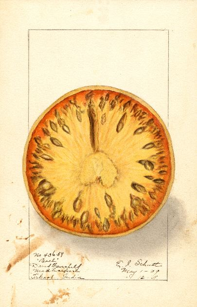

# Get data

```{r, echo=F}

knitr::opts_chunk$set(echo = TRUE, warning = F, message = F)

dt_options <- list(scrollX = T, autoWidth = T, searching = F, ordering = F, lengthChange = F, paginate = F, info = F)
```

<br>

{align="right" style="margin-top: -4px; margin-left: 20px; width: 36%;"}

This section describes how to download air monitoring and modeling data. 


__Air monitoring data__

- Final data <br>
    - \@ref(AQS) EPA AQS Database 
    - \@ref(aqsAPI) EPA AQS API 
    - \@ref(wair) MPCA WAIR Database
- Preliminary data 
    - \@ref(aqi-now)  AirNow: Current AQI observations
    - \@ref(lims) MPCA LIMS data via Tableau
    - \@ref(AirVision) AirVision: Continuous data
 - Air Monitoring Site Information 
    - \@ref(monitors) AirNow: Active AQI monitors 
    - \@ref(EPAsites) EPA Google Earth Site Explorer
    - \@ref(wairsites) WAIR Site Table
    


__Summarized air monitoring results__

- External Data Explorers
    - \@ref(toxics) Air Toxics Data Explorer
    - \@ref(criteria) Criteria Pollutant Data Explorer
    - \@ref(AQI) Air Quality Index Summary Reports
    - \@ref(PAHs) Air Monitoring for PAHs 
- Internal Data Explorers 
    - \@ref(tableau) MPCA Tableau Server

__Health benchmarks and air quality standards__

- Air toxics
    - \@ref(IHBs) Inhalation health benchmarks
- Criteria pollutants
    - \@ref(NAAQS) Air Quality Standards (NAAQs and MAAQS)

__Air modeling__

- Modeling results
    - \@ref(nata) NATA
    - \@ref(mnrisks) MNRISKS
    - \@ref(downscale) Downscaler for Ozone and PM2.5
    - \@ref(cmaq) CMAQ 


__Context__

- Emissions
    - \@ref(mn-ei) MN Emissions Inventory
    - \@ref(nei) EPA's NEI
    - \@ref(fac-coords) Facility locations

- Meteorology and Climate
    - \@ref(wx-obs) Weather observations
    - \@ref(hysplit) HYSPLIT wind trajectories
    
- Geography and Census data
    - \@ref(landuse) Land use maps
    - \@ref(census) U.S. Census boundaries
    - \@ref(acs) Demographics from American Community Survey (ACS) 

<br>


## Air monitoring 

### Retrieving data from AQS {#AQS}
The Air Quality System (AQS) contains ambient air pollution data collected by EPA, state, local, and tribal air pollution control agencies from over thousands of monitors. AQS also contains meteorological data, descriptive information about each monitoring station (including its geographic location and its operator), and data quality assurance/quality control information.

Registered users can access the AQS database via a web application at https://www.epa.gov/aqs. Raw data extracts can be run using the AMP501 report. The AMP501 provides data in the pipe delimited RD transaction format. 


### Retrieving data from AQS API {#aqsAPI}
The AQS API provides access to air quality data stored in the EPA's AQS database and is open to the public. [AQS API](https://aqs.epa.gov/aqsweb/documents/data_api.html)

Note: The AQS API requires a user name and password. The username and password is not the same as your AQS User Account. To request an API account, follow the instructions on the documentation page.

<br> __Sample `R` script__ 

Click the button below for code for a shiny app to access the AQS API.

<div class="toggle">
<button class = "btn_code">Show __R__ code</button>

```{r, eval=FALSE }

library(httr)
library(jsonlite)
library(data.table)
library(lubridate)
library(stringr)
library(tidyverse)
library(readxl)
library(glue)
library(shiny)
library(shinyWidgets)
library(shinyjs)
library(shinycssloaders)
library(shinyBS)
library(plotly)
library(DT)
library(sf)
library(sp)
library(sampSurf)
library(swfscMisc)
library(leaflet)
library(leaflet.extras)
library(tigris)
library(htmltools)

service_opts <- c("sampleData", "dailyData", "annualData", "qaBlanks",
                  "qaCollocatedAssessments", "qaFlowRateVerifications", "qaFlowRateAudits", "qaOnePointQcRawData", "qaPepAudits") %>%
  setNames(c("Sample data", "Daily data", "Annual data", "QA Blanks", "QA Collocated Assessments", "QA Flow Rate Verifactions", "QA Flow Rate Audits",
             "QA One Point QC Raw Data", "QA PEP Audits"))

g <- list(
  scope = 'usa',
  projection = list(type = 'albers usa'),
  showland = TRUE,
  landcolor = toRGB("gray95"),
  subunitcolor = toRGB("gray85"),
  countrycolor = toRGB("gray85"),
  countrywidth = 0.5,
  subunitwidth = 0.5
)


ui <- fluidPage(
  useShinyjs(),
  tags$style(type='text/css', "nav.navbar.navbar-default.navbar-static-top{border-color: #f5f5f5;background-color: #f5f5f5;}"),
  tags$style(type='text/css', ".navbar{min-height: 0px; margin-bottom: 0px;}"),
  tags$style(type='text/css', ".navbar-brand{height: 0px; padding: 0px 0px;}"),
  
  navbarPage
  (
    title = NULL, id = "navBar",
    
    tabPanel
    (
      title = "01", value = "panel1",
      h1("Log in or sign up for AQS API key", align = "center"),
      textInput("email", "Email", ""),
      fluidRow(column(2, passwordInput("key", "Key", "")),
               column(8, br(),
                      dropMenu(
                        actionButton("key_info", "", icon = icon('info')),
                        tags$div(
                          span("This is your AQS API key. If you do not have one or need to reset it, enter your email and click Sign up for API key (check your email in a few minutes)."),
                        ),
                 placement = "right",
                 arrow = TRUE))),
      fluidRow(column(2, actionButton("auth", "Connect")),
               column(2, actionButton("signup", "Sign up for API key")),
               
               #column(4, br(), textOutput("authText"))
               
      )
      
    ),
    
    tabPanel
    (
      title = "02", value = "panel2",
      actionButton("go_back1", "Back"),
      h1("Select service and selection method", align = "center"),
      
      fluidRow(column(2, pickerInput("service", label = "Select service", choices = service_opts)),
               column(2, actionButton("by_state", "Select by state")),
               column(2, actionButton("by_county", "Select by county")),
               column(2, actionButton("by_site", "Select by site"))
      )
    ),
    
    tabPanel (
      title = "03", value = "panel3",
      actionButton("go_back2", "Back"),
      h1('Select one or more states by clicking, drawing shapes, or using the list at the bottom', align = "center"),
      
      leafletOutput("state_map"),
      fluidRow(
      
        column(3, pickerInput("states", label = "Select states", choices = "", multiple = T,
                              options = list(`actions-box` = TRUE, `live-search`=TRUE))),

        column(3, pickerInput("parm_class", label = "Select parameter class", choices = "CRITERIA",
                              selected = "CRITERIA",
                              options = list(`live-search` = TRUE))),

        column(3, pickerInput("parms", label = "Select parameters", choices = "", multiple = T,
                              options = list(`actions-box` = TRUE, `live-search`=TRUE))),

        column(3, dateRangeInput("date_range", "Select date range", today(), today()))

      ),
      
      fluidRow(
        actionButton("get_data", "Get Data"),
        actionButton("select_cnty", "Select Counties"),
        actionButton("next_map", "Select sites")
      )
    ),
    
    tabPanel (
      title = "04", value = "panel4",
      actionButton("go_back3", "Back"),
      h1("Select one or more counties", align = "center"),
      
      leafletOutput("cnty_map"),
      fluidRow(
        
        column(3, pickerInput("cntys", label = "Select counties", choices = "", multiple = T,
                              options = list(`actions-box` = TRUE, `live-search`=TRUE))),
        
        column(3, actionButton("get_data2", "Get Data"))
        
      )
    ),
    
    tabPanel (
      title = "05", value = "panel5",
      actionButton("go_back4", "Back"),
      h1("Select one or more monitors", align = "center"),
      
      leafletOutput("site_map"),
      fluidRow(
        
        column(3, pickerInput("site_select", label = "Select sites", choices = "", multiple = T,
                              options = list(`actions-box` = TRUE, `live-search`=TRUE))),
        
        column(3, actionButton("get_data3", "Get Data"))
        
      )
    ),
    
    tabPanel (
      title = "06", value = "panel6",
      actionButton("go_back5", "Back"),
      
      tabsetPanel(
        tabPanel("View data",
                 fluidRow(column(1, downloadButton("downloadData", "Download")),

                          column(11, withSpinner(dataTableOutput("table"), type = 1))
                 )
        )
      )
    )
  )
)


server <- function(input, output, session) {
  
  v <- reactiveValues(geo_select = c(),
                      selected_states = c(),
                      selected_cntys = c(),
                      selected_sites = c(),
                      state_polys = NULL,
                      cnty_polys = NULL,
                      site_polys = NULL,
                      selected_classes = "CRITERIA",
                      selected_parms = NULL,
                      selected_dates = list(ymd(20190101), ymd(20190101)),
                      data = data.table()
  )
  
  observeEvent(input$signup,{
    req(input$email)
    check_auth <<- GET(glue("https://aqs.epa.gov/data/api/signup?email={input$email}"))$content %>%
      rawToChar() %>% fromJSON() %>% pluck("Data")
  }, ignoreInit = T)
  
  observeEvent(state_list(), {
    hide(selector = "#navBar li a[data-value=panel1]")
    shinyjs::show(selector = "#navBar li a[data-value=panel2]")
    updateNavbarPage(session, "navBar", selected="panel2")
  })
  
  observeEvent(input$by_state, v$geo_select <- "State")
  observeEvent(input$by_county, v$geo_select <- "County")
  observeEvent(input$by_site, v$geo_select <- "Site")
  
  state_list <- reactive({
    if(input$auth == 0) return()
    isolate({
      json_states <<- rawToChar(GET(
        glue(
          "https://aqs.epa.gov/data/api/list/states?email={input$email}&key={input$key}"
        ),
        
        encode = "json"
        
      )$content)
      
      
      
      states <- if (!str_detect(json_states, '\\"status\\": \\"Success\\"'))
        NULL else
          fromJSON(json_states, simplifyDataFrame = T)$Data %>%
        setDT()
      
      check3 <<- states
    })
    
  })
  
  observeEvent(list(input$by_state, input$by_county, input$by_site), {
    
    shiny::validate(need(state_list(), label = "state_list"))
    
    updatePickerInput(session = session, inputId = "states",
                      choices = state_list()[, code %>% setNames(paste0(code, ": ", value_represented))],
                      selected = v$selected_states
                      )
  }, priority = -1)
  
  state_data <- reactive(states(cb = TRUE))
  
  cnty_data <- reactive({
    input$select_cnty
    isolate({
      shiny::validate(need(v$selected_states, label = "states"))
      counties(state = v$selected_states)})
  })
  
  
  
  observeEvent(input$states, v$selected_states <- input$states, ignoreNULL = F)
  
  observeEvent(input$state_map_shape_click,{
    clicked <- input$state_map_shape_click$id %>% str_extract("\\d+") %>% str_pad(2, "left", 0)
    if(clicked %in% v$selected_states) {
      v$selected_states <- v$selected_states[!(v$selected_states %in% clicked)]
    } else {
      v$selected_states <- c(v$selected_states, clicked)  
    }
  })
  
  observeEvent(input$state_map_draw_new_feature,{
    
    v$state_polys <- c(v$state_polys, list(input$state_map_draw_new_feature)) %>%
      set_names(purrr::map(., ~.x$properties$`_leaflet_id`))
  })
  
  observeEvent(input$state_map_draw_deleted_features,{
    remove_polys <- map_int(1:length(input$state_map_draw_deleted_features$features),
                             ~pluck(input$state_map_draw_deleted_features, "features", .x, "properties", "_leaflet_id"))
    v$state_polys <- v$state_polys[!(names(v$state_polys) %in% as.character(remove_polys))]
  })
  
  observeEvent(v$state_polys, {
    
    if(!length(v$state_polys)) {
      v$selected_states <- NULL
      return()
    }
    
    polys <- purrr::map(v$state_polys, ~if(.x$properties$feature_type == "circle") {
      .x$geometry$coordinates %>% unlist() %>%
        {circle.polygon(.[1], .[2], .x$properties$radius / 1000, sides = 1000, by.length = F,
                        units = "km", poly.type = "gc.earth")} %>%
        Polygon()
    } else {
      .x$geometry$coordinates[[1]] %>% rbindlist() %>% Polygon()
    })
    polys <- polys %>% imap(~Polygons(list(.x), .y)) %>% SpatialPolygons() %>% st_as_sf()
    st_crs(polys) <- "WGS84"
    polys <- st_transform(polys, "NAD83")
    state_data1 <<- state_data()
    v$selected_states <- st_intersection(state_data(), polys) %>% pull(GEOID)
    check5 <- v$selected_states
  })
  
  observeEvent(v$selected_states, {
    if(is.null(state_list())) return()
    
    check1 <<- state_data()
    check2 <<- v$selected_states
    
    selected <<- subset(state_data(), STATEFP %in% v$selected_states)
    not_selected <<- subset(state_data(), !(STATEFP %in% v$selected_states))
    
    proxy <- leafletProxy("state_map", session)
    if(nrow(selected) > 0) {proxy %>%
        addPolygons(
          data = selected,
          fillColor = "blue",
          color = "black",
          label = ~selected$NAME,
          layerId = ~paste(selected$STATEFP, "selected"),
          options = pathOptions(pane = "selected_states")
        )
      
    }
    
    proxy %>% removeShape(layerId = paste(not_selected$STATEFP, "selected"))
    
    updatePickerInput(session = session, inputId = "states",
                      choices = state_list()[, code %>% setNames(paste0(code, ": ", value_represented))],
                      selected = v$selected_states)
    
  }, ignoreNULL = F)
  
  
  observeEvent(input$cntys, v$selected_cntys <- input$cntys, ignoreNULL = F)
  
  observeEvent(input$cnty_map_shape_click,{
    clicked <<- input$cnty_map_shape_click$id %>% str_extract("\\d+") %>% str_pad(3, "left", 0)
    if(clicked %in% v$selected_cntys) {
      v$selected_cntys <- v$selected_cntys[!(v$selected_cntys %in% clicked)]
    } else {
      v$selected_cntys <- c(v$selected_cntys, clicked)
    }
  })

  observeEvent(input$cnty_map_draw_new_feature,{

    v$cnty_polys <- c(v$cnty_polys, list(input$cnty_map_draw_new_feature)) %>%
      set_names(purrr::map(., ~.x$properties$`_leaflet_id`))
  })

  observeEvent(input$cnty_map_draw_deleted_features,{
    remove_polys <- map_int(1:length(input$cnty_map_draw_deleted_features$features),
                            ~pluck(input$cnty_map_draw_deleted_features, "features", .x, "properties", "_leaflet_id"))
    v$cnty_polys <- v$cnty_polys[!(names(v$cnty_polys) %in% as.character(remove_polys))]
  })

  observeEvent(v$cnty_polys, {

    if(!length(v$cnty_polys)) {
      v$selected_cntys <- NULL
      return()
    }

    polys <- purrr::map(v$cnty_polys, ~if(.x$properties$feature_type == "circle") {
      .x$geometry$coordinates %>% unlist() %>%
        {circle.polygon(.[1], .[2], .x$properties$radius / 1000, sides = 1000, by.length = F,
                        units = "km", poly.type = "gc.earth")} %>%
        Polygon()
    } else {
      .x$geometry$coordinates[[1]] %>% rbindlist() %>% Polygon()
    })
    polys <- polys %>% imap(~Polygons(list(.x), .y)) %>% SpatialPolygons() %>% st_as_sf()
    st_crs(polys) <- "WGS84"
    polys <- st_transform(polys, "NAD83")
    cnty_data1 <<- cnty_data()
    v$selected_cntys <- st_intersection(cnty_data(), polys) %>% pull(GEOID)
    check5 <- v$selected_cntys
  })

  observeEvent(v$selected_cntys, {
    if(is.null(cnty_data())) return()

    check1 <<- cnty_data()
    check2 <<- v$selected_cntys

    selected <<- subset(cnty_data(), GEOID %in% v$selected_cntys)
    not_selected <<- subset(cnty_data(), !(GEOID %in% v$selected_cntys))

    proxy <- leafletProxy("cnty_map", session)
    if(nrow(selected) > 0) {proxy %>%
        addPolygons(
          data = selected,
          fillColor = "blue",
          color = "black",
          label = ~selected$NAME,
          layerId = ~paste(selected$GEOID, "selected"),
          options = pathOptions(pane = "base_cntys")
        )

    }

    proxy %>% removeShape(layerId = paste(not_selected$GEOID, "selected"))

    updatePickerInput(session = session, inputId = "cntys",
                      choices = cnty_data()$GEOID %>% setNames(paste0(cnty_data()$GEOID, ": ", cnty_data()$NAME)),
                      selected = v$selected_cntys)

  }, ignoreNULL = F)

  
  observeEvent(input$site_select, v$selected_sites <- input$site_select, ignoreNULL = F)

  observeEvent(list(input$by_state, input$by_county, input$by_site), {
    
    v$state_polys <- NULL
    v$selected_cntys <- NULL
    v$selected_sites <- NULL
    if(input$by_state | input$by_county | input$by_site) {
      hide(selector = "#navBar li a[data-value=panel2]")
      shinyjs::show(selector = "#navBar li a[data-value=panel3]")
      updateNavbarPage(session, "navBar", selected="panel3")
    }
    
  }, priority = -2)
  
  observeEvent(req(input$select_cnty), {
    updatePickerInput(session = session, inputId = "cntys",
                      choices = cnty_data()$GEOID %>% setNames(paste0(cnty_data()$GEOID, ": ", cnty_data()$NAME)),
                      selected = NULL)
    hide(selector = "#navBar li a[data-value=panel3]")
    shinyjs::show(selector = "#navBar li a[data-value=panel4]")
    updateNavbarPage(session, "navBar", selected="panel4")
  })
  
  observeEvent(req(input$next_map), {
    updatePickerInput(session = session, inputId = "site_select",
                      choices = site_list()$siteid %>% setNames(paste0(site_list()$siteid, ": ", site_list()$local_site_name)),
                      selected = NULL)
    hide(selector = "#navBar li a[data-value=panel3]")
    shinyjs::show(selector = "#navBar li a[data-value=panel5]")
    updateNavbarPage(session, "navBar", selected="panel5")
    
  })
  
 
  
  observeEvent(input$parm_class, v$selected_classes <- input$parm_class, ignoreNULL = T)
  observeEvent(input$parms, v$selected_parms <- input$parms, ignoreNULL = F)
  observeEvent(input$date_range, v$selected_dates <- input$date_range, ignoreNULL = T)
  
  
  
  
  
  class_list <- reactive({
    shiny::validate(need(input$auth, "connect"))
    isolate({
      json_parameter_classes = rawToChar(GET(
        glue(
          "https://aqs.epa.gov/data/api/list/classes?email={input$email}&key={input$key}"
        ),
        
        encode = "json"
        
      )$content)
      
      
      
      classes = if (!str_detect(json_parameter_classes, '\\"status\\": \\"Success\\"'))
        NULL else
          fromJSON(json_parameter_classes, simplifyDataFrame = T)$Data %>%
        setDT()
    })
    
  })
  
  parameter_list <- reactive({
    shiny::validate(need(class_list(), label = "class_list"),
             need(v$selected_classes, label = "parameter_class"))
    if(is.null(v$selected_classes)) return()
    
    
    check <<- v$selected_classes
    isolate({
      json_parameters = rawToChar(GET(
        glue(
          "https://aqs.epa.gov/data/api/list/parametersByClass?email={input$email}&key={input$key}&pc={v$selected_classes}"
        ),
        
        encode = "json"
        
      )$content)
      
      params <- if (!str_detect(json_parameters, '\\"status\\": \\"Success\\"'))
        NULL else
          fromJSON(json_parameters, simplifyDataFrame = T)$Data %>%
        setDT()
    })
    
  })
  
  state_calls <- reactive({
    
    shiny::validate(
      need(v$selected_states, label = "State(s)"),
      need(v$selected_parms, label = "Parameter(s)"),
      need(v$selected_dates[[1]], label = "Start date"),
      need(v$selected_dates[[2]], label = "End date")
    )
    
    years <- year(v$selected_dates[[1]]) : year(v$selected_dates[[2]])
    
    state_call_table <<- expand_grid(
      parm = v$selected_parms,
      tibble(
        bdate = pmax(v$selected_dates[[1]], ymd(paste(years, "0101"))),
        edate = pmin(v$selected_dates[[2]], ymd(paste(years, "1231")))
      ) %>% mutate_all(~str_replace_all(., "-", "")),
      state = v$selected_states
    ) %>% setDT()
    
  })
  
  monitor_list <- reactive({
    
    next_map <- if(is.null(input$next_map)) 0 else input$next_map
    get_data <- if(is.null(input$get_data)) 0 else input$get_data
    
    if(!(next_map | get_data)) return()
    
    isolate({
      shiny::validate(need(state_calls(), label = "state_calls"))
      
      
      outcomes <- state_calls()[, .(success = {
        json_text <<- rawToChar(GET(
          glue(
            "https://aqs.epa.gov/data/api/monitors/byState?email={input$email}&key={input$key}&param={.BY[[1]]}&bdate={.BY[[2]]}&edate={.BY[[3]]}&state={.BY[[4]]}"
          ),
          
          encode = "json"
          
        )$content)
        
      }), by = .(parm, bdate, edate, state)]
      
      
      
      monitors <<- purrr::map(outcomes$success, ~ if (str_detect(.x, '\\"status\\": \\"Success\\"'))
        fromJSON(.x)$Data else
          NULL) %>%
        rbindlist(fill = T) %>%
        unique() %>%
        setkey()
      
      monitors[, siteid := paste(state_code, county_code, site_number, sep = "-")]
    })
    
  })
  
  site_list <-reactive({
    shiny::validate(need(monitor_list(), "monitor_list"))
    monitor_list()[, .SD[1], by = siteid]
  })
  
  observeEvent(list(input$get_data, input$get_data2, input$get_data3), {
    
    shiny::validate(need(input$service, label = "service"),
                    need(state_calls(), label = "state_calls"),
                    need(v$selected_parms, label = "Parameter(s)"),
                    need(v$selected_dates[[1]], label = "Start date"),
                    need(v$selected_dates[[2]], label = "End date"),
                    need(site_list(), label = "site_list")
    )
    
    
    if(v$geo_select == "State") {
      outcomes <- state_calls()[, .(success = {
        json_text <<- rawToChar(GET(
          glue(
            "https://aqs.epa.gov/data/api/{input$service}/by{v$geo_select}?email={input$email}&key={input$key}&param={.BY[[1]]}&bdate={.BY[[2]]}&edate={.BY[[3]]}&state={.BY[[4]]}"
          ),
          
          encode = "json"
          
        )$content)
        
      }
      ), by = .(parm, bdate, edate, state)]
      
    }
    
    if(v$geo_select == "County") {
      
      shiny::validate(need(v$selected_cntys, label = "Counties"))
      
      years <- year(v$selected_dates[[1]]) : year(v$selected_dates[[2]])
      
      cnty_call_table <<- expand_grid(
        parm = v$selected_parms,
        tibble(
          state = str_sub(v$selected_cntys, 1, 2),
          county = str_sub(v$selected_cntys, 3, 5)
          ),
        tibble(
          bdate = pmax(v$selected_dates[[1]], ymd(paste(years, "0101"))),
          edate = pmin(v$selected_dates[[2]], ymd(paste(years, "1231")))
        ) %>%
          mutate_all(~str_remove_all(., "-"))
      ) %>%
        setDT()
      
      outcomes <- cnty_call_table[, .(success = {
        json_text <<- rawToChar(GET(
          glue(
            "https://aqs.epa.gov/data/api/{input$service}/by{v$geo_select}?email={input$email}&key={input$key}&param={.BY[[1]]}&bdate={.BY[[2]]}&edate={.BY[[3]]}&state={.BY[[4]]}&county={.BY[[5]]}&site={.BY[[6]]}"
          ),
          
          encode = "json"
          
        )$content)
        
      }
      ), by = .(parm, bdate, edate, state, county)]
      
    }
    
    
    if(v$geo_select == "Site") {
      
      shiny::validate(need(monitor_list(), label = "monitor_list"),
                      need(v$selected_sites, label = "Site(s)")
                      )
      
      years <- year(v$selected_dates[[1]]) : year(v$selected_dates[[2]])
      
      site_call_table <<- expand_grid(
        distinct(monitor_list()[siteid %in% v$selected_sites, .(
          parm = parameter_code,
          state = state_code,
          county = county_code,
          site = site_number)]),
        tibble(
          bdate = pmax(v$selected_dates[[1]], ymd(paste(years, "0101"))),
          edate = pmin(v$selected_dates[[2]], ymd(paste(years, "1231")))
        ) %>%
          mutate_all(~str_replace_all(., "-", ""))
      ) %>%
        setDT()
      
      outcomes <- site_call_table[, .(success = {
        json_text <<- rawToChar(GET(
          glue(
            "https://aqs.epa.gov/data/api/{input$service}/by{v$geo_select}?email={input$email}&key={input$key}&param={.BY[[1]]}&bdate={.BY[[2]]}&edate={.BY[[3]]}&state={.BY[[4]]}&county={.BY[[5]]}&site={.BY[[6]]}"
          ),
          
          encode = "json"
          
        )$content)
        
      }
      ), by = .(parm, bdate, edate, state, county, site)]
      
    }
    
    raw_data <<- purrr::map(outcomes$success, ~ if (str_detect(.x, '\\"status\\": \\"Success\\"'))
      fromJSON(.x)$Data else
        NULL
    ) %>%
      rbindlist(fill = T) %>%
      setkey()
    
    req(!is_empty(raw_data))
    
    v$data <- left_join(raw_data, dplyr::select(monitor_list(), -c(latitude, longitude, datum, cbsa_code, siteid)),
                        by = c("state_code", "county_code", "site_number", "parameter_code", "poc"))
    
    purrr::map(3:5, ~hide(selector = glue("#navBar li a[data-value=panel{.x}]")))
    shinyjs::show(selector = "#navBar li a[data-value=panel6]")
    updateNavbarPage(session, "navBar", selected="panel6")
  })
  
  
  
  observe({
    
    purrr::map(2:6, ~hide(selector = glue("#navBar li a[data-value=panel{.x}]")))
    #hide(selector = "#navBar li a[data-value=panel2]")
    hide(selector = "#navBar")
    toggle("by_state", condition = !is.null(state_list()))
    toggle("by_county", condition = !is.null(state_list()))
    toggle("by_site", condition = !is.null(state_list()))
    toggle("states", condition = !is.null(state_list()))
    toggle("parm_class", condition = !is.null(class_list()))
    toggle("parms", condition = !is.null(parameter_list()))
    toggle("service", condition = !is.null(state_list()))
    
  })
  
  observeEvent(v$geo_select, {
    
    toggle("get_data", condition = v$geo_select == "State")
    #if(v$geo_select %in% c("County", "Site")) removeUI("div:has(> #get_data)")
    toggle("select_cnty", condition = v$geo_select == "County")
    toggle("next_map", condition = v$geo_select == "Site")
    
  })
  
  
  
  
  
  observeEvent(list(class_list(), input$by_state, input$by_county, input$by_site), {
    shiny::validate(need(class_list(), "class_list"))
    updatePickerInput(session = session, inputId = "parm_class",
                      choices = class_list()[, code %>% setNames(paste0(code, ": ", value_represented))],
                      selected = v$selected_classes
    )
  })
  
  
  
  
  observeEvent(list(parameter_list(), input$by_state, input$by_county, input$by_site), {
    shiny::validate(need(parameter_list(), "parameter_list"))
    
    updatePickerInput(session = session, inputId = "parms",
                      choices = parameter_list()[, code %>% setNames(paste0(code, ": ", value_represented))],
                      selected = v$selected_parms
    )
  }, priority = -1)
  
  
  
  
  
  
  output$state_map <- renderLeaflet({
    
    list(input$by_state, input$by_county, input$by_site)
    
    isolate({
    
    map_us <- leaflet(state_data()) %>%
      addTiles() %>%
      addMapPane("base_states", zIndex = 380) %>%
      addMapPane("selected_states", zIndex = 390) %>%
      addPolygons(
        fillColor = "grey",
        color = "black",
        label = ~state_data()$NAME,
        layerId = ~state_data()$STATEFP,
        options = pathOptions(pane = "base_states")
      ) %>%
      setView(-98.5795, 39.8282, zoom=4) %>%
      addDrawToolbar(
        targetGroup='Selected',
        polylineOptions = FALSE,
        markerOptions = FALSE,
        circleMarkerOptions = FALSE,
        polygonOptions = drawPolygonOptions(shapeOptions=drawShapeOptions(fillOpacity = 0
                                                                          ,color = 'black'
                                                                          ,weight = 3)),
        rectangleOptions = drawRectangleOptions(shapeOptions=drawShapeOptions(fillOpacity = 0
                                                                              ,color = 'black'
                                                                              ,weight = 3)),
        circleOptions = drawCircleOptions(shapeOptions = drawShapeOptions(fillOpacity = 0
                                                                          ,color = 'black'
                                                                          ,weight = 3)),
        editOptions = editToolbarOptions(edit = FALSE, selectedPathOptions = selectedPathOptions()))
    
    #if(length(v$selected_states) < 1) return()
    
    selected <- subset(state_data(), STATEFP %in% v$selected_states)
    
    if(nrow(selected) > 0) {
        map_us <- addPolygons(
          map_us,
          data = selected,
          fillColor = "blue",
          color = "black",
          label = ~selected$NAME,
          layerId = ~paste(selected$STATEFP, "selected"),
          options = pathOptions(pane = "selected_states")
        )
    }
    map_us
    })
  })
  
  output$cnty_map <- renderLeaflet({
    
    input$select_cnty
    
    leaflet(cnty_data()) %>%
      addTiles() %>%
      addMapPane("base_cntys", zIndex = 380) %>%
      addMapPane("selected_cntys", zIndex = 390) %>%
      addPolygons(
        fillColor = "grey",
        color = "black",
        label = ~cnty_data()$NAME,
        layerId = ~cnty_data()$GEOID,
        options = pathOptions(pane = "base_cntys")
      ) %>%
      addDrawToolbar(
        targetGroup='Selected',
        polylineOptions = FALSE,
        markerOptions = FALSE,
        circleMarkerOptions = FALSE,
        polygonOptions = drawPolygonOptions(shapeOptions=drawShapeOptions(fillOpacity = 0
                                                                          ,color = 'black'
                                                                          ,weight = 3)),
        rectangleOptions = drawRectangleOptions(shapeOptions=drawShapeOptions(fillOpacity = 0
                                                                              ,color = 'black'
                                                                              ,weight = 3)),
        circleOptions = drawCircleOptions(shapeOptions = drawShapeOptions(fillOpacity = 0
                                                                          ,color = 'black'
                                                                          ,weight = 3)),
        editOptions = editToolbarOptions(edit = FALSE, selectedPathOptions = selectedPathOptions()))
  })
  
  
  
  output$site_map <- renderLeaflet({
    
    leaflet(site_list()) %>%
      addTiles() %>%
      addMapPane("base_sites", zIndex = 380) %>%
      addMapPane("selected_sites", zIndex = 390) %>%
      addCircleMarkers(fillColor = "grey",
                       color = "black",
                       label = ~glue("<p style='font-size:18px'>{local_site_name} ({state_code}-{county_code}-{site_number})<br><br>

                                     {city_name}, {state_name}</p>") %>% purrr::map(HTML),
                       layerId = ~siteid,
                       options = pathOptions(pane = "base_sites")
                       ) %>%
      addDrawToolbar(
        targetGroup='Selected',
        polylineOptions = FALSE,
        markerOptions = FALSE,
        circleMarkerOptions = FALSE,
        polygonOptions = drawPolygonOptions(shapeOptions=drawShapeOptions(fillOpacity = 0
                                                                          ,color = 'black'
                                                                          ,weight = 3)),
        rectangleOptions = drawRectangleOptions(shapeOptions=drawShapeOptions(fillOpacity = 0
                                                                              ,color = 'black'
                                                                              ,weight = 3)),
        circleOptions = drawCircleOptions(shapeOptions = drawShapeOptions(fillOpacity = 0
                                                                          ,color = 'black'
                                                                          ,weight = 3)),
        editOptions = editToolbarOptions(edit = FALSE, selectedPathOptions = selectedPathOptions()))
   
  })
  
  observeEvent(input$site_map_marker_click,{
    clicked <- input$site_map_marker_click$id %>% str_extract("\\d{2}-\\d{3}-\\d{4}")
    if(clicked %in% v$selected_sites) {
      v$selected_sites <- v$selected_sites[!(v$selected_sites %in% clicked)]
    } else {
      v$selected_sites <- c(v$selected_sites, clicked)  
    }
  })
  
  observeEvent(input$site_map_draw_new_feature,{
    
    v$site_polys <- c(v$site_polys, list(input$site_map_draw_new_feature)) %>%
      set_names(purrr::map(., ~.x$properties$`_leaflet_id`))
  })
  
  observeEvent(input$site_map_draw_deleted_features,{
    remove_polys <- map_int(1:length(input$site_map_draw_deleted_features$features),
                            ~pluck(input$site_map_draw_deleted_features, "features", .x, "properties", "_leaflet_id"))
    v$site_polys <- v$site_polys[!(names(v$site_polys) %in% as.character(remove_polys))]
  })
  
  observeEvent(v$site_polys, {
    
    if(!length(v$site_polys)) {
      v$selected_sites <- NULL
      return()
    }
    
    polys <- purrr::map(v$site_polys, ~if(.x$properties$feature_type == "circle") {
      .x$geometry$coordinates %>% unlist() %>%
        {circle.polygon(.[1], .[2], .x$properties$radius / 1000, sides = 1000, by.length = F,
                        units = "km", poly.type = "gc.earth")} %>%
        Polygon()
    } else {
      .x$geometry$coordinates[[1]] %>% rbindlist() %>% Polygon()
    })
    polys <- polys %>% imap(~Polygons(list(.x), .y)) %>% SpatialPolygons() %>% st_as_sf()
    st_crs(polys) <- "WGS84"
    site_data <- group_by(site_data1, siteid) %>% group_modify(~st_as_sf(.x, coords = c("longitude", "latitude"), crs = .x$datum) %>%
                                                          st_transform("WGS84")) %>%
      rename(GEOID = siteid) %>% st_as_sf()
    v$selected_sites <- st_intersection(site_data, polys) %>%
      pull(GEOID)
    check5 <- v$selected_sites
  })
  
  observeEvent(v$selected_sites, {
    
    
    shiny::validate(need(site_list(), "site_list"))

    check5 <- v$selected_sites
    
    selected_sites <<- filter(site_list(), siteid %in% v$selected_sites)
    not_selected_sites <<- filter(site_list(), !(siteid %in% v$selected_sites))
    
    proxy <- leafletProxy("site_map", session)
    if(nrow(selected_sites) > 0) {proxy %>%
        addCircleMarkers(
          data = selected_sites,
          fillColor = "blue",
          color = "black",
          layerId = ~paste(siteid, "selected")
        )
      
    }
    
    proxy %>% removeMarker(layerId = paste(not_selected_sites$siteid, "selected"))
    
    updatePickerInput(session = session, inputId = "site_select",
                      choices = site_list()$siteid %>% setNames(paste0(site_list()$siteid, ": ", site_list()$local_site_name)),
                      selected = v$selected_sites)
    
  }, ignoreNULL = F)
  
  observeEvent(purrr::map(1:5, ~input[[paste0("go_back", .x)]]),{
               sheet <<- input$navBar
               recode(input$navBar,
                      panel2 = "panel1",
                      panel3 = "panel2",
                      panel4 = "panel3",
                      panel5 = "panel3",
                      panel6 = if(!is_empty(v$geo_select)) recode(v$geo_select,
                                      State = "panel3",
                                      County = "panel4",
                                      Site = "panel5")
                      ) %>%
                 {hide(selector = glue("#navBar li a[data-value={input$navBar}]"))
                   shinyjs::show(selector = glue("#navBar li a[data-value={.}]"))
                   updateNavbarPage(session, "navBar", selected=.)}
  })
  
  
  
  
  
  output$table <- renderDT({
    if(nrow(v$data) == 0) return()
    check6 <<- v$data
    datatable(v$data, filter = list(position = 'top', clear = FALSE))

  })
  
  output$downloadData <- downloadHandler(
    filename = function() {
      paste("data-", Sys.Date(), ".csv", sep="")
    },
    content = function(file) {
      fwrite(v$data, file)
    }
  )
  
}

runApp(shinyApp(ui, server), launch.browser = T)

```
</div>

<br>


### Retrieving data from MPCA WAIR database {#wair}

The WAIR database provides a queryable local copy of select air quality data extracted from multiple data sources. This database is managed by Margaret McCourtney. Contact Margaret to request login credentials. 

See [WAIR Data Dictionary](http://rainier.pca.state.mn.us/documentation/DataDictionary/wair/index.html) for available data tables.

Use the following code to query WAIR using the R package `dplyr`.

<div class="toggle">
<button class = "btn_code">Show __R__ code</button>


```{r, eval=FALSE}
################################################################################################
## This script loads the library and driver and connects to WAIR.  A dplyr query extracts 
## data from the database into a format specified by Cassie McMahon for calculating           
## OZONE DESIGN VALUES                                                                        
##                                                                                    
## Note: WAIR does not contain values for SamplingFrequency and MonitorProtocolID 
##
## Note:  dplyr does not have a command to disconnect from the database. Connection will
## terminate upon quitting R.  Please do not keep (many) connections open for long periods of
## time.
################################################################################################

## Load the package
library(dplyr)

## Open a connection to the database WAIR, schema AQS ##
my_wair <- src_postgres(dbname = 'wair', host = "wair-db", user = "username", password = "password",
options = "-c search_path=aqs")

## Reference a table, or two if combining, in the database (e.g. aqs.monitor & aqs.obs_value) ##
## Select columns and filter by row ##

#aqs.monitor table in WAIR ##
my_monitor <- tbl(my_wair, "monitor") %>% 
                select(id_mon:poc_code) %>%  
                filter(stateid==27 && parm_code == 44201)

#aqs.obs_value table in WAIR ##
my_obs <- tbl(my_wair, "obs_value") %>% 
            filter(parm_code == 44201 && between(sampldate, "2014-06-01", "2014-06-07")) %>%
              select(id_mon, dur_code, unitid, method_code,
                     sampldate, startime, value, nulldata, qual_code)

## Combine monitor data with observations 
my_mn_o3 <- inner_join(my_monitor, my_obs, type = "inner", by = c("id_mon")) 


## Collect data into a dataframe or table 
my_mn_o3_df <- collect(my_mn_o3) %>% 
                 arrange(stateid, cntyid, siteid, parm_code,  # Arrange combined data in specified order
                         poc_code, dur_code, unitid, method_code, 
                         sampldate, startime, value, nulldata, qual_code)

## 
head(my_mn_o3_df)

```
</div>

<br>


Use the following code to query WAIR using the package `RPostgrSQL`.

<div class="toggle">
<button class = "btn_code">Show __R__ code</button>


```{r, eval = FALSE}
################################################################################################
## This script loads the library and driver and connects to WAIR.  A PostgrSQL query extracts 
## data from the database into a format specified by Cassie McMahon for calculating           
## OZONE DESIGN VALUES                                                                        
##                                                                                    
## Please disconnect from database and unload the driver before proceeding with analysis of 
## the data in your dataframe.
##
## Cassie's headings
## "State.Code", "County.Code", "Site.ID", "Parameter", "POC", "Sample.Duration", "Unit",
## "Method", "Date", "Start.Time", "Sample.Value", "NullDataCode", "SamplingFrequency",
## "MonitorProtocolID", "Qual1"  
##  Note: WAIR does not contain values for SamplingFrequency and MonitorProtocolID 
##
################################################################################################

## call the library
library(RPostgreSQL)

## load the PostgreSQL driver
drv <- dbDriver("PostgreSQL")

## Open a connection 
con <- dbConnect(drv, dbname = "wair", host = 'wair-db', user = 'username', password = 'password')

#***************************** all in 1 step ***************************************************


dframe <- dbGetQuery(con, 
           statement = paste(
       ################ insert SQL here ######################
        "SELECT m.stateid AS state_code,\
        	m.cntyid AS county_code,\
        	m.siteid AS site_id,\
        	m.parm_code AS parameter,\
        	m.poc_code AS poc,\
        	o.dur_code AS sample_duration,\
		o.unitid AS unit,\
        	o.method_code AS method,\
        	o.sampldate AS date,\
        	o.startime AS start_time,\
        	o.value AS sample_value,\
        	o.nulldata AS nulldatacode,\
                NULL AS sampling_frequency,\
		NULL AS monitor_protocol_id,\
        	o.qual_code\
           FROM aqs.monitor m \
           JOIN aqs.obs_value o \
             ON m.id_mon = o.id_mon \ 
          WHERE m.stateid = '27' \
            AND m.parm_code = '44201' \
            AND o.sampldate BETWEEN '2020-06-01' AND '2020-06-07'\
	"
       ########################################################
        		     )); 


#***********************************************************************************************

## Closes the connection
dbDisconnect(con)

## Frees all the resources on the driver
dbUnloadDriver(drv)

```
</div>

#### Updating AQS Data in WAIR

Use the [AQS Web Application](http://aqs.epa.gov/aqs) to pull the AMP 501 (site/monitor metadata) report for MN, IA, ND, SD, and WI for the years 2000-present. Create a new folder [here](X:\Programs\Air_Quality_Programs\Air Monitoring Data and Risks\8 AirDataWarehouse_WAIR\data\aqs_data) (i.e. 210531) and save the text file in the new folder.

Raw data from AQS can be uploaded in the WAIR aqs.obs_value_staging table using this script (need AQS API account and write access to aqs.obs_value_staging).

<div class="toggle">
<button class = "btn_code">Show __R__ code</button>


```{r, eval = FALSE}
library(data.table)
library(RPostgreSQL)
library(tidyverse)
library(lubridate)
library(glue)
library(httr)
library(jsonlite)
library(sf)
library(leaflet)
library(htmlwidgets)
library(htmltools)
library(htmlTable)

#Do in reverse order to get most recent data first
years <- 2020:2000

#Enter your login username and password
username <- ""
password <- ""

api_email <- "" #your email
api_key <- "" #your AQS API key, to create account see: https://aqs.epa.gov/aqsweb/documents/data_api.html#signup

#Get all combinations of states and parameters to pull
state_parms <- fread("X:/Programs/Air_Quality_Programs/Air Monitoring Data and Risks/8 AirDataWarehouse_WAIR/data/aqs_data/amp_501_parameters.csv") %>%
  mutate(across(where(is_character), ~na_if(., ""))) %>%
  fill(everything()) %>%
  mutate(across(where(is_character), ~str_split(.,"(, )"))) %>%
  unnest_longer(States) %>%
  unnest_longer(Parameters) %>%
  #Remove when API allows filter by duration
  distinct(States, Parameters)

con <- dbConnect('PostgreSQL', dbname='wair', host='wair-db', port= 5432, user=username, password=password)

fields <- fread("X:/Programs/Air_Quality_Programs/Air Monitoring Data and Risks/8 AirDataWarehouse_WAIR/data/aqs_data/aqs_obs_value_staging_fields.csv") %>%
  mutate(across(everything(), str_squish))

api_calls <- expand_grid(
  state_parms,
  tibble(
    bdate = c(glue("{years}0101"), glue("{years}0401"), glue("{years}0701"), glue("{years}1001")) %>% sort(),
    edate = c(glue("{years}0331"), glue("{years}0630"), glue("{years}0930"), glue("{years}1231")) %>% sort()
  )
) %>%
  select(parm = Parameters,
         bdate,
         edate,
         state = States
         ) %>%
  arrange(desc(year(ymd(bdate)))) %>%
  setDT()

fields <- mutate(fields, across(type, ~case_when(
  . == "text" ~  "as.character",
  . == "integer" ~  "as.integer",
  . == "numeric" ~  "as.numeric",
  . == "date" ~  "ymd",
  T ~ "I"
)))

#convert columns to appropriate object type after pulling from api
convert <- pull(fields, type) %>% set_names(pull(fields, column))

#Keep track of failed calls
failed <- slice(api_calls, 0) %>% as_tibble()
i <- 1

#Function to call AQS API and convert to string
get_transaction <- possibly(function(api_email, api_key, parm, bdate, edate, state){
  #Wait 5 seconds between pulls
  #Sys.sleep(5)
  
  rawToChar(GET(
    glue(
      "https://aqs.epa.gov/data/api/transactionsSample/byState?email={api_email}&key={api_key}&param={parm}&bdate={bdate}&edate={edate}&state={state}"
    ),
    
    encode = "json"
    
  )$content)
  
}, otherwise = NULL)

#Track time taken
system.time(
  
#Go through all state/parameter/year combos
pwalk(api_calls, function(parm, bdate, edate, state) {
  output <- get_transaction(api_email, api_key, parm, bdate, edate, state)
  #If nothing from API, produce message and add to failed calls list
  if(is_empty(output)) {
    message(glue("No data pulled for {parm} in {state} from {bdate} to {edate}."))
    failed[i,] <<- list(parm, bdate, edate, state)
    i <<- i + 1
    return()
  }
  
  #If status = success, convert to data frame
  data <- if (str_detect(output, '\\"status\\": \\"Success\\"'))
    fromJSON(output)$Data %>%
    select(state_code:uncertainty) else {
      #If status message is not success, add to fail list
      message(glue("No data pulled for {parm} in {state} from {bdate} to {edate}."))
      failed[i,] <<- list(parm, bdate, edate, state)
      i <<- i + 1
      return()
    }
  
  #rename columns for WAIR
  data <- set_names(data, pull(fields,column))
  
  #convert columns to appropriate object types
  data <- mutate(data, across(everything(), ~call(convert[cur_column()], .) %>% eval))
  
  #Remove 5-minute data
  data <- filter(data, sample_duration != "H")
  
  #Write to staging table
  dbWriteTable(con, c("aqs","obs_value_staging"), data, append = T, row.names = FALSE)
  
  })
)

#Create data frame of failed api calls
failed2 <- mutate(failed, across(c(bdate, edate), ymd),
                  date_attempted = today())

#Export table of failed calls
fwrite(failed2,
       "X:/Programs/Air_Quality_Programs/Air Monitoring Data and Risks/8 AirDataWarehouse_WAIR/data/aqs_data/aqs_api_failed_calls.csv",
       dateTimeAs = "write.csv",
       append = T
      )

```
</div>

### Current AQI observations {#aqi-now}

Real-time air data for the entire United States is at your finger tips. _EPA's AirNow_ maintains a publicly accessible folder of current air monitoring data at https://files.airnowtech.org/. Data retrieved from AirNow is preliminary and may change following quality assurance. 

<br> __Sample `R` script__  
  
Use the following R code to grab the most recent AQI results for the entire country.


<div class="toggle">
<button class = "btn_code">Show __R__ code</button>


```{r, eval=F}
library(dplyr)
library(readr)

# Connect to AirNow data site
#https://files.airnowtech.org/

airnow_link <- paste0("https://s3-us-west-1.amazonaws.com//files.airnowtech.org/airnow/today/",
                      "HourlyData_",
                      format(Sys.time() - 60*75, "%Y%m%d%H", tz = "GMT"),
                      ".dat")
  
aqi_now   <- read_delim(airnow_link, "|", 
                        col_names = F)
                        #col_types = c('cccciccdc'))
 
# Add column names
names(aqi_now) <- c("date", "time", "aqsid", "city", "local_time", "parameter", "units", "concentration", "agency")


# Filter to Ozone and PM2.5 results
aqi_now <- filter(aqi_now, parameter %in% c("OZONE", "PM2.5"))
 
```
</div>

If you want a more targeted query of recent air monitoring results, you can use the [AirNow API](https://docs.airnowapi.org/) You create an account for free and use either built-in query tools or create your own urls to query data.

### Retrieving data from LIMS via Tableau {#lims}

The LIMS database is the primary data warehouse for AQ monitoring activities. The LIMS system is being retired and replaced. To ease data accessibilty during this transition LIMS data are available for download via an internal Tableau workbook at http://tableau.pca.state.mn.us/#/workbooks/3342

<br> __Sample `R` script__ 

The following function reads LIMS data from Tableau. All inputs must be provided. The inputs are:

Sites: Integer vector representing site numbers (no state code, county code, or POC)
Parameter_list: Integer vector representing parameters to extract.
Start_date: Character string of date in YYYY-MM-DD format (or other format recognized by ymd())
End_date: Character string of date in YYYY-MM-DD format (or other format recognized by ymd())
Pollutant_Groups: Character vector of pollutant groups to extract. Air toxics include "metals (TSP)", "VOCs", "carbonyls".

<div class="toggle">
<button class = "btn_code">Show __R__ code</button>


```{r, eval=F}
read_AT_data_tableau = function(Sites, Parameter_list, Start_date = "2016-01-01", End_date = "2016-03-31", Pollutant_Groups = c("metals (TSP)", "VOCs", "carbonyls")) {
  
  sample_calendar <- function(start         = "2016-01-01", 
                              end           = "2016-12-31", 
                              day_interval  = 6,
                              type          = "air_toxics") {
    
    library(lubridate)
    
    # Convert 'start' and 'end' to class date
    start <- ymd(start)
    end   <- ymd(end)
    
    # Set official start date to selected EPA calendar
    if(type == "air_toxics") {
      epa_start <- ymd("1989-12-24")
    } else {
      epa_start <- start
    }
    
    # Create full table of sampling dates
    calendar <- seq(from = epa_start, 
                    to   = end, 
                    by   = paste(day_interval, "days"))
    
    
    # Subset to user's date range
    calendar <- calendar[calendar >= start & calendar <= end]
    
    return(calendar)
    
  }
  
  # Generate air toxics sampling dates
  
  Dates = sample_calendar(Start_date, End_date)
  
  # Break dates into quarters
  
  Quarters = quarter(Dates, with_year = T)
  
  library(tidyverse)
  
  # Convert fields to Tableau url format
  
  base_url = "http://tableau.pca.state.mn.us/views/exportDailyData/Datawithnullcodes.csv?"
  Sites = paste(paste0(Sites,"-1", collapse = ","), paste0(Sites,"-2", collapse = ","), sep = ",")
  Testnames = Pollutant_Groups %>% url_encode() %>% paste0(collapse = ",")
  Analytes = url_encode(Analytes) %>% gsub("%2c", "%5C%2C",.) %>% paste0(collapse = ",")
  Parameter_list = paste0(Parameter_list, collapse = ",")
  AT_data = NULL
  
  for (i in unique(Quarters) ) {
  
  Dates2 = paste0(Dates[Quarters == i], collapse = ",")
  
  #Construct url for Tableau
  
  url = paste0(base_url,
                "site%20and%20poc=", Sites,
                "&TESTNAME=", Testnames,
                "&ANALYTES_ANALYTE=", Analytes,
                "&PARAMCODE=", Parameter_list,
                "&RUNDATE=", Dates2
  )
  
  # Read data from Tableau server
  
  AT_data = bind_rows(AT_data, read_csv(url, col_types = "ccccicccd") )
  
  }
  
  return(AT_data)
}
```
</div>


### Retrieving continuous data from AirVision {#AirVision}

AirVision is the data acquistion and temporary storage database for continuous air monitoring data. Data collected in AirVision is transfered to LIMs and AQS for final data storage. If you need the most recent monitoring observations and would like to access continuous data before it has been transfered to the final data repository you can run reports from AirVision.

To run reports, the AirVision client must be installed on your computer and you need a user account. Contact the Air Monitoring Supervisor to request credentials. Alternatively, an AirVision administator can create a report task that will generate a data report and send it to a specified location (FTP site or e-mail). 


### AirNow:Active AQI monitors {#monitors}

A map of MPCA's air monitoring network is available online at [Minnesota air monitoring sites](https://www.pca.state.mn.us/air/minnesota-air-monitoring-sites).

A list of all active AQI monitoring locations around the United States are published to [_AirNow_](https://files.airnowtech.org/?prefix=airnow/today/) in the `monitoring_site_locations.dat` file.


<br> __Sample `R` script__ 

Click the button below to view a step by step example.

<div class="toggle">
<button class = "btn_code">Show __R__ code</button>


```{r, eval=F }
library(dplyr)
library(readr)

# Connect to AirNow data site
#https://files.airnowtech.org/

airnow_link <- paste0("https://s3-us-west-1.amazonaws.com//files.airnowtech.org/airnow/today/",
                      "monitoring_site_locations.dat")
  
aqi_sites   <- read_delim(airnow_link, "|", col_names = F)
 
# Drop empty columns
aqi_sites <- aqi_sites[ , -c(14:16,22:23)]

# Add column names
names(aqi_sites) <- c("aqsid", 
                      "parameter", 
                      "local_id", 
                      "name", 
                      "status", 
                      "state_region", 
                      "agency", 
                      "epa_region", 
                      "lat", 
                      "long", 
                      "elevation",
                      "local_time",
                      "country",
                      "city",
                      "state_fips",
                      "state",
                      "county_fips",
                      "county")
                    

# Filter to Minnesota sites
aqi_sites  <- filter(aqi_sites, state_fips %in% c(27))
 
```

</div>

<br>


### EPA Google Earth Site Maps {#EPAsites}

The AirData Air Quality Monitors app is a mapping application available on the web and on mobile devices that displays monitor locations and monitor-specific information. It also allows the querying and downloading of data daily and annual summary data. Static KMZ files are also available to download.

https://www.epa.gov/outdoor-air-quality-data/interactive-map-air-quality-monitors


### WAIR Site information table {#wairsites}

The WAIR database includes a copy of the EPA site information table, which includes site names and location information. 


__Sample `R` script__ 

Click the button below to view a step by step example.

<div class="toggle">
<button class = "btn_code">Show __R__ code</button>


```{r, eval=F}
library(RPostgreSQL)
username <- #Add WAIR UserName
pass <- #Add WAIR password

## Load the PostgreSQL driver
drv <- dbDriver("PostgreSQL") 

## Open a connection 
con <- dbConnect(drv, dbname="wair",host='wair-db',user=username,password=pass) 

sites <- dbGetQuery(con, 
                    statement = paste(
                      "SELECT *
                      FROM wair.aqs.site  \
                      "
                    )); 

dbDisconnect(con)   ## Closes the connection
dbUnloadDriver(drv) ## Frees all the resources on the driver

```

</div>


### Air toxics Data Explorer {#toxics}

View and download summarized air toxics monitoring data results from the online [Air Toxics Data Explorer](https://www.pca.state.mn.us/air/air-toxics-data-explorer).

### Criteria Pollutant Data Explorer{#criteria}

View and download MPCA calculated annual criteria pollutant design values from the online [Criteria Pollutant Data Explorer] (https://www.pca.state.mn.us/air/criteria-pollutant-data-explorer).

### Air Quality Index Summary Reports{#AQI}

View and download annual AQI Summary Reports (based on final montiroing data) from the online [Air Quality Index Data Explorer](https://www.pca.state.mn.us/air/annual-aqi-summary-reports).

### Air Monitoring for PAHs{#PAHs}

View and download PAH monitoring results from the community and facility based special projects online at [Air Monitoring for PAHs](https://www.pca.state.mn.us/air/pah-study-results).

### Internal Data Explorers {#tableau}

Not all data analysis projects are ready or intended for external audiences. You can find a variety of analzyed monitoring results on the internal Tableau Server. 

- [Air Data Analysis](http://tableau.pca.state.mn.us/#/projects/113/workbooks) 
- [Air Modeling and Risk Evaluation](http://tableau.pca.state.mn.us/#/projects/72/workbooks)

## Health and standards

### Inhalation health benchmarks (IHBs) {#IHBs}

The inhalation health benchmarks used by MPCA are available on the web in these formats:

- __Web table:__ https://public.tableau.com/profile/mpca.data.services#!/vizhome/Airtoxicityvalues/Airtoxicityvalues 
- __Excel:__ https://www.pca.state.mn.us/sites/default/files/aq9-22.xlsm
- __CSV:__ https://raw.githubusercontent.com/MPCA-air/health-values/master/Inhalation_Health_Benchmarks(IHBs).csv


<br>

Use the following R code to fetch the most recent inhalation health benchmarks and references used by MPCA.


<div class="toggle">
<button class = "btn_code">Show __R__ code</button>


```{r, eval=F, warning = FALSE}
library(readr)

url  <- "https://raw.githubusercontent.com/MPCA-air/health-values/master/Inhalation_Health_Benchmarks(IHBs).csv"

ihbs <- read_csv(url) 
```
</div>


<br>


### Air Quality Standards (NAAQS and MAAQS) {#NAAQS}
Criteria air pollutants including: particulate (TSP, PM10, PM2.5), ozone, lead, sulfur dioxide, nitrogen dioxide, and carbon monoxide are regulated via ambient air quality standards. Ambient air quality standards are set at the national (NAAQS) and state (MAAQS) level. 


__NAAQS__

The Clean Air Act, which was last amended in 1990, requires EPA to set National Ambient Air Quality Standards (40 CFR part 50) for pollutants considered harmful to public health and the environment. The Clean Air Act identifies two types of national ambient air quality standards. Primary standards provide public health protection, including protecting the health of "sensitive" populations such as asthmatics, children, and the elderly. Secondary standards provide public welfare protection, including protection against decreased visibility and damage to animals, crops, vegetation, and buildings.

- A summary of current NAAQS is available on EPA's website:
    - https://www.epa.gov/criteria-air-pollutants/naaqs-table
- When calculating NAAQS design values, analysts must follow the procedures defined in the pollutant specific [appendices to 40 CFR 50](https://www.ecfr.gov/cgi-bin/text-idx?SID=c118ce8b63f65737a282c4281a59abf0&mc=true&node=pt40.2.50&rgn=div5).
- In August each year, EPA posts official design values here: 
   - https://www.epa.gov/air-trends/air-quality-design-values

<br>


__MAAQS__

Minnesota Ambient Air Quality Standards (MAAQS) are established in [Minnesota Administrative Rules 7009](https://www.revisor.mn.gov/rules?id=7009&keyword_type=all&keyword=7009&keyword_sg=rule&redirect=0).

In most cases, the MAAQS are the same as the NAAQS. The MAAQS also include standards for two pollutants that are not covered by the NAAQS: TSP and hydrogen sulfide. The MAAQS were last updated in January 2017.

When calculating MAAQS design values:

- If MAAQS = NAAQS, use methods described in appendices to 40 CFR 50.
- If MAAQS = revoked NAAQS, use methods described in archived appendices to 40 CFR 50.
- For MAAQS without a NAAQS, such as H2S, use the "Form of the standard" language to guide your calculations.  


## Air modeling

### NATA modeling {#nata}
The National Air Toxics Assessment is a nationwide air modeling effort to provide air concentrations and risks for all U.S. census tracts. These results may be pulled from a map project or data tables at [NATA](https://www.epa.gov/national-air-toxics-assessment). After each inventory is completed the Minnesota statewide cumulative air pollution model is compared to these results.

<br>


### MNRISKS statewide risk modeling {#mnrisks}
MNRISKS is the statewide cumulative air pollution model that is produced by MPCA every three years with the air toxics emissions inventory publication. The model itself produces point estimates for air concentrations and potential human health risks for hundreds of air pollutants across Minnesota. The model also incorporates a date and transport component that produces multi-pathway risk results. Census block group averaged results are available on MPCA's [Air modeling and human health](https://www.pca.state.mn.us/air/air-modeling-and-human-health) webpage.
<br>


### Downscaler modeling results for Ozone and PM2.5 {#downscale}
Downscaled data _(a blend of modeling and monitoring results)_ are provided by the CDC in cooperation with the EPA for the pollutants ozone and PM-2.5. Daily predicitons are available for each Census tract throughout the country for the years 2001 to 2013.

- CDC information about this platform is available online at [https://ephtracking.cdc.gov/showAirData.action](https://ephtracking.cdc.gov/showAirData.action).
- Data from this platform can be downloaded from the EPA at [https://www.epa.gov/air-research/downscaler-model-predicting-daily-air-pollution](https://www.epa.gov/air-research/downscaler-model-predicting-daily-air-pollution).
- Downloaded data filtered to Minnesota results is available internally in the folder: `X:\Programs\Air_Quality_Programs\Air Monitoring Data and Risks\6 Air Data\EPA Downscaler Modeling`.


### CMAQ Ozone modeling {#cmaq}
The Community Multiscale Air Quality Modeling System (CMAQ) is defined by EPA as:

> an active open-source project of the EPA that consists of a suite of programs for conducting air quality model simulations. CMAQ combines current knowledge in atmospheric science and air quality modeling, and an open-source framework to deliver fast, technically sound estimates of ozone, particulates, air toxics and acids deposition.

The information and data from this platform can be found at the following website [CMAQ](https://www.epa.gov/cmaq).


## Context


### MN Emissions Inventory {#mn-ei}
Every year all facilities (stationary point sources) report criteria pollutant emissions and every three years facilities report air toxics emissions. The EPA and the state of Minnesota emissions inventory team also calculate and report emissions for all other types of emissions sources such as mobile, non-road mobile, and area sources. These non-point emissions are reported every three years with the air toxics emissions. The Minnesota emission inventory is the foundation of MNRISKS. These emissions levels are reported in several data tools on the MPCA website. Their data and the visualization tools can be found on the following website [https://www.pca.state.mn.us/air/emissions-data](https://www.pca.state.mn.us/air/emissions-data).

<br>


### EPA's NEI {#nei}
The National Emissions Inventory (NEI) provides air toxics and criteria and air toxic pollutant emissions for the entire U.S. on the same schedule as described in the Minnesota Emissions Inventory section. This information can be found at the following website [https://www.epa.gov/air-emissions-inventories/national-emissions-inventory-nei](https://www.epa.gov/air-emissions-inventories/national-emissions-inventory-nei).


### Facility locations {#fac-coords}
The most recent compilation of facility coordinates was performed for the 2017 emission inventory. This data is available in the `INV_SOURCES` table found in the _RAPIDS_ schema of MPCA's _DELTA_ database.


Use the following code to load the current facility coordinates.

<div class="toggle">
<button class="btn_code">Show __R__ code</button>

```{r, eval = T}
# This script connects to the MPCA database DELTA. 
# A dplyr query collects source coordinates from the RAPIDS schema.
                                                                          
# Load packages
library(dplyr)
library(RODBC)
library(readr)

```

You can view available database connections in R using the function `odbcDataSources()`.
```{r}

odbcDataSources()

```

<br>


To connect to `deltaw`, use the function `odbcConnect()`.

```{r, warning = F}

# Load credentials
credentials <- read_csv("X:/Agency_Files/Outcomes/Risk_Eval_Air_Mod/_Air_Risk_Evaluation/R/R_Camp/Student Folder/credentials.csv")

user      <- credentials$delta_user
password  <- credentials$delta_pwd

# Alternatively, use your own
#user      <- "ta*******"
#password  <- "da**_*******"
  
# Connect to DELTA
deltaw <- odbcConnect("deltaw", 
                      uid = user, 
                      pwd = password,
                      believeNRows = FALSE)


# Show all tables in RAPIDS schema
rapids_tbls <- sqlTables(deltaw, tableType = "TABLE", schema = "RAPIDS")  

head(rapids_tbls)

# Get inventory year codes
inv_codes  <- sqlQuery(deltaw, "SELECT * FROM RAPIDS.INV_INVENTORIES", max = 100, stringsAsFactors = F)

# Get code for 2017
inv_id  <- filter(inv_codes, INVENTORY_YEAR == 2017)$RID

# Get sources for inventory year
sources   <- sqlQuery(deltaw, paste0("SELECT * FROM RAPIDS.INV_SOURCES WHERE INVENTORY_RID = ", inv_id),
                        max              = 10000, 
                        stringsAsFactors = F, 
                        as.is            = T)


# Get source coordinates
src_coords   <- sqlQuery(deltaw, "SELECT * FROM RAPIDS.INV_COORDINATES",
                        max              = 100000, 
                        stringsAsFactors = F, 
                        as.is            = T)


# Join coordinates to sources
sources <- left_join(sources, src_coords, by = c("RID" = "ENTITY_RID"))


# View data 
sources %>% select(SOURCE_ID, SOURCE_TYPE, SOURCE_NAME, LONGITUDE, LATITUDE) %>% glimpse()

```
</div>


### Weather observations {#wx-obs}
Historical meteorological observations are available from multiple sources. 

__Raw data__

1. An internal Tableau workbook provides raw results for Minnesota meteorological stations: [tableau.pca.state.mn.us/#/workbooks/5714](tableau.pca.state.mn.us/#/workbooks/5714).


__Quality assured data__

1. The AQI forecast uses a web API provided by [_DarkSky_](https://darksky.net/dev) for current forecast information and quality assured historical observations.


### HYSPLIT wind trajectories {#hysplit}
Wind trajectories are useful for determining the primary sources contributing to elevated air monitoring results. Trajectory results for the air monitoring netowork are available in WAIR for the years 2007 to 2017. The R package [SplitR](https://github.com/rich-iannone/SplitR) was used to automate HYSPLIT modeling for each air monitoring location.

Use the following code to query WAIR for HYSPLIT results.

<div class="toggle">
<button class="btn_code">Show __R__ code</button>
```{r, eval = F}
# This script connects to the MPCA database WAIR.  
# A dplyr query collects HYSPLIT modeling results for Anoka Airport.
                                                                                

# Load packages
library(dplyr)

# Open a connection to the database WAIR, schema hys ##
my_wair <- src_postgres(dbname = 'wair', host = "wair-db", user = "username", password = "password")

# Show tables
src_tbls(my_wair) %>% sort()


# Connect to hys.backtrajectory table ##
hys <- tbl(my_wair, "hys.backtrajectory")

hys <- tbl(my_wair, sql('hys.backtrajectory'))

# Collect data for Anoka Airport after year 2010 ##
hys_mpls  <- hys %>% 
               select(-the_geom) %>%
               filter(site_catid == "27-003-1002", yr > 10) %>% 
               collect(n = 2000)

# View data 
head(hys_mpls)

```
</div>


    
### Land use maps {#landuse}
Land use shapefiles are maintained by MPCA GIS technical staff and stored on the agency R-drive at `R:\landuse_landcover`.


### United States Census boundaries {#census}
Census boundaries can be loaded into R for mapping air data to Census tracts and block groups.


Use the following code to download and map MN boundaries.

<div class="toggle">
<button class="btn_code">Show __R__ code</button>
```{r tigris-1, results="hide"}
# This script downloads shapefiles of Minnesota 
## Counties
## Census tracts
## Census Block groups  

# Load packages
library(tigris)

# Load boundaries
county_bounds <- counties(state = "MN", cb = T)
```

```{r county-plot}
# Plot 
plot(county_bounds, col = "steelblue")
```


__Tracts & Block groups__
```{r, eval=F}
tract_bounds  <- tracts(state = "MN", cb = T)

bg_bounds     <- block_groups(state = "MN", cb = T)

```
</div>


### American Community Survey (ACS) {#acs}
The ACS provides updated demographic statistics used for population estimates and Environmental Justice indicators.  

Use the following code to download Minnesota ACS results.

<div class="toggle">
<button class="btn_code">Show __R__ code</button>
```{r, eval = F}
# This script downloads American Community Survey (ACS) results for MN

# Load packages
library(tidycensus)

# ACS data requires a Census key
# Visit: http://api.census.gov/data/key_signup.html
census_api_key("Your_API_key")

# View all ACS variables
acs_variables <- load_variables(2015, "acs5", cache = TRUE)


# Download 5-yr population estimates for 2015
pops_2015 <- get_acs(geography = "tract", 
                     state     = "MN", 
                     variables = "B01003_001", 
                     survey    = "acs5", 
                     year      = 2015)


# Download decennial population estimates for 2010
pops_2010 <- get_decennial(geography = "tract", 
                           state     = "MN", 
                           variables = "P0080001", 
                           year      = 2010)


# Download household median income for 2015
med_inc_2015 <- get_acs(geography = "tract", 
                        state     = "MN", 
                        variables = "B19013_001", 
                        survey    = "acs5", 
                        year      = 2015)

```
</div>


<br> [Back to top](#get-data)

