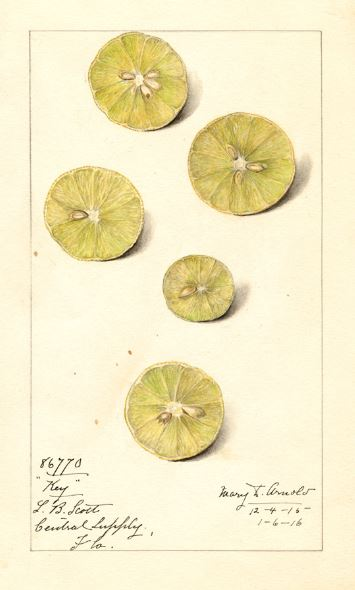

# Data cleaning

```{r out.width='75%', echo=F}

knitr::opts_chunk$set(echo = T, warning = F, message = F)

dt_options <- list(scrollX = T, autoWidth = T, searching = F, ordering = F, lengthChange = F, paginate = F, info = F)

# Image ref: "U.S. Department of Agriculture Pomological Watercolor Collection. Rare and Special Collections, National Agricultural Library, Beltsville, MD 20705"
```


{align="right" style="margin-top: -4px; margin-left: 20px; width: 36%;"}

<br>

Before jumping into your analysis you'll want to clean up your data with some helpful quality checks and formatting procedures.  

These procedures include steps to:  

\@ref(missing)  __Remove blank, invalid, NULL, and missing values__  
\@ref(quals)    __Evaluate qualified data__     
\@ref(dups)     __Remove duplicate observations__ 
 

<br>

 
## Blank, NULL, and missing values {#missing}

__Description__  
Large monitoring data sets often contain observations with missing concentrations, detection limits or other non-instrument result entries that can lead to incorrect summary statistics.  

<br> __Recommended steps__

1. Identify any blank, NULL, `-999`, and missing values.
1. If available, review Null Data Codes. These codes will tell you why the data is missing. Most data sets will include null data codes. For AQS null code descriptions, see https://aqs.epa.gov/aqsweb/documents/codetables/qualifiers.html.
1. Determine if your analysis needs to account for missing data before deleting observations. You may want to perform a count on all sample dates to quantify the expected number of observations.
1. If you no longer need these records, remove them from the dataset.
1. Document your process. It is recommended that you document your data processing by writing it in the form of a script in a language such as R or Python.

<br> __Why not keep them?__

In most cases, our analyses do not require or allow filling in missing values. For this reason, it makes sense to remove them. However, for some analyses you may want to fill the missing values. The method for filling values will be project specific and decisions should be documented. Data sets should identify any records that include a replaced missing value. 


<br> __Sample `R` script__ 

Click the button below to view a step by step example of the methods above.

<div class="toggle"><button class="btn_code">Show __R__ code</button>


```{r echo=F, message=F, warning=F}  
library(knitr)
library(DT)
library(kableExtra)

options(knitr.table.format = "html") 

```

<br> Load example monitoring data
```{r demo_missing, eval=T, message=F, warning=F}
library(tidyverse)

data <- read_csv('aqs_id,poc,param_code,date,conc,null_code,md_limit,pollutant,cas
                  271231003,1,12101,"2004-01-04",-999.99,NA,0.06,"Aluminum","7429-90-5"
                  271231003,1,12101,"2004-01-10",0.23,NA,0.06,"Aluminum","7429-90-5"
                  271231003,1,12101,"2004-01-16",0.35,NA,0.06,"Aluminum","7429-90-5"
                  271231003,1,12101,"2004-01-22",0.22,NA,0.06,"Aluminum","7429-90-5"
                  271231003,1,12101,"2004-01-28",NA,NA,0.08,"Aluminum","7429-90-5"
                  271231003,1,12101,"2004-02-03",0.07,NA,0.06,"Aluminum","7429-90-5"
                  271231003,1,12101,"2004-02-09",0.02,NA,0.06,"Aluminum","7429-90-5"
                  271231003,1,12101,"2004-02-15"," ",NA,0.06,"Aluminum","7429-90-5"
                  271231003,1,12101,"2004-02-21",0.03,NA,0.06,"Aluminum","7429-90-5"
                  271231003,1,12101,"2004-02-27",0.21,NA,0.06,"Aluminum","7429-90-5"
                  271377001,1,12101,"2007-09-21",NULL,a,0.04,"Aluminum","7429-90-5"
                  271377001,1,12101,"2007-09-21",0.14,NA,0.04,"Aluminum","7429-90-5"')
```


<br> _Sample monitoring data_
```{r, eval=T, echo=F, message=F, warning=F, fig.width=4}
datatable(head(data), options = dt_options, rownames = FALSE)

```


<br> Create a function to test for missing concentration values.
```{r eval=T, message=F, warning=F}

# Test for missing concentrations, non-numeric values, and -999
missing_conc <- function(x) {
  
  is.na(as.numeric(x)) || as.numeric(x) < -900
  
}

```
 
  
<br> Use the function to add a column to your data `conc_missing` that tests for missing concentration values. 
```{r eval=T, message=F, warning=F}

# Create a new TRUE/FALSE column labeling each result as missing or not
data <- data %>% 
        rowwise() %>% 
        mutate(conc_missing = missing_conc(conc))

# Select all missing observations
missing_values <- filter(data, conc_missing == TRUE) 
```
  
  
<br> _Missing values_
```{r, eval=T, echo=F, message=F, warning=F}
#kable(head(data), booktabs = T, caption = "Sample monitoring data.")
datatable(select(missing_values, -null_code), options = dt_options, rownames = FALSE)
```


<br> Filter the data to only non-missing observations.
```{r eval=T, message=F, warning=F}

data <- filter(data, conc_missing == FALSE)
```
  
  
<br> _The new and improved cleaner data_   
```{r, eval=T, echo=F, message=F, warning=F}
#kable(head(data), booktabs = T, caption = "Sample monitoring data.")
datatable(select(data, -null_code), options = dt_options, rownames = FALSE)
```


<br> You can create similar functions to test for missing dates, site IDs, detection limits, and parameter codes.
```{r eval=T, message=F, warning=F}

# Test for missing dates
missing_dates <- function(x) {
  is.na(as.character(x)) || 
    nchar(as.character(x)) > 11 || nchar(as.character(x)) < 6
}

# Test for missing site IDs
missing_sites <- function(x) {
  is.na(as.character(x)) || nchar(as.character(x)) < 5 
}

# Test for missing detection limits
missing_dls <- function(x) {
  is.na(as.numeric(x)) || as.numeric(x) < 0
}

# Test for missing parameter codes
missing_param <- function(x) {
  is.na(as.numeric(x)) || as.numeric(x) < 0 || 
    nchar(as.character(x)) < 5 || nchar(as.character(x)) > 9
}

```
  
  
<br> To apply these functions all at once use `dplyr`'s great function called `mutate()`.
```{r eval=T, message=F, warning=F}

# Create new TRUE/FALSE columns labeling each result as missing or not
data <- data %>% 
        rowwise() %>% 
        mutate(conc_missing  = missing_conc(conc),
              date_missing   = missing_dates(date),
              site_missing   = missing_sites(aqs_id),
              dl_missing     = missing_dls(md_limit),
              param_missing  = missing_param(param_code)) 

# Filter to remove any rows with a missing parameter.
# We use sum() to count the number of missing parameters.
# In this case we will drop any row with at least one missing parameter.
data <- data %>% 
        filter(sum(c(conc_missing, 
                     date_missing, 
                     site_missing, 
                     dl_missing, 
                     param_missing), na.rm = T) < 1)

```  

  
<br> _The super cleaner data_  
```{r, eval=T, echo=F, message=F, warning=F}
#kable(head(data), booktabs = T, caption = "Sample monitoring data.")
datatable(data, options = dt_options)
```

</div>


## Qualified data {#quals}


__Description__  
Valid sample results may have data qualifiers. These qualifiers provide contextual information about factors that can influence results. In the AQS data format, qualifiers are listed in 10 qualifier fields. A sample may have more than one qualifier. Descriptions of the AQS qualifier codes are available from the EPA at https://aqs.epa.gov/aqsweb/documents/codetables/qualifiers.html.  


<br> __Recommended steps__ 

1. Filter data to view samples with Qualifier codes
1. Evaluate whether any of the qualified data will unduly influence your analysis. For example, you may want to remove samples influenced by unique events. In other instances, you may want to create a rule to remove a set of data with a certain level of qualified data.
1. When removing qualified data, maintain a copy of the original data set and document what values have been removed. In some cases, you may want to run your analysis with and without the qualified values to characterize the influence of the qualified data on the results. 


<br> __Sample `R` script__  
  
Click the button below to view a step by step example of the methods above.

<div class="toggle">
<button class="btn_code">Show __R__ code</button>

```{r echo=T, message=F, warning=F}  
library(readr)

qualifier_data <- read_csv("X:/Programs/Air_Quality_Programs/Air Monitoring Data and Risks/0 Methods and documentation/3. Analysis methods/Web book/air-methods/qualifier_date.csv")

#qualifier data is your data set with qualifier codes
#names are what you want to name the output objects

view_qualifiers <- function(qualifier_data, 
                            names = c("data_with_qual_desc", "qualified_data", "qualifiers_present", "non_qualified_data")) {
  
  library(RCurl)
  library(dplyr)
  library(tidyr)

  download <- "https://aqs.epa.gov/aqsweb/documents/codetables/qualifiers.csv"
  
  qualifiers <- read_csv(download)
  
  qualifiers <- qualifiers %>% 
                select(`Qualifier Code`, `Qualifier Description`, `Qualifier Type`)

  qualifier_data <- left_join(qualifier_data, qualifiers, 
                              by = c("qual_code" = "Qualifier Code"))
  
  qualified_data <- filter(qualifier_data, !is.na(qual_code))
  
## review qualifier types in the data
  qualifiers_present <- unique(qualified_data$`Qualifier Description`)
  
  print(qualifiers_present)

## remove qualified data if appropriate
  non_qualified_data <- filter(qualifier_data, is.na(qual_code)) %>%
                        select(-c(`Qualifier Description`, `Qualifier Type`))

  list2env(list(qualifier_data, qualified_data, qualifiers_present, non_qualified_data) %>% purrr::set_names(names), envir = .GlobalEnv)

  return()
}

view_qualifiers(qualifier_data)

```

</div>

<br> 


## Duplicate observations {#dups}

__Description__  

Large monitoring data sets often contain multiple observations from the same monitor for the same time period. When multiple observations do occur they tend to be identified by or by a qualifier describing why the second observation was recorded (e.g. a duplicate for quality control). The treatment of these duplicate values will depend on the analysis. 


<br> __Recommended steps__  

1. Identify duplicate observations.
1. A duplicate in the data is likely the result of an error. Consult the lab about duplicate values.
1. Treatment of a duplicate observation will depend on the project.
    - For criteria pollutant design values, treatment of duplicate samples is defined for each pollutant in the [Appendices of 40 CFR 50](https://www.ecfr.gov/cgi-bin/text-idx?tpl=/ecfrbrowse/Title40/40cfr50_main_02.tpl).
    - For air toxics, treatment of duplicate values will depend on the analysis. In some cases you may want to average the results. In others, you may want to take the maximum value.
1. If you identify records that are completely duplicated (same date, same site, same POC, same result, same MDL), delete these records prior to completing analyses.  
1. For automated annual summaries, use the following hierarchy to remove duplicates:
    - Calculate the mean concentration of all non-censored observations.
    - If all observations are censored, select the observation with the lowest detection limit.
    - If all observations are censored and the detection limits are equal, select a single observation.  

<br> __Why not keep all the data?__

Leaving multiple observations for some dates in the data set is likely to bias calculated summary statistics. For example, duplicate ozone observations from January would be likely to skew the annual average lower. By limiting the number of observations to 1 per day, we can remove the bias due to duplicate observations. 

<br> __Sample `R` script__  
  
Click the button below to view a step by step example of the methods above.

<div class="toggle">
<button class="btn_code">Show __R__ code</button>

```{r echo=F, message=F, warning=F}  
library(knitr)
library(DT)
```

<br> 

Load the sample monitoring data.

```{r eval=T, message=F, warning=F}

data <- read.csv(text = '
aqs_id,poc,param_code,date,conc,null_code,md_limit,pollutant,cas
271231003,1,12101,"2004-01-04",0.05,NA,0.06,"Aluminum","7429-90-5"
271231003,1,12101,"2004-01-10",0.23,NA,0.06,"Aluminum","7429-90-5"
271231003,1,12101,"2004-01-16",0.35,NA,0.06,"Aluminum","7429-90-5"
271231003,1,12101,"2004-01-22",0.22,NA,0.06,"Aluminum","7429-90-5"
271231003,1,12101,"2004-01-28",0.01,NA,0.06,"Aluminum","7429-90-5"
271231003,1,12101,"2004-02-03",0.07,NA,0.06,"Aluminum","7429-90-5"
271231003,1,12101,"2004-02-09",0.02,NA,0.06,"Aluminum","7429-90-5"
271231003,1,12101,"2004-02-15",0.07,NA,0.06,"Aluminum","7429-90-5"
271231003,1,12101,"2004-02-21",0.03,NA,0.06,"Aluminum","7429-90-5"
271231003,1,12101,"2004-02-21",0.02,NA,0.05,"Aluminum","7429-90-5"
271231003,1,12101,"2004-02-27",0.04,NA,0.06,"Aluminum","7429-90-5"
271231003,1,12101,"2004-02-27",0.21,NA,0.06,"Aluminum","7429-90-5"
271377001,1,12101,"2007-09-21",0.18,NA,0.04,"Aluminum","7429-90-5"
271377001,1,12101,"2007-09-21",0.14,NA,0.04,"Aluminum","7429-90-5"
271377001,1,12101,"2007-09-21",0.14,NA,0.04,"Aluminum","7429-90-5"
', stringsAsFactor = F)
```

<br> _Sample monitoring data_ 
```{r, eval=T, echo=F, message=F, warning=F}
datatable(data, options = dt_options, rownames = FALSE)
```
 
 
<br> Delete rows of data that are exact duplicates.
```{r, eval=T, message=F, warning=F}

# Check for exact duplicate rows
dup_rows <- data[duplicated(data), ]

# Drop the exact duplicates
data    <- data[!duplicated(data), ]

```
  
  
<br> Add a unique column ID to each `site/poc/param-code/date` combination.
```{r, eval=T, message=F, warning=F}

# Add unique key to each row
data$key <- 1:nrow(data)

# Create a unique ID for each site/poc/param-code/date combination
data$unique_sample_id <- paste(data$aqs_id, data$poc, data$param_code, data$date, sep = "_")
```
  
  
```{r, eval=T, echo=F, message=F, warning=F, fig.cap ="Unique ID column added."}
datatable(head(data[, c(10:11,1:9)]), options = dt_options, rownames = FALSE)
```

   
<br> Test for duplicate observations. 
```{r, eval=T, message=F, warning=F}
# Label duplicate samples
data <- group_by(data, unique_sample_id) %>% mutate(duplicate = n() > 1)

# Create duplicate table
dupes <- filter(data, duplicate == T)
```
  
  
<br> _Duplicate observations_ 
```{r, eval=T, echo=F, message=F, warning=F}
datatable(head(dupes), options = dt_options, rownames = FALSE)
```
  

<br> If duplicates are found, use the following hierarchy to remove duplicates:
  
1. Calculate the mean concentration of all non-censored observations.
1. If all observations are censored, select the observation with the lowest detection limit.
1. If all observations are censored and the detection limits are equal, select a single observation.
    
```{r, eval=T, message=F, warning=F}
# Replace censored observations with NA
dupes <- dupes %>% mutate(conc = ifelse(conc >= md_limit, conc, NA))

# Calculate the mean of non-censored observations
dupes <- group_by(dupes, unique_sample_id) %>% 
         mutate(conc = mean(conc, na.rm = T))

# Arrange by concentration and detection limit, then select the first observation
dupes <- group_by(dupes, unique_sample_id) %>% 
         arrange(desc(conc), md_limit) %>% 
         filter(key == key[1])

# Remove Unique IDs with duplicates from data
data <- filter(data, !duplicate)

# Attach the selected duplicates with highest result and lowest detection limit
data <- rbind(data, dupes)
```


<br> _The new cleaner data_  
```{r, eval=T, echo=F, message=F, warning=F, fig.cap ="Final data set with 1 duplicate removed."}

datatable(select(data, -key, -duplicate), 
          options = list(scrollX = T, autoWidth = T, searching = F, ordering = F, lengthChange = F, paginate = F, info = F), 
          rownames = FALSE)

# Code folding reference: https://stackoverflow.com/questions/37755037/how-to-add-code-folding-to-output-chunks-in-rmarkdown-html-documents/37839683#37839683

```

</div>


<br> [Back to top](#missing)

  