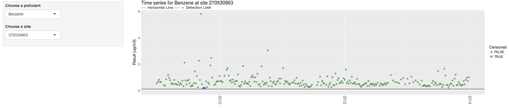

# Data validation

```{r, include=F}
knitr::opts_chunk$set(echo = T, warning = F, message = F)

dt_options <- list(scrollX = T, autoWidth = T, searching = F, ordering = F, lengthChange = F, paginate = F, info = F)
```

```{r, out.width='62%', echo=F}
knitr::include_graphics("https://i0.wp.com/catscradleshelter.org/wp-content/uploads/2015/10/8-quality-control.jpg?fit=1200%2C800")
```


Environmental monitoring data can be subject to error. One way to catch these errors is to complete routines to find data that are inconsistent with expectations or do not comply with data rules. The first of these routines should always be to visually inspect data in a variety of ways to focus data validation steps. These steps should be completed at a scheduled frequency depending on the data duration and frequency and the resources available.

Some important data validation checks include:

- \@ref(leaks)    __Leaks, instrument drift, and sample contamination__
- \@ref(outs)     __Outliers and extreme values__  
- \@ref(sticky2)  __Sequential repeats and _sticky_ numbers__  
- \@ref(unique)   __Insufficient unique values__ 

<br>

There may be other data validation steps you want to carry out dependent on the pollutant of interest.

<br> __What is the importance of data validation steps above and beyond the typical laboratory calibration and qualifying procedures that always occur?__

A decreasing signal or repeated sequential measurements may mean that the data are not interpretable. An exceptionally high value could mean laboratory contamination or potentially could contribute to human health impacts if the high value is accurate. Data validation steps are critical for these reasons.     

Data that fail validation tests may imply that laboratory equipment or system is in error. A failed validation test may also imply that there are extreme values at a site because of a significant air pollution source. In either case, a data validation routine is important to distiguish which of these may be the case and what program to contact for futher information.

<br> __Basic validation tests__

1. Visualize the data to help focus data validation steps.
1. Identify potential instrument drift: Find a significant change in variation in the data in the same time frame from one year to the next. This, or a sudden shift in magnitude of signal, could imply that there is drift or concentrations results are only different due to a new calibration or instrument change.
1. Identify extreme values: Find extreme values that may be in error, from contamination, or from a loss in signal.
1. Identify sequential identical values (sticking): Find 3 or more sequential identical values within the same site and pollutants.
1. Identify data sets with too few unique values.
1. Report any failed test or significant finding to the laboratory if instrument failure is suspected. If there are several extreme values, communicate this to monitoring staff to find out if anything significant happened in the field. If there is no suggestion that the values could be from instrument or sampling issues, than a pollution source specialist should be consulted.

<br><br>


The following sections show examples of data validation steps. 


__Load example data__

```{r validation}
library(tidyverse)
library(stringr)
library(RcppRoll)
library(lubridate)

data <- read_csv('https://raw.githubusercontent.com/MPCA-air/air-methods/master/airtoxics_data_2009_2013.csv')

names(data) <- c("aqs_id", "poc", "param_code", "date", "conc", "null_code", "md_limit", "pollutant", "year", "cas")


```


<br> __Sample monitoring data__   
```{r, echo=F}
library(knitr)
library(DT)

dt_options <- list(scrollX = T, autoWidth = T, searching = F, ordering = F, lengthChange = F, paginate = F, info = F)

#kable(head(data), booktabs = T, caption = "Sample monitoring data.")

datatable(head(data, 8), options = dt_options, rownames = F)
```

<br>


First, it's always a good idea to plot the data. If there are a low number of numeric data points the statistical tests that follow may not be advised.

Open the web tool below to chart the measured pollutants at each site. A script to recreate the webtool for other monitoring data is included as well.


[Shiny Data tool](https://mpca-pahs.shinyapps.io/ChartCleanData/)

<a href=https://mpca-pahs.shinyapps.io/ChartCleanData/>
```{r out.width='100%', echo=F, fig.align="center"}

```
</a>

```{r, eval=F, echo=F}
library(shiny)
library(readr)
library(ggplot2)
library(tidyverse)
library(stringr)
library(RcppRoll)
library(lubridate)
library(DT)
library(rsconnect)

data <- read_csv('https://raw.githubusercontent.com/MPCA-air/air-methods/master/airtoxics_data_2009_2013.csv')
colnames(data) <- c("aqs_id", "poc", "param_code", "date", "conc", "null_code", "md_limit", "pollutant", "year", "cas")
data <- mutate(data, sitePOC = paste0(aqs_id,"-", poc) )
pollutant <- unique(data$pollutant)
site <- unique(data$sitePOC)


shinyApp(
  ui = fluidPage(responsive = FALSE,
                 fluidRow(
                   column(3,
                          style = "padding-bottom: 20px;",
                          inputPanel(
                            selectInput("pollutant", label="Choose a pollutant", choices = pollutant, selected="Benzene"),
                            selectInput("site", label="Choose a site", choices = site, selected=270535501))),
                   column(9,
                          plotOutput('detlim', height = "400px")))),
  
  
  server = function(input, output) {
    
    
    
    
    output$detlim <- renderPlot({
      print(input$pollutant)
      print(input$site)
      data_sub = filter(data, pollutant==input$pollutant, sitePOC == input$site)
      data_sub$Censored <- ifelse(data_sub$conc > data_sub$md_limit, FALSE, TRUE)
      mdl <- max(data_sub$md_limit)
      ggplot(data=data_sub, aes(x= date, y=conc)) +
        geom_point(aes(color=Censored), size =3, alpha=0.55) +
        geom_line() +
        geom_hline(yintercept=mdl) +
        scale_x_date() +
        xlab(NULL) +
        ylab("Result (ug/m3)") +
        expand_limits(y=c(0, max(data_sub$conc))) +
        scale_colour_manual(values= c("#197519"[FALSE %in% unique(data_sub$Censored)], "#0000FF"[TRUE %in% unique(data_sub$Censored)]), breaks=c(FALSE, TRUE)) +
        theme(text = element_text(size=15), axis.text.x = element_text(angle = -90, vjust = 0.3,  size=14)) +
        ggtitle(paste0("Time series for ", input$pollutant, " at site ", input$site),
                subtitle = "---- Horizontal Line ----  =  Detection Limit")
    })
    
  })

```


## Instrument drift or leaks in a system. {#leaks} 

The intrument drift test returns a difference in variance of carbon tetrachloride between a calendar quarter for two consecutive years. This test works for VOC air toxics measurements only. Carbon tetrachloride was chosen because it is a banned substance and no longer in use, it has very few below detection limit values, and no direct sources. It has seasonally variable concentrations, so calendar quarters were compared to eliminate the detection of seasonal differences. The statistical test used was a Levenes Test for homogeneity of variance. This test could be applied to other surrogate compounds where there are multiple analytes, or could be applied to single analyte measurements (i.e. PM2.5). Another way to test for instrument drift is to test for significant differences between equal numbers of measurements before and after a calibration or tuning. (See site comparison section of this book for these tests)

<br> __Sample `R` script__ 

Click below to view an example of checking for instrument drift.

<div class="toggle"><button class="btn_code">Show __R__ code</button>

```{r echo=T}  

library(car)

data$conc <- as.numeric(data$conc)
data$aqs_id <- as.character(data$aqs_id)
sites <- unique(data$aqs_id)
years <- unique(data$year)
data$quarter = quarter(data$date)
quarters <- unique(data$quarter)
pocs <- unique(data$poc)

clean_values = function(data) {
  data$conc = as.numeric(as.character(data$conc))
  data$conc[abs(data$conc) >= 999] = NA
  return(data)
}

data = clean_values(data)

levene_function = function(conc, quarter_year, row, col) {
  if(length(unique(quarter_year))<2){
  return(NA)} 
  data = data.frame(conc = conc, quarter_year = quarter_year)
  return(leveneTest(conc~as.factor(quarter_year), data = data)[row,col])
}

leak_table_unfiltered <- data.frame()
for(i in max(years):max(years)-1:length(years)){
  for(j in i+1){
    data_carbontet=data.frame()
  data_carbontet <- filter(data, pollutant=="Carbon Tetrachloride", !is.na(conc), year %in% c(i, j))
data_carbontet$quarter_year = paste(data_carbontet$quarter, "_", data_carbontet$year)
data_carbontet <- data_carbontet %>% group_by(aqs_id, poc, quarter) %>% 
  summarise(fvalue_levene = levene_function(conc, quarter_year, 1,2), 
            pval_levene = levene_function(conc, quarter_year, 1,3), 
            deg_free_levene = levene_function(conc, quarter_year, 2,1),
            Year_1 = min(year), 
            Year_2 = max(year),
            Mean_Year_1 = mean(conc[year==min(year)], na.rm=T),
            Mean_Year_2 = mean(conc[year==max(year)], na.rm=T)) %>% ungroup()
leak_table_unfiltered  <- rbind(leak_table_unfiltered,data_carbontet)
  }
}
leak_table <- filter(leak_table_unfiltered, pval_levene<0.01, abs(Year_1-Year_2)==1)
leak_table$Warning_Type <- "Decrease_in_Measurements"

datatable(head(leak_table, 10), options = dt_options) %>% formatSignif(c("fvalue_levene", "pval_levene", "Mean_Year_1", "Mean_Year_2"), digits = 2)

```
</div>


## Extreme values and outliers {#outs} 

We recommend testing air toxics for extreme values by comparing each measured concentration to 3 x the 75th percentile of the data set by year, site, and pollutant. For now, collocated measurements (POCS) are not tested separately. For data with higher temporal variability, such as black carbon and ultrafine particulates, a criteria of 3 x the 95th percentile of the data set by year, site and pollutant should be used. There are a variety of outlier tests. The recommended criteria are sensitive enough to find outliers each year but not so sensitive that values reflecting site conditions are flagged. For example, most air pollution measurements are much higher during fire works, such as occurrs on July 4th and December 31st. These data are not in error, they are accurate representations of the air concentrations during those times.


<br> __Sample `R` script__ 


Click the button to view an example.

<div class="toggle"><button class="btn_code">Show __R__ code</button>

```{r}

# Test for exceptionally high values [above 75th percentile X 3] This can be modified to 95% for continous or other short duration data.
high_data <- group_by(data, year, aqs_id, pollutant) %>% mutate(AR_Mean = mean(conc, na.rm=T), Percentile_75 = quantile(conc, 0.75, na.rm = T), Percentile_75_X3 = Percentile_75*3) %>% ungroup()

high_data <- filter(high_data, conc>Percentile_75_X3, !is.na(conc), AR_Mean>md_limit, Percentile_75>0)


high_data$Warning_Type <- "Exceptionally_High_Value_Test"
high_data <- unique(high_data)

datatable(head(high_data, 10), options = dt_options) 

high_data <- high_data[, c("date", "pollutant", "aqs_id", "Warning_Type")]

```

</div>
   
   
## Sequential repeats and "sticky" numbers {#sticky2}
 
Three or more sequential replicate values may be a result of a machine error.

```{r}
##Search for three repeating identical values.
repeat_data <- group_by(data, poc, year, aqs_id, pollutant) %>% 
  arrange(year, aqs_id, poc, pollutant, date) %>% 
  mutate(Previous_Day   = lag(conc, 1), 
         Two_Days_Prior = lag(conc, 2)) %>% ungroup()

repeat_data <- mutate(repeat_data, Repeat_Test = ifelse(round(conc, digits = 4) == round(Previous_Day, digits = 4) & round(Previous_Day, digits = 4) == round(Two_Days_Prior, digits=4), "TRUE", "FALSE"))

repeat_data$Warning_Type <- "Repeat_Test"

repeat_data <- filter(repeat_data, conc > 0 &  Repeat_Test == TRUE)

datatable(head(repeat_data, 10), options = dt_options)

repeat_data <- repeat_data[, c("date", "pollutant", "aqs_id", "Warning_Type")]

```


<br> _Table: Dates and pollutants to check including the potential issue_   
```{r, echo=F}
warnings_table <- rbind(repeat_data, high_data)

datatable(head(warnings_table, 10), options = dt_options, rownames = FALSE)
```


## Unique detected values {#unique}

In some cases the detected observations at a site may all be an identical value. Identical observations scattered throughout monitoring results at a single monitor can indicate a machine error. In addition, calculating summary statistics often requires a minimum number of unique values. 

<br> __Example `R` script__ 

Click below to view an example of counting unqiue detected values.

<div class="toggle"><button class="btn_code">Show __R__ code</button>

```{r, echo=F}
library(knitr)
library(DT)
```

Packages
```{r message=F}
library(tidyverse)

```


Our example data is organized by monitoring site and date.
```{r message=F}
data <- read_csv('https://raw.githubusercontent.com/MPCA-air/air-methods/master/airtoxics_data_2009_2013.csv')
```

```{r message=F, echo=F, fig.cap = "Sample data table."}

DT::datatable(head(data, 5), options = dt_options, rownames = F)
```
<br>


Count the number of unique detected values for each year.
```{r message=F}

data <- data %>% 
        group_by(AQSID, POC, Param_Code, CAS, Year) %>%
        mutate(detected_obs  = ifelse(Concentration < Dlimit, NA, Concentration), 
               unique_values = n_distinct(detected_obs, na.rm = TRUE))
        
```

<br>

Flag sites with less than 3 unique values.
```{r, message=F}

data <- data %>% 
          group_by(AQSID, POC, Param_Code, CAS, Year) %>%
          summarize(unique_values = unique_values[1],
                    unique_flag   = unique_values < 3) %>%
          ungroup()
        
```

<br>


__Final table with added `unique_flag`__
```{r message=F, echo=F}

DT::datatable(sample_n(data, size = 10, replace = F), options = list(scrollX = 0, autoWidth = 0, searching = F, ordering = F, lengthChange = F, paginate = F, pageLength = 10, info = 0), rownames = F)
```

</div>


## References {#valid_ref}    

[USEPA Technical Support Document for the Nation Air Toxics Trends Sites](https://www3.epa.gov/ttnamti1/files/ambient/airtox/NATTS%20TAD%20Revision%203_FINAL%20October%202016.pdf)

[European Union Guide to Data Validation](https://webgate.ec.europa.eu/fpfis/mwikis/essvalidserv/images/a/ad/PRACTICAL_GUIDE_TO_DATA_VALIDATION.pdf)

[US EPA Guidance on Data Verification and Data Validation](https://www.epa.gov/sites/production/files/2015-06/documents/g8-final.pdf)

[US EPA Data Validation Workbook Presentation and Training Materials](https://www3.epa.gov/ttnamti1/files/ambient/airtox/workbook/T-Workbook_Secs1-8.pdf)

[US EPA Data Analysis Workbook](https://nepis.epa.gov/Exe/ZyPDF.cgi/P1006PAB.PDF?Dockey=P1006PAB.PDF)

[Temporal variability of selected air toxics in the United States](http://www.sciencedirect.com/science/article/pii/S1352231007004840)

[Spatial and temporal analysis of national air toxics data](http://www.tandfonline.com/doi/pdf/10.1080/10473289.2006.10464576)


<br> 

> [Back to top](#data-validation)
