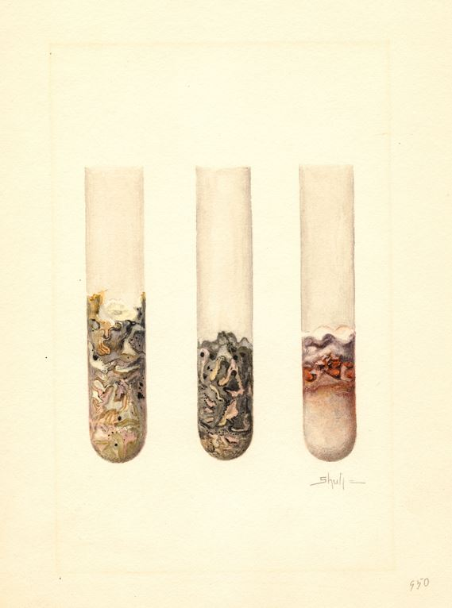
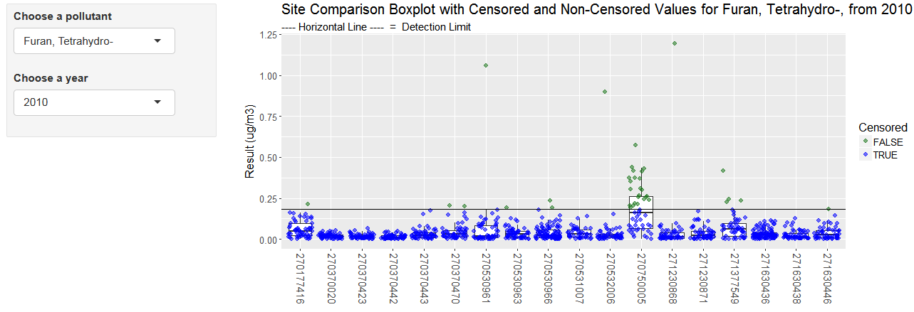

# Detection limits


```{r, echo=F}
knitr::opts_chunk$set(echo = T, warning = F, message = F)
dt_options <- list(scrollX = T, autoWidth = T, searching = F, ordering = F, lengthChange = F, paginate = F, info = F)
```


{align="right" style="margin-top: -8px; margin-bottom: 16px; margin-left: 34px; width: 36%;"}


## Method Detection Limit

A method detection limit (MDL) is the minimum concentration of a substance that can be measured and reported with 99% confidence that the analyte concentration is greater than zero.  


## Calculating MDLs

- Prior to 2017, the lab calculated detection limits according to the procedures defined in 40 CFR Appendix B to Part 136 ([Definition and Procedure for the determination of Method Detection Limit](https://www.gpo.gov/fdsys/granule/CFR-2011-title40-vol23/CFR-2011-title40-vol23-part136-appB/content-detail.html)).   
- Begining in 2017, the lab adopted a modified method for calcuating the method detection limit. Known as the "Method Update Rule(MUR)", this method accounts for media background contamination when establishing the MDL.   

This method is defined in the [NATTS TAD (October 2016)](https://www.google.com/url?sa=t&rct=j&q=&esrc=s&source=web&cd=1&cad=rja&uact=8&ved=0ahUKEwjJ3Y6AyfzVAhVL2IMKHXe_DI0QFggoMAA&url=https%3A%2F%2Fwww3.epa.gov%2Fttnamti1%2Ffiles%2Fambient%2Fairtox%2FNATTS%2520TAD%2520Revision%25203_FINAL%2520October%25202016.pdf&usg=AFQjCNGVu-9E0zS1-Gjkt_5sULzOPNeymg). EPA has proposed to revise 40 CFR Appendix B to Part 136 to reflect this methodology. 

- Both methods require preparing and analyzing 7 matrix spikes and 7 method blanks. Samples should be prepped and analyzed over the course of at least 3 seperate batches/days.   
    - Calculate the MDL of spiked samples (MDL_sp)  
    - Calculate standard deviation of the calcuated concentrations for the spiked samples.   
    - Calculate the MDL for the spiked samples by multiplying the standard deviation of spiked sample by the one-sided student's T value at 99% confidence corresponding to the number of spikes analyzed (3.143 if 7 samples).    
      
The new method also requires calculation of the MDL of the method blanks (MDL_b):  

- If no method blank provides a numerical result, no further action needed.  
- If method blank pool includes a combination of ND and numeric values, set the method blank MDL to equal the highest of the method blank results.   
- If all concentration values for the method blank pool are numeric values, calculate the MDL_b as follows:  
    - Calculate the average concentration of method blanks
    - Calculate the standard deviation of the method blank concentrations
    - Multiply the standard deviation by the one-sided student's T value at 99% confidence corresponding to the number of blanks analyzed
    - Calculate the MDL_b as the sum of the average concentration method blanks, and the product of the standard deviation of blanks and the associated student's T Value
    - MDL_b = mean_blanks + stdv_blanks * Student T  
- Compare MDL_sp and MDL_b. 
    - The higher of the two values is reported as the laboratory MDL.  


## Finding MPCA detection limits

Annual method detection limits used for data analysis are stored on the X-drive at: 

- `X:\Databases\AQ\AQ Lab\Data Analysis\Air Toxics\Detection Limits\Annual Detection Limits (micrograms).xlsx`
- Use the `ParamYear` field to join monitoring observations to their respective detection limits.  
- Detection limits are updated when received from the lab. Current year samples may not have a detection limit in the file if the lab has not performed the test. 

If you receive a detection limit directly from the lab it is likely in "_instrument units_".  

- **Metals (ug/mL):** conversion to ug/m3 requires accounting for flow rate, runtime, and 1/9 filter strip, and 40 mL liquid extraction  
- **Carbonyls (ug/mL):** conversion requires accounting for flow rate, runtime, and extraction volume   
- **VOCs (ppb):** conversion can be done using Molecular Wt. and Standard Temp and Pressure    

When _Promium_ is adopted, method detection limits will be applied on a sample by sample basis, and will account for the varying air volumes of samples. As a result, there will be multiple detection limits for an analyte. 


## Qualifier Codes for Detection Limits

Beginning in 2017, the MPCA now links laboratory detection limits to sample data and applies appropriate data qualifiers depending on the detection status. 

These qualifiers include:

>
> - **`SQL`** 3.18 X MDL
> - **`ND`**  Not qualitatively identified _(reported as zero)_
> - **`MD`**  < MDL
> - **`SQ`**  >= MDL but < SQL
> - **`No qualifier`**  Measured concentration >= to SQL
  
  
## Estimating below detection values 

> **The 3 Don'ts**

1. __Don’t delete data.__
    - Deleting data that are below a detection limit biases central tendency estimates and whole data summaries (quantiles of the data set) high.
1. __Don’t fill with zeros__
    - Substituting below detection limit data with 0’s biases central tendency estimates and whole data summaries (quantiles of the data set) low, and can change the distribution by the creation of multiple same value numbers, and can even create an inaccurate bimodal distribution of the data.
1. __Don’t fill with DLs or ½ DLs__
    - Substituting below detection limit data with 1/2 MDL creates the least bias in central tendency estimates and whole data summaries (quantiles of the data set), however, it can change the distribution by the creation of multiple same value numbers, and can even create an inaccurate bimodal distribution of the data.
    - Substituting below detection limit data with MDLs biases central tendency estimates and whole data summaries (quantiles of the data set) high, and can change the distribution by the creation of multiple same value numbers, and can even create an inaccurate bimodal distribution of the data.
  
  
## Recommended Steps 

24-hour samples which are below the method detection limit should be noted as "<MDL" and the machine values should not be reported to the public unless explicitly requested. It is advised to replace the machine value with note, such as `MDL`, so the machine value is not used in independent analysis and to alert users of the data that censored values exist in the monitoring results. For details on how to deal with censored values in calculating annual summaries, see the summary methods section.


<br> __Shiny tool for displaying non-detects__

Open this tool to chart pollutant values and detection limits by year

- https://mpca-pahs.shinyapps.io/ChartDetectionLimits/

```{r out.width='100%', echo=F, fig.align="center"}

```

<br> 

**Shiny code** 

Click below to view the R script for the Shiny App.

<div class="toggle"><button class = "btn_code">Show __R__ code</button>

```{r, eval=T, echo=F, message=F, warning=F}
library(tidyverse)
library(stringr)
library(lubridate)
library(car)
library(DT)
library(shiny)

data <- read_csv('https://raw.githubusercontent.com/MPCA-air/air-methods/master/airtoxics_data_2009_2013.csv')

names(data) <- c("aqs_id", "poc", "param_code", "date", "conc", "null_code", "md_limit", "pollutant", "year", "cas")

```

<br> _Table: Sample monitoring data_   
```{r, eval=T, echo=F, message=F, warning=F}
library(knitr)
datatable(head(data, 10), options = dt_options)
```


```{r, eval=F, echo=T, message=F, warning=F}
library(shiny)
library(rsconnect)
library(readr)
library(ggplot2)
library(dplyr)

data <- read_csv('https://raw.githubusercontent.com/MPCA-air/air-methods/master/airtoxics_data_2009_2013.csv')

colnames(data) <- c("aqs_id", "poc", "param_code", "date", "conc", "null_code", "md_limit", "pollutant", "year", "cas")

pollutant <- unique(data$pollutant)

year <- unique(data$year)

shinyApp(
 ui = fluidPage(responsive = FALSE,
                   fluidRow(
                     column(3,
                            style = "padding-bottom: 20px;",
                            inputPanel(
  selectInput("pollutant", label = "Choose a pollutant", choices = pollutant, selected = "Benzene"),
  selectInput("year", label = "Choose a year", choices = years, selected = 2009))),
                    column(9,
                   plotOutput('detlim', height = "400px")))),
   

  server = function(input, output) {

output$detlim <- renderPlot({
  print(input$year)
  print(input$pollutant)
    data_sub = filter(data, year==input$year, pollutant==input$pollutant)
    mdl <- mean(data_sub$md_limit)
    data_sub$Censored <- ifelse(data_sub$conc > data_sub$md_limit, FALSE, TRUE)
    ggplot(data=data_sub, aes(x= factor(aqs_id), y=conc)) +
      scale_colour_manual(values= c("#197519"[FALSE %in% unique(data_sub$Censored)], "#0000FF"[TRUE %in% unique(data_sub$Censored)]), breaks=c(FALSE, TRUE)) +
    geom_boxplot(outlier.colour=NA) +
    geom_jitter(aes(color=Censored), size =2.4, alpha=0.55) +
    geom_hline(yintercept = mdl) +
    xlab(NULL) +
    ylab("Result (ug/m3)") +
    expand_limits(y=c(0, max(data_sub$conc))) +
    theme(text = element_text(size=15), axis.text.x = element_text(angle = -90, vjust = 0.3,  size=14)) +
    ggtitle(paste0("Site Comparison Boxplot with Censored and Non-Censored Values for ", input$pollutant, ", from ", input$year),
            subtitle = "---- Horizontal Line ----  =  Detection Limit")
})

})

```

</div>


## Multiple detection limits   

Regression on order statistics may be replaced with maximum likelyhood estimates for below detection limit data methodlogies if there are more than one detection limit per year in a data set.

## Reporting limits

Results below the method reporting limit are considered estimated but valid. If more than 80% of results in a year for a pollutant at a site are below the method reporting limit, the annual summary statistics should be qualified as below the reporting limit.

## References

[Review article by Helsel, D about non-detects and substitution methods.](https://academic.oup.com/annweh/article/54/3/257/223531/Much-Ado-About-Next-to-Nothing-Incorporating)

[A Chemosphere review article describing why BDL substitution should not be done.](https://pdfs.semanticscholar.org/182e/9278fc36dd73d48a414b8fbc30a44ea314d3.pdf)

[A below detection limit primer from Iowa State University](http://www.public.iastate.edu/~pdixon/stat505/Chapter 11.pdf)


<br> [Back to top](#detection-limits)
