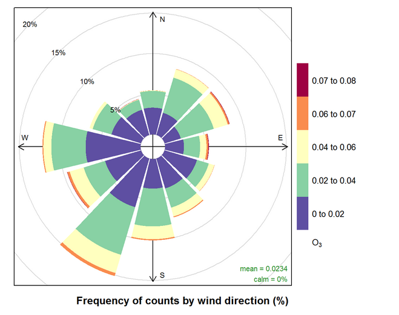

# Charts 

{width="45%"}

```{r, include=F}
knitr::opts_chunk$set(echo = T, warning = F, message = F)

dt_options <- list(scrollX = T, autoWidth = T, searching = F, ordering = F, lengthChange = F, paginate = F, info = F)
```

<br>

This section describes various charts for exploring and reporting air monitoring data.


## Calendar plots

The R package _openair_ provides a convenient function for presenting data in a calendar format. The code below shows an example of using the `calendarPlot()` function to display monitoring results for formaldehyde. 

<br>

```{r, echo=F}
library(openair)
library(tidyverse)

data <- read_csv('https://raw.githubusercontent.com/MPCA-air/air-methods/master/airtoxics_data_2009_2013.csv')

formaldehyde_963 <- filter(data,Param_Code == 43502, AQSID == 270530963, Date >= "2013-01-01")

names(formaldehyde_963)[4] <- "date" #openair requires dates to be stored under field name "date"

calendarPlot(formaldehyde_963,pollutant<- "Concentration",statistic="mean", year=2013, annotate="value",digits=1, key.footer="ug/m3", main="Daily Average Formaldehyde Concentrations at Mpls-Phillips (963), 2013")

```

<br>


## Colors and themes


R offers a wide variety of color palettes and chart themes to use in your plots. 

Some __color palettes__ include:

- [Viridis colors](https://cran.r-project.org/web/packages/viridis/vignettes/intro-to-viridis.html)
- [Wes Anderson Movies colors](https://github.com/karthik/wesanderson)
- [Ghibli Movie colors](https://github.com/ewenme/ghibli)


Some __chart themes__ include:

- [hrbrthemes](https://github.com/hrbrmstr/hrbrthemes)
- [XKCD](http://xkcd.r-forge.r-project.org/)
- [ggthemes](http://xkcd.r-forge.r-project.org/)
- [ggpomological](https://github.com/gadenbuie/ggpomological)
- [ggthemr](https://github.com/cttobin/ggthemr)
- [lato](https://github.com/briandconnelly/lato)


_The example below shows charts with the `ggpomological` theme._


<div class="toggle"><button class="btn_code">Show __R__ code</button>


A pollutant scatterplot with _pomological_ colors.
```{r}
#devtools::install_github("gadenbuie/ggpomological")
library(ggpomological)
library(tidyverse)

# Load air pollution data
data <- read_csv('https://raw.githubusercontent.com/MPCA-air/air-methods/master/airtoxics_data_2009_2013.csv')

names(data) <- c("aqs_id", "poc", "param_code", "date", "conc", "null_code", "md_limit", "pollutant", "year", "cas")

data <- filter(data, pollutant %in% c("Formaldehyde", "Benzene", "1,3-Butadiene"))

data$pollutant <- factor(data$pollutant, levels = c("Formaldehyde", "Benzene", "1,3-Butadiene"))

# Make scatterplot w/ pomo colors
ggplot(data, aes(x = pollutant, y = conc, color = pollutant, fill = pollutant)) +
     scale_y_log10() +
     geom_boxplot(aes(fill = factor(pollutant)), alpha = 0.8) + 
     scale_color_pomological() + 
     scale_fill_pomological() + 
     labs(title = "Air monitoring results")
```

<br>

You add a calm cream paper background.
```{r}

# Make scatterplot w/ pomo colors and cream background
ggplot(data, aes(x = year, y = conc, color = pollutant)) +
     scale_y_log10() +
     geom_jitter(size = 2, alpha = 0.6) + 
     scale_color_pomological() + 
     theme_pomological() + 
     labs(title = "Air monitoring results", subtitle = "2009 - 2013")

```

<br>

Or create a fancy chart in the style of an old fashioned nature journal.
```{r, results=F}
library(extrafont)

## Download fancyfont here - https://fonts.google.com/specimen/Homemade+Apple/
## Add to this folder - "Control Panel\All Control Panel Items\Fonts"

# Check loaded fonts
#windowsFonts()
#loadfonts(device = "win")

fonts_df <- fonttable()

# Load new font
#font_import(pattern = "HomemadeApple-Regular")
```


```{r, cache=T, out.width="100%"}

# Make fancy scatterplot w/ pomo colors, paper background and cursive fonts
fancy_plot <- ggplot(data, aes(x = year, y = conc, color = pollutant)) +
                   scale_y_log10() +
                   geom_jitter(size = 2, alpha = 0.3) + 
                   scale_color_pomological() +
                   theme_pomological_fancy() +
                   labs(title = "Air monitoring data", subtitle = "2009 - 2013")

# Create web image
paint_pomological(fancy_plot, res = 120)

```


<br>

Or create a density plot.
```{r, cache=T}
#devtools::install_github("yixuan/showtext")
library(showtext)

# Get fancy font
font_add_google(name = "Homemade Apple", family = "Homemade Apple")

#font_add_google(name = "Indie Flower", family = "Indie Flower")

# Create density plot
#showtext_begin()
#showtext_end()

ggplot(data, aes(x = sqrt(conc), fill = pollutant, color = pollutant)) +
                   scale_x_log10() +
                   geom_density(alpha = 0.7) + 
                   scale_fill_pomological() +
                   scale_color_pomological() +
                   labs(title    = "Air monitoring data", 
                        subtitle = "2009 - 2013", 
                        x        = "concentration") +
                   theme_pomological("Homemade Apple")  #theme(text = element_text(family = "Homemade Apple"))
                
                   
```

<br>


Or split the density plot into separate rows.
```{r, cache=T, out.width = "100%", fig.asp = .62}

library(ggridges)

# Create fancy_plot
fancy_plot <-  ggplot(data, aes(x = sqrt(conc), y = forcats::fct_rev(pollutant), fill = pollutant, color = pollutant)) +
                   geom_density_ridges(alpha = 0.7) + 
                   theme_pomological(base_family = 'Homemade Apple',
                                     base_size   = 16,
                                     base_theme  = ggridges::theme_ridges()) + 
                   scale_fill_pomological() +
                   scale_color_pomological() +
                   labs(title    = "Air monitoring data", 
                        subtitle = "2009 - 2013", 
                        x        = "concentration", 
                        y        = "pollutant")

# Create web image
paint_pomological(fancy_plot, res = 120)
```


</div>


```{r, echo = F, eval = F}
See [Ghibli](https://github.com/ewenme/ghibli).

{width="70%"}

```


## Pollution roses 

{width="70%"}

<br>

Pollution roses display a map of pollutant concentrations that correspond to different wind directions. The length of each "paddle" is correlated with the percentage valid measurements taken when the wind was blowing from that direction. 

If the longest paddle is the one extending downward, then the wind blew from the South on average more times than any other direction for days with valid pollutant measurements. The colors on a paddle correspond to the concentration of the pollutant. In this case, blue shows lower concentrations and orange shows higher concentrations.

> __Note__ 
>
> For a 24-hour sample, the plotted wind direction is the vector averaged wind direction over all hours of the day.

<br> 

__Sample `R` script__ 

The script below produces an interactive Shiny App for exploring pollutant concentrations in relation to wind direction and speed.

<div class="toggle"><button class="btn_code">Show __R__ code</button>

```{r roses, eval=F, message=F, warning=F}

pollution_roses = function(data, met_data_filepath, num_breaks = 5) { #Met data must be in Tableau format
  
  library(tidyverse)
  library(openair)
  library(reshape)
  library(shiny)
  library(rsconnect)
  
  data$Date <- ymd(data$Date)
  
  met_data <- read_csv(met_data_filepath)
  
  names(met_data)[c(1,8,9)] <- c("Day","wd","ws")
  
  met_data <- mutate(met_data, date = paste0(Year, "/", Month, "/", Day, " ", Hour, ":00"))
  
  met_data$date <- ymd_hm(met_data$date)
  
  met_data <- met_data[ , -c(1:3,10)]
  
  met_data <- timeAverage(met_data, avg.time = "day")
  
  met_data$date <- ymd(met_data$date)
  
  data <- left_join(data, met_data, by = c("Date" = "date"))
  
  Pollutant <- unique(data$Pollutant)
  
  Site <- unique(data$AQSID)
  
  Year <- unique(data$Year)

  shinyApp(
    
  ui = fluidPage(responsive = FALSE,
                 fluidRow(
                   column(3,
                          style = "padding-bottom: 20px;",
                          inputPanel(
                            selectInput("Pollutant", label="Choose a pollutant", choices = Pollutant),
                            selectInput("Year", label="Choose a year", choices = Year),
                            selectInput("Site", label="Choose a site", choices = Site))),
                   column(9,
                          plotOutput('normviz', height = "500px")))),
  
  
  server = function(input, output) {
    
    output$normviz = renderPlot({
      
      print(input$Pollutant)
      
      print(input$Site)
      
      print(input$Year)
      
      data_sub <- filter(data, 
                         Pollutant == input$Pollutant, 
                         AQSID == input$Site, 
                         Year == input$Year, 
                         !is.na(Result))
      
      data_sub <- data_sub %>% 
                  mutate(MDL     = max(MDL), 
                         minimum = min(Result), 
                         maximum = max(Result), 
                         Result  = ifelse(Censored, 1e-16, Result))
      
      breaks_site <- NULL
      
      if(!all(data_sub$Censored)){
        
        breaks_site <- c(breaks_site, 0, #c(round_any(data_sub$minimum[1], 0.001, floor),
                         round_any( c(data_sub$MDL[1], data_sub$MDL[1] + (data_sub$maximum[1] - data_sub$MDL[1]) * 
                                     (1:(num_breaks-1) / (num_breaks-1) ) ), 0.0001, ceiling ) )
        
        pollutionRose(data_sub, 
                      statistic  = "abs.count", 
                      pollutant  = "Result", 
                      breaks     = breaks_site, 
                      key.footer = "ug/m3", 
                      main       = paste("Daily Average Pollution Rose for", data_sub$Pollutant[1],"\n", data_sub$AQSID[1]) )
      } else {
        
        breaks_site <- c(breaks_site, 
                         c(round_any(0, 0.0001, floor),
                         round_any(c(data_sub$MDL[1], 2*data_sub$MDL[1] ), 0.0001, ceiling) ) )
        
        pollutionRose(data_sub, 
                      statistic  = "abs.count", 
                      pollutant  = "Result", 
                      breaks     = breaks_site, 
                      key.footer = "ug/m3", 
                      main       = paste("Daily Average Pollution Rose for", data_sub$Pollutant[1],"\n", data_sub$AQSID[1]) )
        
      }
      
    })
    
  })

}

```

</div>

<br>[Back to top](#charts)

