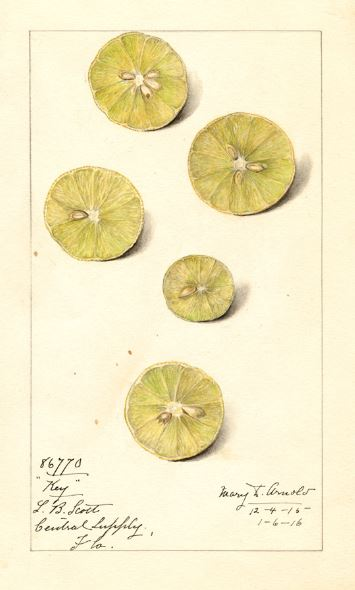
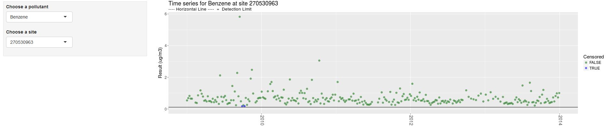
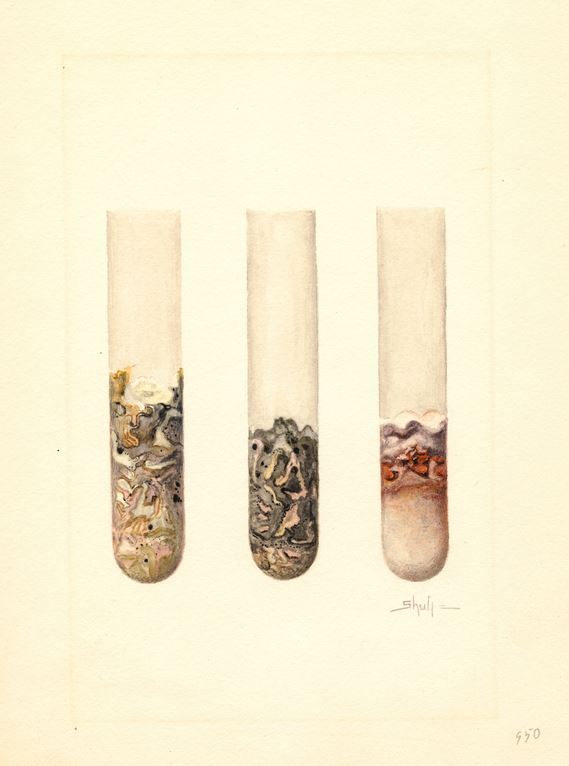

--- 
title: ''
author: ''
bibliography:
  - book.bib
  - packages.bib
cover-image: images/cover.jpeg
documentclass: book
fontsize: 14pt
github-repo: MPCA-air/air-methods
link-citations: yes
monofont: Source Code Pro
monofontoptions: Scale=0.75
site: bookdown::bookdown_site
biblio-style: apalike
url: https\://github.com/MPCA-air/air-methods
---


# Introduction {-}  

<div style= "margin-top: -25px;">
_Updated `r format(Sys.Date(),"%b %d, %Y")`_
</div>  


```{r, out.width='85%', fig.align='center', echo=FALSE}
knitr::include_graphics('images/cover.jpeg', dpi = NA)
```


This guide describes the methods used at the MPCA to analyze air monitoring data. The charts and code found in this guide were produced using the free statistical software R. To follow along with the examples download a copy of R to your computer from the [r-project](https://cran.r-project.org/) or use [R-Fiddle](http://www.r-fiddle.org/#/) in your browser. You can also download the free [R Studio](https://www.rstudio.com/products/rstudio/download/) software, which helps make R easier to use and keeps your data analysis projects organized.  

This web book is a working body of data analysis methods and code examples. The current contributors are listed below. You are invited to contribute content and add your name to the list.

<br> __Contributors__   

> Dorian Kvale  
> Cassie McMahon  
> Derek Nagel  
> Kristie Ellickson  


<!--chapter:end:index.Rmd-->

# Best practices


{width="230" align="right" style="margin-left: 20px; margin-right: 18px; margin-top: -24px;"}


<br>

This section includes some _best practices_ to promote consistent, efficient, and accurate data analysis with `R`.  


<br>

## Welcome to the Tidyverse

The  _Tidyverse_ consists of a group of R packages that work in harmony by sharing a common data format and syntax. Using packages within the _Tidyverse_ for your analysis will make your scripts easier to read for others and the _future you_.

{width="460"}

<br>


__Recommended packages__


> __Loading data__

`readr`     Load data from text files: tab, comma, and other delimited files.

`readxl`    Load data from Excel.

`RODBC`     Load data from Access and Oracle databases such as DELTA.

`RMySQL`, `RPostgresSQL`, and `RSQLite`  Connect to SQL databases.

`rvest`     Read and scrape content from webpages.

`pdftools`  Read PDF documents.

`googledrive` Read and write files to your Google Drive.

`foreign`   Load data from Minitab and Systat.

`R.matlab`  Load data from Matlab.

`haven`     Load data from SAS, SPSS, and Stata.

<br>


> __Manipulate data__

`dplyr`        Essential shortcuts to subset, summarize, rearrange, and join data sets.

`tidyr`        Reshape tables and unpack multiple inputs stored in single cell.

`stringr`      Tools to edit and clean text and character strings.

`lubridate`    Tools to format dates and perform calculations based on time.

`forcats`      Set, re-order and change levels of _factors_ (ordered character variables).

`magrittr`     Simplify your scripts by chaining multiple commands together with the pipe `%>%`.

<br>


> __Charts and visuals__

`ggplot2`      Essential package for plots and charts.

`ggsave`       Export charts in various formats and sizes.

`xkcd`, `hrbrthemes` , `ggpomological`, `ggthemes`     Chart themes for ggplot.

`viridis`, `wesanderson`, `ghibli`     Color palettes.

`rmarkdown`    Write summary reports and save as PDF, Word document, presentation, or website.

`shiny`        Create interactive data exploration tools for the web.

`DT`           Create data tables for the web.

<br>


> __Maps__

`leaflet`      Display spatial data and make interactive maps.

`sf`           Simple features, a spatial format using data frames to perform spatial.

`tigris`       Download geography boundaries: States, Counties, Census tracts, Block groups.

`tidycensus`   Download Census and American Community Survey data.

<br>


> __Files and folders__

`here`         Simplify file paths in your scripts and functions.

`fs`           Command line functions for copying, moving, and deleting files.


<br>


> __Automation__

`cronR`     Schedule scripts to run and refresh data at a set time.

```{r include=F}
#`drake`     An automated data analysis workflow manager. Update charts automatically after change to data.
```

<br>


> __Create R packages__

`devtools`      Essential tools for creating your own R package.

`roxygen2`      A quick way to document your R packages.

`usethis`       Shortcuts for package development and Github integration.

`goodpractice`  Automated feedback on your R package.

<br>


> __Find new packages__

{width=23% align="right" style="margin-left: 8px; margin-right: 10px; margin-top: -60px; max-width: 23%;"}

- Install the Addin [CRANsearcher](https://github.com/RhoInc/CRANsearcher) to browse all published packages.

- Visit [rOpenSci](https://ropensci.org/packages/) to view a selection of peer reviewed science packages.

<br>


## Keep R updated

__Get the _installr_ package__
```{r, eval=F}
install.packages('installr') 
library('installr')
```

__Update your R version__
```{r, eval=F}
updateR()
```

- When a popup suggests closing RStudio and running the update from _RGUI_, 
click __NO__. 
- When asked whether to copy and update all of your packages. Click __Yes__. This will save you buckets of time.

To learn more about _installr_ see https://github.com/talgalili/installr/#readme.


## Script organization

The following tips will help make your R scripts easier to read and easier for others to use your code in their own projects.

- Add a description to the top of your script.
- Load all packages at the top of the script.
- Assign important file paths and parameters near the top of the script.
- Avoid changing working directories with `setwd()`.
- Save files to a local working directory such as `"~\results.csv"`, rather than to a fixed location, such as `X:\EAO\Air Data\Project1\results.csv`.
- Load usernames and passwords from a file such as `credentials.csv`.

<br>

> __An example R script__

```{r, eval = F}
# name_of_script.R

# Purpose: This script does amazing things.
# Assumptions: The monitoring data for the sites is from different years, 
#              but we compare them anyways. 
# Warning! Don't use this script for Kryptonite. It will break everything.

# Load packages
library(dplyr)
library(readr)

# Set parameters
year <- 2017

data_file <- "monitors 1 and 2.csv"


# Load data
air_data <- read_csv(data_file)

# My functions
calc_stat <- function(data) {
  
  new_stat <- step1(data) %>% step2() %>% step3()
  
}

# My analysis
results <- air_data %>% summarize(stat = calc_stat(concentration))

# Save results to local folder
write_csv(results, "results/summary_results.csv")

```


## Divide and conquer

For complex projects, many small components are often better than one big super script. Try to create small functions to perform each task within your analysis. If it's a function that you will use across multiple projects, it is helpful to save the function to it's own script. 

These functions will become reusable building blocks that both future you and others can apply to their own projects. 

Using an R Markdown document is an additional way to split your project into manageable steps. R Markdown makes it easier to add a short description of each step to your analysis. In fact, you are reading the output of an R Markdown document right now.

An example folder structure for a project is shown below:

`New_Project\` 

> - data  
>     - monitors 1 and 2.csv 
> - R    
>     - load_data.R 
>     - calc_ucl95.R   
>     - lil_boot_function.R  
>     - summary_report.RMD  
> - results  
>     - summary_results.csv  
>     - summary_report.pdf  
>  


## Codebooks, metadata, and data dictionaries

A __codebook__ provides essential technical details and references for the variables in a dataset. The codebook ensures someone unfamiliar with your data will have the necessary information to complete their analysis and help them to estimate the uncertainty of their results. An R package named `dataMaid` is available to assist with creating documentation for your data sets.

__An example codebook generated with _dataMaid_ __

```{r, eval = F}

library(dataMaid)
library(readr)

data <- read_csv('https://raw.githubusercontent.com/MPCA-air/air-methods/master/airtoxics_data_2009_2013.csv')

names(data) <- c("aqs_id", "poc", "param_code", "date", "conc", "null_code", "md_limit", "pollutant", "year", "cas")

attr(data$aqs_id, "labels") <- "Monitor ID"
attr(data$aqs_id, "shortDescription") <- "EPA assigned monitor ID for the national Air Quality System (AQS)."

makeCodebook(data, vol = 1, reportTitle = "Codebook for air toxics monitoring data", replace = TRUE)


```


## Data formatting

Performing similar analysis on multiple pollutants at multiple sites over multiple years becomes much easier when data is in a consistent format. MPCA prefers tidy data where each result has its own row in a table. More information on tidy data can be found here: https://cran.r-project.org/web/packages/tidyr/vignettes/tidy-data.html. 

For monitoring data, each row should contain a separate column for:

- `monitoring site ID`  Preferably the ASQ ID or other unique identifier

- `parameter code`      In some cases other identifiers for pollutants may be used such as CAS or the analyte name, but the identifier should be unique to each analyte in the data

- `POC`                 For collocated monitors; if there are no collocated monitors in your data then you can include a POC column with all values set to 1

- `sample date`         Recommended format is _yyyymmdd_ or _yyyy-mm-dd_; other formats can be converted using R's _lubridate_ package

 - `sample start time`   Format is _hh:mm:ss_

- `sample duration`     Code for duration or numeric value of duration

- `result`              Observed value

- `null data code` 


<br>

> __Example Tidy data__
```{r tidy_ex, echo = F, message=F, warning=F}
library(tidyverse)
library(DT)

dt_options <- list(scrollX = T, autoWidth = T, searching = F, ordering = F, lengthChange = F, paginate = F, info = F)

data <- read_csv('aqs_id,poc,param_code,date,duration,conc,null_code,md_limit
                  271231003,1,12101,"2004-01-04",NA,-999.99,NA,0.06
                  271231003,1,12101,"2004-01-10",NA,0.23,NA,0.06
                  271231003,1,12101,"2004-01-16",NA,0.35,NA,0.06
                  271231003,1,12101,"2004-01-22",NA,0.22,NA,0.06
                  271231003,1,12101,"2004-01-28",NA,NA,NA,0.08
                  271231003,1,12101,"2004-02-03",NA,0.07,NA,0.06
                  271231003,1,12101,"2004-02-09",NA,0.02,NA,0.06
                  271231003,1,12101,"2004-02-15",NA,0.06,NA,0.08')

datatable(data, options = dt_options, rownames = FALSE)

```


<br>

Additional columns may include qualifier codes and method detection limits. Fields directly associated with one or more of the columns above can be removed and stored in their own tables whenever possible. For example, the site address and site name are both fields that are directly associated with the monitor's AQS ID. If your data file already has the AQS ID column, you can perform all analysis based on AQS ID and then join the site information after the analysis is completed. EPA's AQS data is stored in a recommended format for air monitoring data, as it meets all of the requirements for tidy data.

The R functions shown in this guide often group and sort based on the columns identified above. Including these columns in your data will allow you to apply these functions in your own scripts as-is. Keep in mind that you may need to rearrange your data depending on its original format. For example, you may have multiple result columns (e.g. a separate column for each site's results) and you will want to reorganize the data so that all of the results are in a single column. 

The `gather()` function in R's _tidyr_ package works well for this purpose. The `mutate()` function in R's _dplyr_ package can add and manipulate columns. The functions `rename()` and `names(_)` can update column names to make data compatible with the examples in this guide.


## Pollutant names

Pollutants often go by different names depending on the context. To prevent confusion it helps to include a unique `CAS #` or parameter code in your analysis results and summary data. If you are working with monitoring data that is missing a unique identifier for each pollutant, an R package named `aircas` is available to help join CAS numbers to pollutant names.   


```{r db_store, include=F, eval = F}
## Storing data and databases

Create a PostgreSQL database.

library(dplyr)
library(DBI)

# Create temp database
con <- dbConnect(RPostgreSQL::PostgreSQL(), path = ":memory:")

# Connect to server
con <- dbConnect(RPostgreSQL::PostgreSQL(), 
                  host = "database.rstudio.com",
                  user = "hadley",
                  password = rstudioapi::askForPassword("Database password"))

copy_to(con, 
        nycflights13::flights, "flights",
        temporary = FALSE, 
        indexes   = list(c("year", "month", "day"), 
                         "carrier", 
                         "tailnum",
                         "dest"))

flights_db <- tbl(con, "flights")

tailnum_delay_db <- flights_db %>% 
                      group_by(tailnum) %>%
                      summarise(delay = mean(arr_delay),
                                n     = n()) %>% 
                      arrange(desc(delay)) %>%
                      filter(n > 100)

# Show SQL query
tailnum_delay_db %>% show_query()

```

<!--chapter:end:001-best_practices.Rmd-->

# Get data

```{r, echo=F}

knitr::opts_chunk$set(echo = TRUE, warning = F, message = F)

dt_options <- list(scrollX = T, autoWidth = T, searching = F, ordering = F, lengthChange = F, paginate = F, info = F)
```

<br>

{align="right" style="margin-top: -4px; margin-left: 20px; width: 36%;"}

This section describes how to download air monitoring and modeling data. 


__Air monitoring data__

- Final data <br>
    - \@ref(AQS) EPA AQS Database 
    - \@ref(rqamd) EPA AQS Datamart (RQAMD Package)
    - \@ref(lims) MPCA LIMS data via Tableau
    - \@ref(wair) MPCA WAIR Database
- Preliminary data 
    - \@ref(aqi-now)  AirNow: Current AQI observations
    - \@ref(AirVision) AirVision: Continuous data
 - Air Monitoring Site Information 
    - \@ref(wairsites) WAIR Site Table
    - \@ref(monitors) AirNow: Active AQI monitors 
    - \@ref(EPAsites) EPA Google Earth Site Explorer
    


__Summarized air monitoring results__

- External Data Explorers
    - \@ref(toxics) Air Toxics Data Explorer
    - \@ref(criteria) Criteria Pollutant Data Explorer
    - \@ref(AQI) Air Quality Index Summary Reports
    - \@ref(PAHs) Air Monitoring for PAHs 
- Internal Data Explorers 
    - \@ref(tableau) MPCA Tableau Server

__Health benchmarks and air quality standards__

- Air toxics
    - \@ref(IHBs) Inhalation health benchmarks
- Criteria pollutants
    - \@ref(NAAQS) Air Quality Standards (NAAQs and MAAQS)

__Air modeling__

- Modeling results
    - \@ref(nata) NATA
    - \@ref(mnrisks) MNRISKS
    - \@ref(downscale) Downscaler for Ozone and PM2.5
    - \@ref(cmaq) CMAQ 


__Context__

- Emissions
    - \@ref(mn-ei) MN Emissions Inventory
    - \@ref(nei) EPA's NEI
    - \@ref(fac-coords) Facility locations

- Meteorology and Climate
    - \@ref(wx-obs) Weather observations
    - \@ref(hysplit) HYSPLIT wind trajectories
    
- Geography and Census data
    - \@ref(landuse) Land use maps
    - \@ref(census) U.S. Census boundaries
    - \@ref(acs) Demographics from American Community Survey (ACS) 

<br>


## Air monitoring 

### Retrieving data from AQS {#AQS}
The Air Quality System (AQS) contains ambient air pollution data collected by EPA, state, local, and tribal air pollution control agencies from over thousands of monitors. AQS also contains meteorological data, descriptive information about each monitoring station (including its geographic location and its operator), and data quality assurance/quality control information.

Registered users can access the AQS database via a web application at https://www.epa.gov/aqs. Raw data extracts can be run using the AMP501 report. The AMP501 provides data in the pipe delimited RD transaction format. 


### Retrieving data from AQS DataMart {#rqamd}
The AQS Data Mart provides a convenient API to access air quality data stored in the EPA's AQS database, [AQS Data Mart] (https://aqs.epa.gov/aqsweb/documents/data_mart_welcome.html)

Note: The AQS Data Mart requires a user name and password. The username and password is not the same as your AQS User Account. To request a Data Mart account, follow the instructions on the Data Mart page. 

The `RQAMD` package allows users to query the AQS Data Mart in R, see [RQAMD](https://github.com/ebailey78/raqdm) on Github.

Warning: Data from AQS Data Mart does not include null results.

<br> __Sample `R` script__ 

Click the button below to view a step by step example.

<div class="toggle">
<button class = "btn_code">Show __R__ code</button>

```{r, eval=FALSE }

##install raqdm package
library(devtools)
devtools::install_github("ebailey78/raqdm")
library(raqdm)

##set Data Mart username and password.

setAQDMuser("User Name","PW",save=TRUE) #Note save=TRUE creates a file that stores username and password locally, you will not need to run setuser info each time you load raqdm. 

setAQDMdefaults(pc="CRITERIA", state="27", save=TRUE) #Set defaults that are locally stored for queries. This eliminates need to define the data type and state code. 


## Single parameter query

x <- getAQDMdata(state="27",pc="CRITERIA",param="42602",format="AQCSV",bdate="20140101",edate="20141231",synchronous = FALSE) # Queries Data Mart DataBase

aqcsv <- getAQDMrequest(x) # Wait for email confirming file is ready. 


## Multiple parameter loops


params <- c("45201", "42602", "44201") #Create a vector with the parameters you are interested in

# Use lapply to loop through the params vector, requesting each one from AQDM. A list of requests will be returned to the x variable
x <- lapply(params, function(p) {
  return(getAQDMdata(param=p))
})

# Now loop through the requests to retrieve the data
y <- lapply(x, function(r) {
  return(getAQDMrequest(r))
})

# Use do.call and rbind to combine them into one data.frame
d <- do.call(rbind, y)

```
</div>

<br>


### Current AQI observations {#aqi-now}

Real-time air data for the entire United States is at your finger tips. _EPA's AirNow_ maintains a publicly accessible folder of current air monitoring data at https://files.airnowtech.org/. Data retrieved from AirNow is preliminary and may change following quality assurance. 

<br> __Sample `R` script__  
  
Use the following R code to grab the most recent AQI results for the entire country.


<div class="toggle">
<button class = "btn_code">Show __R__ code</button>


```{r}
library(dplyr)
library(readr)

# Connect to AirNow data site
#https://files.airnowtech.org/

airnow_link <- paste0("https://s3-us-west-1.amazonaws.com//files.airnowtech.org/airnow/today/",
                      "HourlyData_",
                      format(Sys.time() - 60*75, "%Y%m%d%H", tz = "GMT"),
                      ".dat")
  
aqi_now   <- read_delim(airnow_link, "|", 
                        col_names = F)
                        #col_types = c('cccciccdc'))
 
# Add column names
names(aqi_now) <- c("date", "time", "aqsid", "city", "local_time", "parameter", "units", "concentration", "agency")


# Filter to Ozone and PM2.5 results
aqi_now <- filter(aqi_now, parameter %in% c("OZONE", "PM2.5"))
 
```
</div>

### WAIR Site information table {#wairsites}
The WAIR database includes a copy of the EPA site information table, which includes site names and location information. 


__Sample `R` script__ 

Click the button below to view a step by step example.

<div class="toggle">
<button class = "btn_code">Show __R__ code</button>


```{r, eval=F}
library(RPostgreSQL)
username <- #Add WAIR UserName
pass <- #Add WAIR password

## Load the PostgreSQL driver
drv <- dbDriver("PostgreSQL") 

## Open a connection 
con <- dbConnect(drv, dbname="wair",host='eiger',user=username,password=pass) 

sites <- dbGetQuery(con, 
                    statement = paste(
                      "SELECT *
                      FROM wair.aqs.site  \
                      "
                    )); 

dbDisconnect(con)   ## Closes the connection
dbUnloadDriver(drv) ## Frees all the resources on the driver

```

</div>


### AirNow:Active AQI monitors {#monitors}

A map of MPCA's air monitoring network is available online at [Minnesota air monitoring sites](https://www.pca.state.mn.us/air/minnesota-air-monitoring-sites).

A list of all active AQI monitoring locations around the United States are published to [_AirNow_](https://files.airnowtech.org/?prefix=airnow/today/) in the `monitoring_site_locations.dat` file.


<br> __Sample `R` script__ 

Click the button below to view a step by step example.

<div class="toggle">
<button class = "btn_code">Show __R__ code</button>


```{r }
library(dplyr)
library(readr)

# Connect to AirNow data site
#https://files.airnowtech.org/

airnow_link <- paste0("https://s3-us-west-1.amazonaws.com//files.airnowtech.org/airnow/today/",
                      "monitoring_site_locations.dat")
  
aqi_sites   <- read_delim(airnow_link, "|", col_names = F)
 
# Drop empty columns
aqi_sites <- aqi_sites[ , -c(14:16,22:23)]

# Add column names
names(aqi_sites) <- c("aqsid", 
                      "parameter", 
                      "local_id", 
                      "name", 
                      "status", 
                      "state_region", 
                      "agency", 
                      "epa_region", 
                      "lat", 
                      "long", 
                      "elevation",
                      "local_time",
                      "country",
                      "city",
                      "state_fips",
                      "state",
                      "county_fips",
                      "county")
                    

# Filter to Minnesota sites
aqi_sites  <- filter(aqi_sites, state_fips %in% c(27))
 
```

</div>

<br>


### EPA Google Earth Site Maps {#EPAsites}

The AirData Air Quality Monitors app is a mapping application available on the web and on mobile devices that displays monitor locations and monitor-specific information. It also allows the querying and downloading of data daily and annual summary data.  Static KMZ files are also available to download.

https://www.epa.gov/outdoor-air-quality-data/interactive-map-air-quality-monitors

### Retrieving data from LIMS via Tableau {#lims}

The LIMS database is the primary data warehouse for AQ monitoring activities. The LIMS system is being retired and replaced. To ease data accessibilty during this transition LIMS data are available for download via an internal Tableau workbook at http://tableau.pca.state.mn.us/#/workbooks/3342

<br> __Sample `R` script__ 

The following function reads LIMS data from Tableau. All inputs must be provided. The inputs are:

Sites: Integer vector representing site numbers (no state code, county code, or POC)
Parameter_list: Integer vector representing parameters to extract.
Start_date: Character string of date in YYYY-MM-DD format (or other format recognized by ymd())
End_date: Character string of date in YYYY-MM-DD format (or other format recognized by ymd())
Pollutant_Groups: Character vector of pollutant groups to extract. Air toxics include "metals (TSP)", "VOCs", "carbonyls".

<div class="toggle">
<button class = "btn_code">Show __R__ code</button>


```{r}
read_AT_data_tableau = function(Sites, Parameter_list, Start_date = "2016-01-01", End_date = "2016-03-31", Pollutant_Groups = c("metals (TSP)", "VOCs", "carbonyls")) {
  
  sample_calendar <- function(start         = "2016-01-01", 
                              end           = "2016-12-31", 
                              day_interval  = 6,
                              type          = "air_toxics") {
    
    library(lubridate)
    
    # Convert 'start' and 'end' to class date
    start <- ymd(start)
    end   <- ymd(end)
    
    # Set official start date to selected EPA calendar
    if(type == "air_toxics") {
      epa_start <- ymd("1989-12-24")
    } else {
      epa_start <- start
    }
    
    # Create full table of sampling dates
    calendar <- seq(from = epa_start, 
                    to   = end, 
                    by   = paste(day_interval, "days"))
    
    
    # Subset to user's date range
    calendar <- calendar[calendar >= start & calendar <= end]
    
    return(calendar)
    
  }
  
  # Generate air toxics sampling dates
  
  Dates = sample_calendar(Start_date, End_date)
  
  # Break dates into quarters
  
  Quarters = quarter(Dates, with_year = T)
  
  library(tidyverse)
  
  # Convert fields to Tableau url format
  
  base_url = "http://tableau.pca.state.mn.us/views/exportDailyData/Datawithnullcodes.csv?"
  Sites = paste(paste0(Sites,"-1", collapse = ","), paste0(Sites,"-2", collapse = ","), sep = ",")
  Testnames = Pollutant_Groups %>% url_encode() %>% paste0(collapse = ",")
  Analytes = url_encode(Analytes) %>% gsub("%2c", "%5C%2C",.) %>% paste0(collapse = ",")
  Parameter_list = paste0(Parameter_list, collapse = ",")
  AT_data = NULL
  
  for (i in unique(Quarters) ) {
  
  Dates2 = paste0(Dates[Quarters == i], collapse = ",")
  
  #Construct url for Tableau
  
  url = paste0(base_url,
                "site%20and%20poc=", Sites,
                "&TESTNAME=", Testnames,
                "&ANALYTES_ANALYTE=", Analytes,
                "&PARAMCODE=", Parameter_list,
                "&RUNDATE=", Dates2
  )
  
  # Read data from Tableau server
  
  AT_data = bind_rows(AT_data, read_csv(url, col_types = "ccccicccd") )
  
  }
  
  return(AT_data)
}
```
</div>

### Retrieving continuous data from AirVision {#AirVision}

AirVision is the data acquistion and temporary storage database for continuous air monitoring data. Data collected in AirVision is transfered to LIMs and AQS for final data storage. If you need the most recent monitoring observations and would like to access continuous data before it has been transfered to the final data repository you can run reports from AirVision.

To run reports, the AirVision client must be installed on your computer and you need a user account. Contact the Air Monitoring Supervisor to request credentials. Alternatively, an AirVision administator can create a report task that will generate a data report and send it to a specified location (FTP site or e-mail). 


### Retrieving data from MPCA WAIR database {#wair}

The WAIR database provides a queryable local copy of select air quality data extracted from multiple data sources. This database is managed by Margaret McCourtney.Contact Margaret to request login credentials. 

See [WAIR Data Dictionary](http://rainier.pca.state.mn.us/documentation/DataDictionary/wair/index.html) for available data tables.

Use the following code to query WAIR using the R package `dplyr`.

<div class="toggle">
<button class = "btn_code">Show __R__ code</button>


```{r, eval=FALSE}
################################################################################################
## This script loads the library and driver and connects to WAIR.  A dplyr query extracts 
## data from the database into a format specified by Cassie McMahon for calculating           
## OZONE DESIGN VALUES                                                                        
##                                                                                    
## Note: WAIR does not contain values for SamplingFrequency and MonitorProtocolID 
##
## Note:  dplyr does not have a command to disconnect from the database. Connection will
## terminate upon quitting R.  Please do not keep (many) connections open for long periods of
## time.
################################################################################################

## Load the package
library(dplyr)

## Open a connection to the database WAIR, schema AQS ##
my_wair <- src_postgres(dbname = 'wair', host = "eiger", user = "username", password = "password",
options = "-c search_path=aqs")

## Reference a table, or two if combining, in the database (e.g. aqs.monitor & aqs.obs_value) ##
## Select columns and filter by row ##

#aqs.monitor table in WAIR ##
my_monitor <- tbl(my_wair, "monitor") %>% 
                select(id_mon:poc_code) %>%  
                filter(stateid==27 && parm_code == 44201)

#aqs.obs_value table in WAIR ##
my_obs <- tbl(my_wair, "obs_value") %>% 
            filter(parm_code == 44201 && between(sampldate, "2014-06-01", "2014-06-07")) %>%
              select(id_mon, dur_code, unitid, method_code,
                     sampldate, startime, value, nulldata, qual_code)

## Combine monitor data with observations 
my_mn_o3 <- inner_join(my_monitor, my_obs, type = "inner", by = c("id_mon")) 


## Collect data into a dataframe or table 
my_mn_o3_df <- collect(my_mn_o3) %>% 
                 arrange(stateid, cntyid, siteid, parm_code,  # Arrange combined data in specified order
                         poc_code, dur_code, unitid, method_code, 
                         sampldate, startime, value, nulldata, qual_code)

## 
head(my_mn_o3_df)

```
</div>

<br>


Use the following code to query WAIR using the package `RPostgrSQL`.

<div class="toggle">
<button class = "btn_code">Show __R__ code</button>


```{r, eval = FALSE}
################################################################################################
## This script loads the library and driver and connects to WAIR.  A PostgrSQL query extracts 
## data from the database into a format specified by Cassie McMahon for calculating           
## OZONE DESIGN VALUES                                                                        
##                                                                                    
## Please disconnect from database and unload the driver before proceeding with analysis of 
## the data in your dataframe.
##
## Cassie's headings
## "State.Code", "County.Code", "Site.ID", "Parameter", "POC", "Sample.Duration", "Unit",
## "Method", "Date", "Start.Time", "Sample.Value", "NullDataCode", "SamplingFrequency",
## "MonitorProtocolID", "Qual1"  
##  Note: WAIR does not contain values for SamplingFrequency and MonitorProtocolID 
##
################################################################################################

## call the library
library(RPostgreSQL)

## load the PostgreSQL driver
drv <- dbDriver("PostgreSQL")

## Open a connection 
con <- dbConnect(drv, dbname = "wair", host = 'eiger', user = 'username', password = 'password')

#***************************** all in 1 step ***************************************************


dframe <- dbGetQuery(con, 
           statement = paste(
       ################ insert SQL here ######################
        "SELECT m.stateid AS state_code,\
        	m.cntyid AS county_code,\
        	m.siteid AS site_id,\
        	m.parm_code AS parameter,\
        	m.poc_code AS poc,\
        	o.dur_code AS sample_duration,\
		o.unitid AS unit,\
        	o.method_code AS method,\
        	o.sampldate AS date,\
        	o.startime AS start_time,\
        	o.value AS sample_value,\
        	o.nulldata AS nulldatacode,\
                NULL AS sampling_frequency,\
		NULL AS monitor_protocol_id,\
        	o.qual_code\
           FROM aqs.monitor m \
           JOIN aqs.obs_value o \
             ON m.id_mon = o.id_mon \ 
          WHERE m.stateid = '27' \
            AND m.parm_code = '44201' \
            AND o.sampldate BETWEEN '2014-06-01' AND '2014-06-07'\
	"
       ########################################################
        		     )); 


#***********************************************************************************************

## Closes the connection
dbDisconnect(con)

## Frees all the resources on the driver
dbUnloadDriver(drv)

```
</div>


### Air toxics Data Explorer{#toxics}

View and download summarized air toxics monitoring data results from the online [Air Toxics Data Explorer](https://www.pca.state.mn.us/air/air-toxics-data-explorer).

### Criteria Pollutant Data Explorer{#criteria}

View and download MPCA calculated annual criteria pollutant design values from the online [Criteria Pollutant Data Explorer] (https://www.pca.state.mn.us/air/criteria-pollutant-data-explorer).

### Air Quality Index Summary Reports{#AQI}

View and download annual AQI Summary Reports (based on final montiroing data) from the online [Air Quality Index Data Explorer](https://www.pca.state.mn.us/air/annual-aqi-summary-reports).

### Air Monitoring for PAHs{#PAHs}

View and download PAH monitoring results from the community and facility based special projects online at [Air Monitoring for PAHs](https://www.pca.state.mn.us/air/pah-study-results).

### Internal Data Explorers {#tableau}

Not all data analysis projects are ready or intended for external audiences. You can find a variety of analzyed monitoring results on the internal Tableau Server. 

- [Air Data Analysis](http://tableau.pca.state.mn.us/#/projects/113/workbooks) 
- [Air Modeling and Risk Evaluation](http://tableau.pca.state.mn.us/#/projects/72/workbooks)

## Health and standards

### Inhalation health benchmarks (IHBs) {#IHBs}

The inhalation health benchmarks used by MPCA are available on the web in these formats:

- __Web table:__ https://public.tableau.com/profile/mpca.data.services#!/vizhome/Airtoxicityvalues/Airtoxicityvalues 
- __Excel:__ https://www.pca.state.mn.us/sites/default/files/aq9-22.xlsm
- __CSV:__ https://raw.githubusercontent.com/MPCA-air/health-values/master/Inhalation_Health_Benchmarks(IHBs).csv


<br>

Use the following R code to fetch the most recent inhalation health benchmarks and references used by MPCA.


<div class="toggle">
<button class = "btn_code">Show __R__ code</button>


```{r, warnings = FALSE}
library(readr)

url  <- "https://raw.githubusercontent.com/MPCA-air/health-values/master/Inhalation_Health_Benchmarks(IHBs).csv"

ihbs <- read_csv(url) 
```
</div>


<br>


### Air Quality Standards (NAAQS and MAAQS) {#NAAQS}
Criteria air pollutants including: particulate (TSP, PM10, PM2.5), ozone, lead, sulfur dioxide, nitrogen dioxide, and carbon monoxide are regulated via ambient air quality standards. Ambient air quality standards are set at the national (NAAQS) and state (MAAQS) level. 


__NAAQS__

The Clean Air Act, which was last amended in 1990, requires EPA to set National Ambient Air Quality Standards (40 CFR part 50) for pollutants considered harmful to public health and the environment. The Clean Air Act identifies two types of national ambient air quality standards. Primary standards provide public health protection, including protecting the health of "sensitive" populations such as asthmatics, children, and the elderly. Secondary standards provide public welfare protection, including protection against decreased visibility and damage to animals, crops, vegetation, and buildings.

- A summary of current NAAQS is available on EPA's website:
    - https://www.epa.gov/criteria-air-pollutants/naaqs-table
- When calculating NAAQS design values, analysts must follow the procedures defined in the pollutant specific [appendices to 40 CFR 50](https://www.ecfr.gov/cgi-bin/text-idx?SID=c118ce8b63f65737a282c4281a59abf0&mc=true&node=pt40.2.50&rgn=div5).
- In August each year, EPA posts official design values here: 
   - https://www.epa.gov/air-trends/air-quality-design-values

<br>


__MAAQS__

Minnesota Ambient Air Quality Standards (MAAQS) are established in [Minnesota Administrative Rules 7009](https://www.revisor.mn.gov/rules?id=7009&keyword_type=all&keyword=7009&keyword_sg=rule&redirect=0).

In most cases, the MAAQS are the same as the NAAQS. The MAAQS also include standards for two pollutants that are not covered by the NAAQS: TSP and hydrogen sulfide. The MAAQS were last updated in January 2017.

When calculating MAAQS design values:

- If MAAQS = NAAQS, use methods described in appendices to 40 CFR 50.
- If MAAQS = revoked NAAQS, use methods described in archived appendices to 40 CFR 50.
- For MAAQS without a NAAQS, such as H2S, use the "Form of the standard" language to guide your calculations.  


## Air modeling

### NATA modeling {#nata}
The National Air Toxics Assessment is a nationwide air modeling effort to provide air concentrations and risks for all U.S. census tracts. These results may be pulled from a map project or data tables at [NATA](https://www.epa.gov/national-air-toxics-assessment). After each inventory is completed the Minnesota statewide cumulative air pollution model is compared to these results.

<br>


### MNRISKS statewide risk modeling {#mnrisks}
MNRISKS is the statewide cumulative air pollution model that is produced by MPCA every three years with the air toxics emissions inventory publication. The model itself produces point estimates for air concentrations and potential human health risks for hundreds of air pollutants across Minnesota. The model also incorporates a date and transport component that produces multi-pathway risk results. Census block group averaged results are available on MPCA's [Air modeling and human health](https://www.pca.state.mn.us/air/air-modeling-and-human-health) webpage.
<br>


### Downscaler modeling results for Ozone and PM2.5 {#downscale}
Downscaled data _(a blend of modeling and monitoring results)_ are provided by the CDC in cooperation with the EPA for the pollutants ozone and PM-2.5. Daily predicitons are available for each Census tract throughout the country for the years 2001 to 2013.

- CDC information about this platform is available online at [https://ephtracking.cdc.gov/showAirData.action](https://ephtracking.cdc.gov/showAirData.action).
- Data from this platform can be downloaded from the EPA at [https://www.epa.gov/air-research/downscaler-model-predicting-daily-air-pollution](https://www.epa.gov/air-research/downscaler-model-predicting-daily-air-pollution).
- Downloaded data filtered to Minnesota results is available internally in the folder: `X:\Programs\Air_Quality_Programs\Air Monitoring Data and Risks\6 Air Data\EPA Downscaler Modeling`.


### CMAQ Ozone modeling {#cmaq}
The Community Multiscale Air Quality Modeling System (CMAQ) is defined by EPA as:

> an active open-source project of the EPA that consists of a suite of programs for conducting air quality model simulations. CMAQ combines current knowledge in atmospheric science and air quality modeling, and an open-source framework to deliver fast, technically sound estimates of ozone, particulates, air toxics and acids deposition.

The information and data from this platform can be found at the following website [CMAQ](https://www.epa.gov/cmaq).


## Context


### MN Emissions Inventory {#mn-ei}
Every year all facilities (stationary point sources) report criteria pollutant emissions and every three years facilities report air toxics emissions. The EPA and the state of Minnesota emissions inventory team also calculate and report emissions for all other types of emissions sources such as mobile, non-road mobile, and area sources. These non-point emissions are reported every three years with the air toxics emissions. The Minnesota emission inventory is the foundation of MNRISKS. These emissions levels are reported in several data tools on the MPCA website. Their data and the visualization tools can be found on the following website [https://www.pca.state.mn.us/air/emissions-data](https://www.pca.state.mn.us/air/emissions-data).

<br>


### EPA's NEI {#nei}
The National Emissions Inventory (NEI) provides air toxics and criteria and air toxic pollutant emissions for the entire U.S. on the same schedule as described in the Minnesota Emissions Inventory section. This information can be found at the following website [https://www.epa.gov/air-emissions-inventories/national-emissions-inventory-nei](https://www.epa.gov/air-emissions-inventories/national-emissions-inventory-nei).


### Facility locations {#fac-coords}
The most recent compilation of facility coordinates was performed for the 2017 emission inventory. This data is available in the `INV_SOURCES` table found in the _RAPIDS_ schema of MPCA's _DELTA_ database.


Use the following code to load the current facility coordinates.

<div class="toggle">
<button class="btn_code">Show __R__ code</button>

```{r, eval = T}
# This script connects to the MPCA database DELTA. 
# A dplyr query collects source coordinates from the RAPIDS schema.
                                                                          
# Load packages
library(dplyr)
library(RODBC)
library(readr)

```

You can view available database connections in R using the function `odbcDataSources()`.
```{r}

odbcDataSources()

```

<br>


To connect to `deltaw`, use the function `odbcConnect()`.

```{r, warning = F}

# Load credentials
credentials <- read_csv("X:/Agency_Files/Outcomes/Risk_Eval_Air_Mod/_Air_Risk_Evaluation/R/R_Camp/Student Folder/credentials.csv")

user      <- credentials$delta_user
password  <- credentials$delta_pwd

# Alternatively, use your own
#user      <- "ta*******"
#password  <- "da**_*******"
  
# Connect to DELTA
deltaw <- odbcConnect("deltaw", 
                      uid = user, 
                      pwd = password,
                      believeNRows = FALSE)


# Show all tables in RAPIDS schema
rapids_tbls <- sqlTables(deltaw, tableType = "TABLE", schema = "RAPIDS")  

head(rapids_tbls)

# Get inventory year codes
inv_codes  <- sqlQuery(deltaw, "SELECT * FROM RAPIDS.INV_INVENTORIES", max = 100, stringsAsFactors = F)

# Get code for 2017
inv_id  <- filter(inv_codes, INVENTORY_YEAR == 2017)$RID

# Get sources for inventory year
sources   <- sqlQuery(deltaw, paste0("SELECT * FROM RAPIDS.INV_SOURCES WHERE INVENTORY_RID = ", inv_id),
                        max              = 10000, 
                        stringsAsFactors = F, 
                        as.is            = T)


# Get source coordinates
src_coords   <- sqlQuery(deltaw, "SELECT * FROM RAPIDS.INV_COORDINATES",
                        max              = 100000, 
                        stringsAsFactors = F, 
                        as.is            = T)


# Join coordinates to sources
sources <- left_join(sources, src_coords, by = c("RID" = "ENTITY_RID"))


# View data 
sources %>% select(SOURCE_ID, SOURCE_TYPE, SOURCE_NAME, LONGITUDE, LATITUDE) %>% glimpse()

```
</div>


### Weather observations {#wx-obs}
Historical meteorological observations are available from multiple sources. 

__Raw data__

1. An internal Tableau workbook provides raw results for Minnesota meteorological stations: [tableau.pca.state.mn.us/#/workbooks/5714](tableau.pca.state.mn.us/#/workbooks/5714).


__Quality assured data__

1. The AQI forecast uses a web API provided by [_DarkSky_](https://darksky.net/dev) for current forecast information and quality assured historical observations.


### HYSPLIT wind trajectories {#hysplit}
Wind trajectories are useful for determining the primary sources contributing to elevated air monitoring results. Trajectory results for the air monitoring netowork are available in WAIR for the years 2007 to 2017. The R package [SplitR](https://github.com/rich-iannone/SplitR) was used to automate HYSPLIT modeling for each air monitoring location.

Use the following code to query WAIR for HYSPLIT results.

<div class="toggle">
<button class="btn_code">Show __R__ code</button>
```{r, eval = F}
# This script connects to the MPCA database WAIR.  
# A dplyr query collects HYSPLIT modeling results for Anoka Airport.
                                                                                

# Load packages
library(dplyr)

# Open a connection to the database WAIR, schema hys ##
my_wair <- src_postgres(dbname = 'wair', host = "eiger", user = "username", password = "password")

# Show tables
src_tbls(my_wair) %>% sort()


# Connect to hys.backtrajectory table ##
hys <- tbl(my_wair, "hys.backtrajectory")

hys <- tbl(my_wair, sql('hys.backtrajectory'))

# Collect data for Anoka Airport after year 2010 ##
hys_mpls  <- hys %>% 
               select(-the_geom) %>%
               filter(site_catid == "27-003-1002", yr > 10) %>% 
               collect(n = 2000)

# View data 
head(hys_mpls)

```
</div>


    
### Land use maps {#landuse}
Land use shapefiles are maintained by MPCA GIS technical staff and stored on the agency R-drive at `R:\landuse_landcover`.


### United States Census boundaries {#census}
Census boundaries can be loaded into R for mapping air data to Census tracts and block groups.


Use the following code to download and map MN boundaries.

<div class="toggle">
<button class="btn_code">Show __R__ code</button>
```{r tigris-1, results="hide"}
# This script downloads shapefiles of Minnesota 
## Counties
## Census tracts
## Census Block groups  

# Load packages
library(tigris)

# Load boundaries
county_bounds <- counties(state = "MN", cb = T)
```

```{r county-plot}
# Plot 
plot(county_bounds, col = "steelblue")
```


__Tracts & Block groups__
```{r, eval=F}
tract_bounds  <- tracts(state = "MN", cb = T)

bg_bounds     <- block_groups(state = "MN", cb = T)

```
</div>


### American Community Survey (ACS) {#acs}
The ACS provides updated demographic statistics used for population estimates and Environmental Justice indicators.  

Use the following code to download Minnesota ACS results.

<div class="toggle">
<button class="btn_code">Show __R__ code</button>
```{r, eval = F}
# This script downloads American Community Survey (ACS) results for MN

# Load packages
library(tidycensus)

# ACS data requires a Census key
# Visit: http://api.census.gov/data/key_signup.html
census_api_key("Your_API_key")

# View all ACS variables
acs_variables <- load_variables(2015, "acs5", cache = TRUE)


# Download 5-yr population estimates for 2015
pops_2015 <- get_acs(geography = "tract", 
                     state     = "MN", 
                     variables = "B01003_001", 
                     survey    = "acs5", 
                     year      = 2015)


# Download decennial population estimates for 2010
pops_2010 <- get_decennial(geography = "tract", 
                           state     = "MN", 
                           variables = "P0080001", 
                           year      = 2010)


# Download household median income for 2015
med_inc_2015 <- get_acs(geography = "tract", 
                        state     = "MN", 
                        variables = "B19013_001", 
                        survey    = "acs5", 
                        year      = 2015)

```
</div>


<br> [Back to top](#get-data)


<!--chapter:end:01-get_data.Rmd-->

# __Quality assurance methods__ {-}

The following sections describe the data quality assurance methods used to find anomalies or errors in the air monitoring data.

<!--chapter:end:015-quality_assurance_section.Rmd-->

# Data cleaning

```{r out.width='75%', echo=F}

knitr::opts_chunk$set(echo = T, warning = F, message = F)

dt_options <- list(scrollX = T, autoWidth = T, searching = F, ordering = F, lengthChange = F, paginate = F, info = F)

# Image ref: "U.S. Department of Agriculture Pomological Watercolor Collection. Rare and Special Collections, National Agricultural Library, Beltsville, MD 20705"
```


{align="right" style="margin-top: -4px; margin-left: 20px; width: 36%;"}

<br>

Before jumping into your analysis you'll want to clean up your data with some helpful quality checks and formatting procedures.  

These procedures include steps to:  

\@ref(missing)  __Remove blank, invalid, NULL, and missing values__  
\@ref(quals)    __Evaluate qualified data__     
\@ref(dups)     __Remove duplicate observations__ 
 

<br>

 
## Blank, NULL, and missing values {#missing}

__Description__  
Large monitoring data sets often contain observations with missing concentrations, detection limits or other non-instrument result entries that can lead to incorrect summary statistics.  

<br> __Recommended steps__

1. Identify any blank, NULL, `-999`, and missing values.
1. If available, review Null Data Codes. These codes will tell you why the data is missing. Most data sets will include null data codes. For AQS null code descriptions, see https://aqs.epa.gov/aqsweb/documents/codetables/qualifiers.html.
1. Determine if your analysis needs to account for missing data before deleting observations. You may want to perform a count on all sample dates to quantify the expected number of observations.
1. If you no longer need these records, remove them from the dataset.
1. Document your process. It is recommended that you document your data processing by writing it in the form of a script in a language such as R or Python.

<br> __Why not keep them?__

In most cases, our analyses do not require or allow filling in missing values. For this reason, it makes sense to remove them. However, for some analyses you may want to fill the missing values. The method for filling values will be project specific and decisions should be documented. Data sets should identify any records that include a replaced missing value. 


<br> __Sample `R` script__ 

Click the button below to view a step by step example of the methods above.

<div class="toggle"><button class="btn_code">Show __R__ code</button>


```{r echo=F, message=F, warning=F}  
library(knitr)
library(DT)
library(kableExtra)

options(knitr.table.format = "html") 

```

<br> Load example monitoring data
```{r demo_missing, eval=T, message=F, warning=F}
library(tidyverse)

data <- read_csv('aqs_id,poc,param_code,date,conc,null_code,md_limit,pollutant,cas
                  271231003,1,12101,"2004-01-04",-999.99,NA,0.06,"Aluminum","7429-90-5"
                  271231003,1,12101,"2004-01-10",0.23,NA,0.06,"Aluminum","7429-90-5"
                  271231003,1,12101,"2004-01-16",0.35,NA,0.06,"Aluminum","7429-90-5"
                  271231003,1,12101,"2004-01-22",0.22,NA,0.06,"Aluminum","7429-90-5"
                  271231003,1,12101,"2004-01-28",NA,NA,0.08,"Aluminum","7429-90-5"
                  271231003,1,12101,"2004-02-03",0.07,NA,0.06,"Aluminum","7429-90-5"
                  271231003,1,12101,"2004-02-09",0.02,NA,0.06,"Aluminum","7429-90-5"
                  271231003,1,12101,"2004-02-15"," ",NA,0.06,"Aluminum","7429-90-5"
                  271231003,1,12101,"2004-02-21",0.03,NA,0.06,"Aluminum","7429-90-5"
                  271231003,1,12101,"2004-02-27",0.21,NA,0.06,"Aluminum","7429-90-5"
                  271377001,1,12101,"2007-09-21",NULL,a,0.04,"Aluminum","7429-90-5"
                  271377001,1,12101,"2007-09-21",0.14,NA,0.04,"Aluminum","7429-90-5"')
```


<br> _Sample monitoring data_
```{r, eval=T, echo=F, message=F, warning=F, fig.width=4}
datatable(head(data), options = dt_options, rownames = FALSE)

```


<br> Create a function to test for missing concentration values.
```{r eval=T, message=F, warning=F}

# Test for missing concentrations, non-numeric values, and -999
missing_conc <- function(x) {
  
  is.na(as.numeric(x)) || as.numeric(x) < -900
  
}

```
 
  
<br> Use the function to add a column to your data `conc_missing` that tests for missing concentration values. 
```{r eval=T, message=F, warning=F}

# Create a new TRUE/FALSE column labeling each result as missing or not
data <- data %>% 
        rowwise() %>% 
        mutate(conc_missing = missing_conc(conc))

# Select all missing observations
missing_values <- filter(data, conc_missing == TRUE) 
```
  
  
<br> _Missing values_
```{r, eval=T, echo=F, message=F, warning=F}
#kable(head(data), booktabs = T, caption = "Sample monitoring data.")
datatable(select(missing_values, -null_code), options = dt_options, rownames = FALSE)
```


<br> Filter the data to only non-missing observations.
```{r eval=T, message=F, warning=F}

data <- filter(data, conc_missing == FALSE)
```
  
  
<br> _The new and improved cleaner data_   
```{r, eval=T, echo=F, message=F, warning=F}
#kable(head(data), booktabs = T, caption = "Sample monitoring data.")
datatable(select(data, -null_code), options = dt_options, rownames = FALSE)
```


<br> You can create similar functions to test for missing dates, site IDs, detection limits, and parameter codes.
```{r eval=T, message=F, warning=F}

# Test for missing dates
missing_dates <- function(x) {
  is.na(as.character(x)) || 
    nchar(as.character(x)) > 11 || nchar(as.character(x)) < 6
}

# Test for missing site IDs
missing_sites <- function(x) {
  is.na(as.character(x)) || nchar(as.character(x)) < 5 
}

# Test for missing detection limits
missing_dls <- function(x) {
  is.na(as.numeric(x)) || as.numeric(x) < 0
}

# Test for missing parameter codes
missing_param <- function(x) {
  is.na(as.numeric(x)) || as.numeric(x) < 0 || 
    nchar(as.character(x)) < 5 || nchar(as.character(x)) > 9
}

```
  
  
<br> To apply these functions all at once use `dplyr`'s great function called `mutate()`.
```{r eval=T, message=F, warning=F}

# Create new TRUE/FALSE columns labeling each result as missing or not
data <- data %>% 
        rowwise() %>% 
        mutate(conc_missing  = missing_conc(conc),
              date_missing   = missing_dates(date),
              site_missing   = missing_sites(aqs_id),
              dl_missing     = missing_dls(md_limit),
              param_missing  = missing_param(param_code)) 

# Filter to remove any rows with a missing parameter.
# We use sum() to count the number of missing parameters.
# In this case we will drop any row with at least one missing parameter.
data <- data %>% 
        filter(sum(c(conc_missing, 
                     date_missing, 
                     site_missing, 
                     dl_missing, 
                     param_missing), na.rm = T) < 1)

```  

  
<br> _The super cleaner data_  
```{r, eval=T, echo=F, message=F, warning=F}
#kable(head(data), booktabs = T, caption = "Sample monitoring data.")
datatable(data, options = dt_options)
```

</div>


## Qualified data {#quals}


__Description__  
Valid sample results may have data qualifiers. These qualifiers provide contextual information about factors that can influence results. In the AQS data format, qualifiers are listed in 10 qualifier fields. A sample may have more than one qualifier. Descriptions of the AQS qualifier codes are available from the EPA at https://aqs.epa.gov/aqsweb/documents/codetables/qualifiers.html.  


<br> __Recommended steps__ 

1. Filter data to view samples with Qualifier codes
1. Evaluate whether any of the qualified data will unduly influence your analysis. For example, you may want to remove samples influenced by unique events. In other instances, you may want to create a rule to remove a set of data with a certain level of qualified data.
1. When removing qualified data, maintain a copy of the original data set and document what values have been removed. In some cases, you may want to run your analysis with and without the qualified values to characterize the influence of the qualified data on the results. 


<br> __Sample `R` script__  
  
Click the button below to view a step by step example of the methods above.

<div class="toggle">
<button class="btn_code">Show __R__ code</button>

```{r echo=T, message=F, warning=F}  
library(readr)

qualifier_data <- read_csv("X:/Programs/Air_Quality_Programs/Air Monitoring Data and Risks/0 Methods and documentation/3. Analysis methods/Web book/air-methods/qualifier_date.csv")

#qualifier data is your data set with qualifier codes
#names are what you want to name the output objects

view_qualifiers <- function(qualifier_data, 
                            names = c("data_with_qual_desc", "qualified_data", "qualifiers_present", "non_qualified_data")) {
  
  library(RCurl)
  library(dplyr)
  library(tidyr)

  download <- getURL("https://aqs.epa.gov/aqsweb/documents/codetables/qualifiers.csv")
  
  qualifiers <- read_csv(download)
  
  qualifiers <- qualifiers %>% 
    select(`Qualifier Code`, `Qualifier Description`, `Qualifier Type`)

  qualifier_data <- left_join(qualifier_data, qualifiers, 
                              by = c("qual_code" = "Qualifier Code"))
  
  qualified_data <- filter(qualifier_data, !is.na(qual_code))
  
## review qualifier types in the data
  qualifiers_present <- unique(qualified_data$`Qualifier Description`)
  print(qualifiers_present)

## remove qualified data if appropriate
  non_qualified_data <- filter(qualifier_data, is.na(qual_code)) %>%
                        select(-c(`Qualifier Description`, `Qualifier Type`))

  list2env(list(qualifier_data, qualified_data, qualifiers_present, non_qualified_data) %>% set_names(names), envir = .GlobalEnv)

  return("")
}

view_qualifiers(qualifier_data)

```

</div>

<br> 


## Duplicate observations {#dups}

__Description__  

Large monitoring data sets often contain multiple observations from the same monitor for the same time period. When multiple observations do occur they tend to be identified by or by a qualifier describing why the second observation was recorded (e.g. a duplicate for quality control). The treatment of these duplicate values will depend on the analysis. 


<br> __Recommended steps__  

1. Identify duplicate observations.
1. A duplicate in the data is likely the result of an error. Consult the lab about duplicate values.
1. Treatment of a duplicate observation will depend on the project.
    - For criteria pollutant design values, treatment of duplicate samples is defined for each pollutant in the [Appendices of 40 CFR 50](https://www.ecfr.gov/cgi-bin/text-idx?tpl=/ecfrbrowse/Title40/40cfr50_main_02.tpl).
    - For air toxics, treatment of duplicate values will depend on the analysis. In some cases you may want to average the results. In others, you may want to take the maximum value.
1. If you identify records that are completely duplicated (same date, same site, same POC, same result, same MDL), delete these records prior to completing analyses.  
1. For automated annual summaries, use the following hierarchy to remove duplicates:
    - Calculate the mean concentration of all non-censored observations.
    - If all observations are censored, select the observation with the lowest detection limit.
    - If all observations are censored and the detection limits are equal, select a single observation.  

<br> __Why not keep all the data?__

Leaving multiple observations for some dates in the data set is likely to bias calculated summary statistics. For example, duplicate ozone observations from January would be likely to skew the annual average lower. By limiting the number of observations to 1 per day, we can remove the bias due to duplicate observations. 

<br> __Sample `R` script__  
  
Click the button below to view a step by step example of the methods above.

<div class="toggle">
<button class="btn_code">Show __R__ code</button>

```{r echo=F, message=F, warning=F}  
library(knitr)
library(DT)
```

<br> 

Load the sample monitoring data.

```{r eval=T, message=F, warning=F}

data <- read.csv(text = '
aqs_id,poc,param_code,date,conc,null_code,md_limit,pollutant,cas
271231003,1,12101,"2004-01-04",0.05,NA,0.06,"Aluminum","7429-90-5"
271231003,1,12101,"2004-01-10",0.23,NA,0.06,"Aluminum","7429-90-5"
271231003,1,12101,"2004-01-16",0.35,NA,0.06,"Aluminum","7429-90-5"
271231003,1,12101,"2004-01-22",0.22,NA,0.06,"Aluminum","7429-90-5"
271231003,1,12101,"2004-01-28",0.01,NA,0.06,"Aluminum","7429-90-5"
271231003,1,12101,"2004-02-03",0.07,NA,0.06,"Aluminum","7429-90-5"
271231003,1,12101,"2004-02-09",0.02,NA,0.06,"Aluminum","7429-90-5"
271231003,1,12101,"2004-02-15",0.07,NA,0.06,"Aluminum","7429-90-5"
271231003,1,12101,"2004-02-21",0.03,NA,0.06,"Aluminum","7429-90-5"
271231003,1,12101,"2004-02-21",0.02,NA,0.05,"Aluminum","7429-90-5"
271231003,1,12101,"2004-02-27",0.04,NA,0.06,"Aluminum","7429-90-5"
271231003,1,12101,"2004-02-27",0.21,NA,0.06,"Aluminum","7429-90-5"
271377001,1,12101,"2007-09-21",0.18,NA,0.04,"Aluminum","7429-90-5"
271377001,1,12101,"2007-09-21",0.14,NA,0.04,"Aluminum","7429-90-5"
271377001,1,12101,"2007-09-21",0.14,NA,0.04,"Aluminum","7429-90-5"
', stringsAsFactor = F)
```

<br> _Sample monitoring data_ 
```{r, eval=T, echo=F, message=F, warning=F}
datatable(data, options = dt_options, rownames = FALSE)
```
 
 
<br> Delete rows of data that are exact duplicates.
```{r, eval=T, message=F, warning=F}

# Check for exact duplicate rows
dup_rows <- data[duplicated(data), ]

# Drop the exact duplicates
data    <- data[!duplicated(data), ]

```
  
  
<br> Add a unique column ID to each `site/poc/param-code/date` combination.
```{r, eval=T, message=F, warning=F}

# Add unique key to each row
data$key <- 1:nrow(data)

# Create a unique ID for each site/poc/param-code/date combination
data$unique_sample_id <- paste(data$aqs_id, data$poc, data$param_code, data$date, sep = "_")
```
  
  
```{r, eval=T, echo=F, message=F, warning=F, fig.cap ="Unique ID column added."}
datatable(head(data[, c(10:11,1:9)]), options = dt_options, rownames = FALSE)
```

   
<br> Test for duplicate observations. 
```{r, eval=T, message=F, warning=F}
# Label duplicate samples
data <- group_by(data, unique_sample_id) %>% mutate(duplicate = n() > 1)

# Create duplicate table
dupes <- filter(data, duplicate == T)
```
  
  
<br> _Duplicate observations_ 
```{r, eval=T, echo=F, message=F, warning=F}
datatable(head(dupes), options = dt_options, rownames = FALSE)
```
  

<br> If duplicates are found, use the following hierarchy to remove duplicates:
  
1. Calculate the mean concentration of all non-censored observations.
1. If all observations are censored, select the observation with the lowest detection limit.
1. If all observations are censored and the detection limits are equal, select a single observation.
    
```{r, eval=T, message=F, warning=F}
# Replace censored observations with NA
dupes <- dupes %>% mutate(conc = ifelse(conc >= md_limit, conc, NA))

# Calculate the mean of non-censored observations
dupes <- group_by(dupes, unique_sample_id) %>% 
         mutate(conc = mean(conc, na.rm = T))

# Arrange by concentration and detection limit, then select the first observation
dupes <- group_by(dupes, unique_sample_id) %>% 
         arrange(desc(conc), md_limit) %>% 
         filter(key == key[1])

# Remove Unique IDs with duplicates from data
data <- filter(data, !duplicate)

# Attach the selected duplicates with highest result and lowest detection limit
data <- rbind(data, dupes)
```


<br> _The new cleaner data_  
```{r, eval=T, echo=F, message=F, warning=F, fig.cap ="Final data set with 1 duplicate removed."}

datatable(select(data, -key, -duplicate), 
          options = list(scrollX = T, autoWidth = T, searching = F, ordering = F, lengthChange = F, paginate = F, info = F), 
          rownames = FALSE)

# Code folding reference: https://stackoverflow.com/questions/37755037/how-to-add-code-folding-to-output-chunks-in-rmarkdown-html-documents/37839683#37839683

```

</div>


<br> [Back to top](#missing)

  

<!--chapter:end:02-data_cleaning.Rmd-->

# Data validation

```{r, include=F}
knitr::opts_chunk$set(echo = T, warning = F, message = F)
dt_options <- list(scrollX = T, autoWidth = T, searching = F, ordering = F, lengthChange = F, paginate = F, info = F)
```

```{r out.width='62%', echo=F}
knitr::include_graphics("https://i0.wp.com/catscradleshelter.org/wp-content/uploads/2015/10/8-quality-control.jpg?fit=1200%2C800")
```


Environmental monitoring data can be subject to error. One way to catch these errors is to complete routines to find data that are inconsistent with expectations or do not comply with data rules. The first of these routines should always be to visually inspect data in a variety of ways to focus data validation steps. These steps should be completed at a scheduled frequency depending on the data duration and frequency and the resources available.

Some important data validation checks include:

- \@ref(leaks)    __Leaks, instrument drift, and sample contamination__
- \@ref(outs)     __Outliers and extreme values__  
- \@ref(sticky2)  __Sequential repeats and _sticky_ numbers__  
- \@ref(unique)   __Insufficient unique values__ 

<br>

There may be other data validation steps you want to carry out dependent on the pollutant of interest.

<br> __What is the importance of data validation steps above and beyond the typical laboratory calibration and qualifying procedures that always occur?__

A decreasing signal or repeated sequential measurements may mean that the data are not interpretable. An exceptionally high value could mean laboratory contamination or potentially could contribute to human health impacts if the high value is accurate. Data validation steps are critical for these reasons.     

Data that fail validation tests may imply that laboratory equipment or system is in error. A failed validation test may also imply that there are extreme values at a site because of a significant air pollution source. In either case, a data validation routine is important to distiguish which of these may be the case and what program to contact for futher information.

<br> __Basic validation tests__

1. Visualize the data to help focus data validation steps.
1. Identify potential instrument drift: Find a significant change in variation in the data in the same time frame from one year to the next. This, or a sudden shift in magnitude of signal, could imply that there is drift or concentrations results are only different due to a new calibration or instrument change.
1. Identify extreme values: Find extreme values that may be in error, from contamination, or from a loss in signal.
1. Identify sequential identical values (sticking): Find 3 or more sequential identical values within the same site and pollutants.
1. Identify data sets with too few unique values.
1. Report any failed test or significant finding to the laboratory if instrument failure is suspected. If there are several extreme values, communicate this to monitoring staff to find out if anything significant happened in the field. If there is no suggestion that the values could be from instrument or sampling issues, than a pollution source specialist should be consulted.

<br><br>


The following sections show examples of data validation steps. 


__Load example data__

```{r validation, eval=T, message=F, warning=F}
library(tidyverse)
library(stringr)
library(RcppRoll)
library(lubridate)

data <- read_csv('https://raw.githubusercontent.com/MPCA-air/air-methods/master/airtoxics_data_2009_2013.csv')

names(data) <- c("aqs_id", "poc", "param_code", "date", "conc", "null_code", "md_limit", "pollutant", "year", "cas")


```


<br> __Sample monitoring data__   
```{r, eval=T, echo=F, message=F, warning=F}
library(knitr)
library(DT)

dt_options <- list(scrollX = T, autoWidth = T, searching = F, ordering = F, lengthChange = F, paginate = F, info = F)

#kable(head(data), booktabs = T, caption = "Sample monitoring data.")

datatable(head(data, 8), options = dt_options, rownames = F)
```

<br>


First, it's always a good idea to plot the data. If there are a low number of numeric data points the statistical tests that follow may not be advised.

Open the web tool below to chart the measured pollutants at each site. A script to recreate the webtool for other monitoring data is included as well.


[Shiny Data tool](https://mpca-pahs.shinyapps.io/ChartCleanData/)

<a href=https://mpca-pahs.shinyapps.io/ChartCleanData/>
```{r out.width='100%', echo=F, fig.align="center"}

```
</a>

```{r, eval=F, echo=F, message=F, warning=F}
library(shiny)
library(readr)
library(ggplot2)
library(tidyverse)
library(stringr)
library(RcppRoll)
library(lubridate)
library(DT)
library(rsconnect)

data <- read_csv('https://raw.githubusercontent.com/MPCA-air/air-methods/master/airtoxics_data_2009_2013.csv')
colnames(data) <- c("aqs_id", "poc", "param_code", "date", "conc", "null_code", "md_limit", "pollutant", "year", "cas")
data <- mutate(data, sitePOC = paste0(aqs_id,"-", poc) )
pollutant <- unique(data$pollutant)
site <- unique(data$sitePOC)


shinyApp(
  ui = fluidPage(responsive = FALSE,
                 fluidRow(
                   column(3,
                          style = "padding-bottom: 20px;",
                          inputPanel(
                            selectInput("pollutant", label="Choose a pollutant", choices = pollutant, selected="Benzene"),
                            selectInput("site", label="Choose a site", choices = site, selected=270535501))),
                   column(9,
                          plotOutput('detlim', height = "400px")))),
  
  
  server = function(input, output) {
    
    
    
    
    output$detlim <- renderPlot({
      print(input$pollutant)
      print(input$site)
      data_sub = filter(data, pollutant==input$pollutant, sitePOC == input$site)
      data_sub$Censored <- ifelse(data_sub$conc > data_sub$md_limit, FALSE, TRUE)
      mdl <- max(data_sub$md_limit)
      ggplot(data=data_sub, aes(x= date, y=conc)) +
        geom_point(aes(color=Censored), size =3, alpha=0.55) +
        geom_line() +
        geom_hline(yintercept=mdl) +
        scale_x_date() +
        xlab(NULL) +
        ylab("Result (ug/m3)") +
        expand_limits(y=c(0, max(data_sub$conc))) +
        scale_colour_manual(values= c("#197519"[FALSE %in% unique(data_sub$Censored)], "#0000FF"[TRUE %in% unique(data_sub$Censored)]), breaks=c(FALSE, TRUE)) +
        theme(text = element_text(size=15), axis.text.x = element_text(angle = -90, vjust = 0.3,  size=14)) +
        ggtitle(paste0("Time series for ", input$pollutant, " at site ", input$site),
                subtitle = "---- Horizontal Line ----  =  Detection Limit")
    })
    
  })

```


## Instrument drift or leaks in a system. {#leaks} 

The intrument drift test returns a difference in variance of carbon tetrachloride between a calendar quarter for two consecutive years. This test works for VOC air toxics measurements only. Carbon tetrachloride was chosen because it is a banned substance and no longer in use, it has very few below detection limit values, and no direct sources. It has seasonally variable concentrations, so calendar quarters were compared to eliminate the detection of seasonal differences. The statistical test used was a Levenes Test for homogeneity of variance. This test could be applied to other surrogate compounds where there are multiple analytes, or could be applied to single analyte measurements (i.e. PM2.5). Another way to test for instrument drift is to test for significant differences between equal numbers of measurements before and after a calibration or tuning. (See site comparison section of this book for these tests)

<br> __Sample `R` script__ 

Click below to view an example of checking for instrument drift.

<div class="toggle"><button class="btn_code">Show __R__ code</button>

```{r echo=T, message=F, warning=F}  

library(car)

data$conc <- as.numeric(data$conc)
data$aqs_id <- as.character(data$aqs_id)
sites <- unique(data$aqs_id)
years <- unique(data$year)
data$quarter = quarter(data$date)
quarters <- unique(data$quarter)
pocs <- unique(data$poc)

clean_values = function(data) {
  data$conc = as.numeric(as.character(data$conc))
  data$conc[abs(data$conc) >= 999] = NA
  return(data)
}

data = clean_values(data)

levene_function = function(conc, quarter_year, row, col) {
  if(length(unique(quarter_year))<2){
  return(NA)} 
  data = data.frame(conc = conc, quarter_year = quarter_year)
  return(leveneTest(conc~as.factor(quarter_year), data = data)[row,col])
}

leak_table_unfiltered <- data.frame()
for(i in max(years):max(years)-1:length(years)){
  for(j in i+1){
    data_carbontet=data.frame()
  data_carbontet <- filter(data, pollutant=="Carbon Tetrachloride", !is.na(conc), year %in% c(i, j))
data_carbontet$quarter_year = paste(data_carbontet$quarter, "_", data_carbontet$year)
data_carbontet <- data_carbontet %>% group_by(aqs_id, poc, quarter) %>% 
  summarise(fvalue_levene = levene_function(conc, quarter_year, 1,2), 
            pval_levene = levene_function(conc, quarter_year, 1,3), 
            deg_free_levene = levene_function(conc, quarter_year, 2,1),
            Year_1 = min(year), 
            Year_2 = max(year),
            Mean_Year_1 = mean(conc[year==min(year)], na.rm=T),
            Mean_Year_2 = mean(conc[year==max(year)], na.rm=T)) %>% ungroup()
leak_table_unfiltered  <- rbind(leak_table_unfiltered,data_carbontet)
  }
}
leak_table <- filter(leak_table_unfiltered, pval_levene<0.01, abs(Year_1-Year_2)==1)
leak_table$Warning_Type <- "Decrease_in_Measurements"

datatable(head(leak_table, 10), options = dt_options) %>% formatSignif(c("fvalue_levene", "pval_levene", "Mean_Year_1", "Mean_Year_2"), digits = 2)

```
</div>


## Extreme values and outliers {#outs} 

We recommend testing air toxics for extreme values by comparing each measured concentration to 3 x the 75th percentile of the data set by year, site, and pollutant. For now, collocated measurements (POCS) are not tested separately. For data with higher temporal variability, such as black carbon and ultrafine particulates, a criteria of 3 x the 95th percentile of the data set by year, site and pollutant should be used. There are a variety of outlier tests. The recommended criteria are sensitive enough to find outliers each year but not so sensitive that values reflecting site conditions are flagged. For example, most air pollution measurements are much higher during fire works, such as occurrs on July 4th and December 31st. These data are not in error, they are accurate representations of the air concentrations during those times.


<br> __Sample `R` script__ 


Click the button to view an example.

<div class="toggle"><button class="btn_code">Show __R__ code</button>

```{r, eval=T, message=F, warning=F}

# Test for exceptionally high values [above 75th percentile X 3] This can be modified to 95% for continous or other short duration data.
high_data <- group_by(data, year, aqs_id, pollutant) %>% mutate(AR_Mean = mean(conc, na.rm=T), Percentile_75 = quantile(conc, 0.75, na.rm = T), Percentile_75_X3 = Percentile_75*3) %>% ungroup()

high_data <- filter(high_data, conc>Percentile_75_X3, !is.na(conc), AR_Mean>md_limit, Percentile_75>0)


high_data$Warning_Type <- "Exceptionally_High_Value_Test"
high_data <- unique(high_data)

datatable(head(high_data, 10), options = dt_options) 

high_data <- high_data[, c("date", "pollutant", "aqs_id", "Warning_Type")]

```

</div>
   
   
## Sequential repeats and "sticky" numbers {#sticky2}
 
Three or more sequential replicate values may be a result of a machine error.

```{r eval=T, message=F, warning=F}
##Search for three repeating identical values.
repeat_data <- group_by(data, poc, year, aqs_id, pollutant) %>% 
  arrange(year, aqs_id, poc, pollutant, date) %>% 
  mutate(Previous_Day   = lag(conc, 1), 
         Two_Days_Prior = lag(conc, 2)) %>% ungroup()

repeat_data <- mutate(repeat_data, Repeat_Test = ifelse(round(conc, digits = 4) == round(Previous_Day, digits = 4) & round(Previous_Day, digits = 4) == round(Two_Days_Prior, digits=4), "TRUE", "FALSE"))

repeat_data$Warning_Type <- "Repeat_Test"

repeat_data <- filter(repeat_data, conc > 0 &  Repeat_Test == TRUE)

datatable(head(repeat_data, 10), options = dt_options)

repeat_data <- repeat_data[, c("date", "pollutant", "aqs_id", "Warning_Type")]

```


<br> _Table: Dates and pollutants to check including the potential issue_   
```{r, eval=T, echo=F, message=F, warning=F}
warnings_table <- rbind(repeat_data, high_data)

datatable(head(warnings_table, 10), options = dt_options, rownames = FALSE)
```


## Unique detected values {#unique}

In some cases the detected observations at a site may all be an identical value. Identical observations scattered throughout monitoring results at a single monitor can indicate a machine error. In addition, calculating summary statistics often requires a minimum number of unique values. 

<br> __Example `R` script__ 

Click below to view an example of counting unqiue detected values.

<div class="toggle"><button class="btn_code">Show __R__ code</button>

```{r eval=T, message=F, warning=F, echo=F}
library(knitr)
library(DT)
```

Packages
```{r message=F}
library(tidyverse)

```


Our example data is organized by monitoring site and date.
```{r message=F}
data <- read_csv('https://raw.githubusercontent.com/MPCA-air/air-methods/master/airtoxics_data_2009_2013.csv')
```

```{r message=F, echo=F, fig.cap = "Sample data table."}

DT::datatable(head(data, 5), options = dt_options, rownames = F)
```
<br>


Count the number of unique detected values for each year.
```{r message=F}

data <- data %>% 
        group_by(AQSID, POC, Param_Code, CAS, Year) %>%
        mutate(detected_obs  = ifelse(Concentration < Dlimit, NA, Concentration), 
               unique_values = n_distinct(detected_obs, na.rm = TRUE))
        
```

<br>

Flag sites with less than 3 unique values.
```{r, message=F}

data <- data %>% 
          group_by(AQSID, POC, Param_Code, CAS, Year) %>%
          summarize(unique_values = unique_values[1],
                    unique_flag   = unique_values < 3) %>%
          ungroup()
        
```

<br>


__Final table with added `unique_flag`__
```{r message=F, echo=F}

DT::datatable(sample_n(data, size = 10, replace = F), options = list(scrollX = 0, autoWidth = 0, searching = F, ordering = F, lengthChange = F, paginate = F, pageLength = 10, info = 0), rownames = F)
```

</div>


## References {#valid_ref}    

[USEPA Technical Support Document for the Nation Air Toxics Trends Sites](https://www3.epa.gov/ttnamti1/files/ambient/airtox/NATTS%20TAD%20Revision%203_FINAL%20October%202016.pdf)

[European Union Guide to Data Validation](https://webgate.ec.europa.eu/fpfis/mwikis/essvalidserv/images/a/ad/PRACTICAL_GUIDE_TO_DATA_VALIDATION.pdf)

[US EPA Guidance on Data Verification and Data Validation](https://www.epa.gov/sites/production/files/2015-06/documents/g8-final.pdf)

[US EPA Data Validation Workbook Presentation and Training Materials](https://www3.epa.gov/ttnamti1/files/ambient/airtox/workbook/T-Workbook_Secs1-8.pdf)

[US EPA Data Analysis Workbook](https://nepis.epa.gov/Exe/ZyPDF.cgi/P1006PAB.PDF?Dockey=P1006PAB.PDF)

[Temporal variability of selected air toxics in the United States](http://www.sciencedirect.com/science/article/pii/S1352231007004840)

[Spatial and temporal analysis of national air toxics data](http://www.tandfonline.com/doi/pdf/10.1080/10473289.2006.10464576)


<br> [Back to top](#data-validation)

<!--chapter:end:03-data_validation.Rmd-->

# Collocated monitors

```{r out.width='95%', echo=F}
knitr::opts_chunk$set(echo = T, warning = F, message = F)
dt_options <- list(scrollX = T, autoWidth = T, searching = F, ordering = F, lengthChange = F, paginate = F, info = F)
```


<br>

Analysis steps for collocated monitors include:

\@ref(evalpocs) __Evaluate sites with collocated monitors__   
\@ref(pripocs)  __Prioritize observations from collocated monitors__ 

<br>


## Evaluate collocated air monitors {#evalpocs}  

__Description__ 

Collocated samples are multiple samples taken for a pollutant from the same monitoring site at the same time, using two pieces of monitoring equipment. Collocated samples provide an extra layer of quality assurance by taking multiple measurements under very similar conditions which helps detect machine, lab, and human error. Depending on the results from collocated monitors, only one of the monitors, or potentially neither may be considered as valid measurements.


<br> __Why not keep all the data?__

Leaving observations for multiple POCs in the data set is likely to bias calculated summary statistics. For example, consider a site that starts with two monitors operating during the winter months, but after one malfunctions, the site is left with one monitor operating for the remainder of the year. If we were to calculate the annual average for this site, the mean would be biased by having twice as many observations during the winter months. By limiting the number of observations to 1 per day, we can remove the bias due to the extra winter observations. 


<br> __Recommended steps__   

Viewing a scatterplot of collocated measurements is suggested as it helps to view both obvious and subtle irregularities between collocated measurements. If there is evidence of bias in one of the monitors (values from one collocated monitor are usually higher than the other), or there is large variance between the collocated monitors (values differ from each other by significant margins), then both collocated monitors need to be investigated further.

EPA recommends that collocated monitors have no higher than a 15% coefficient of variation between their measurements. Calculating the CV for every measurement pair does not make sense as small differences (i.e. 0.001 and 0.002) have the same CV as large differences (i.e. 10 and 20). Therefore, we chose to look at the median CV for each site, pollutant, and year then flag collocated monitors if the median CV is greater than 15 which suggests differences between the collocated monitors are systematic. We only calculate the CV for collocated monitors on days which both have valid measurements greater than or equal to the MDL since there is lower confidence in values below the MDL. We only compare the median CV to the threshold of 15 if there are at least 10 calculated CV values since it does not make sense to flag monitors where only a few values are above detection.

If collocated monitors do not agree, then consult with the lab, field or quality assurance team to determine if there is a problem with one of the POCs. If they determine that one of POCs is reliable and the other is not, then only use data from the reliable POC. If they cannot determine which POC is the problem, then confidence in the measurements from both collocated monitors is reduced and * no measurements taken from either collocated monitor should be used.* More than likely, we will be asked to report results. We will have lower confidence in the accuracy of those results
 


<br> __Sample `R` script__ 

The function `POC_compare()` below generates scatterplots comparing sample values from POC 1 and POC 2 for sites with collocated monitors. If most points on the scatterplot are close to the red line and the correlation is high, then measurements from both POCs are considered equally valid. If points are not close to the red line or the correlation is not high, then both POCs need to be investigated to determine if one POC is more relaible.

Click below to view the script.

<div class="toggle">
<button class="btn_code">Show __R__ code</button>

```{r message=F, echo=T, eval=F, warning = FALSE}
library(tidyverse)

data <- read_csv('https://raw.githubusercontent.com/MPCA-air/air-methods/master/airtoxics_data_2009_2013.csv')
names(data) <- c("AQSID", "POC", "Parameter", "Date", "Result", "null_code", "MDL", "Pollutant", "Year", "cas")

POC_compare = function(data) {

library(shiny)
library(tidyverse)
library(rsconnect)  
  
data = distinct(data, AQSID, POC, Parameter, Date, Pollutant, Year, .keep_all = T) #replace with better cleaning function
data = spread(data, POC, Result) %>% mutate(Status = ifelse(`1` < MDL  & `2` < MDL, "POCs 1 and 2 below MDL", ifelse(`1` < MDL, "POC 1 below MDL", ifelse(`2` < MDL, "POC 2 below MDL", "POCs 1 and 2 above MDL") ) ) ) %>% drop_na(Status)


Pollutant <- unique(data$Pollutant)
Site <- unique(data$AQSID)
Year <- unique(data$Year)

shinyApp(
  ui = fluidPage(responsive = FALSE,
                 fluidRow(
                   column(3,
                          style = "padding-bottom: 20px;",
                          inputPanel(
                            selectInput("Pollutant", label="Choose a pollutant", choices = Pollutant),
                            selectInput("Year", label="Choose a year", choices = Year),
                            selectInput("Site", label="Choose a site", choices = Site))),
                   column(9,
                          plotOutput('normviz', height = "500px")))),
  
  
  server = function(input, output) {
    
    
    
    
    output$normviz <- renderPlot({
      print(input$Pollutant)
      print(input$Site)
      print(input$Year)
      data_sub = filter(data, Pollutant==input$Pollutant, AQSID == input$Site, Year == input$Year)
      ggplot(data_sub, aes(x = `1`, y = `2`, color = Status)) +
        geom_point(size = 3) +
        geom_segment(x=-1000, xend=1000, y=-1000, yend=1000, color="red", size=1) +
        labs(title = "POC comparison chart", x = "POC 1", y = "POC 2", subtitle = paste("Correlation =", round(cor(data_sub$`1`,data_sub$`2`, use = "complete"), 2) ) )
    })
    
  })

}

POC_compare(data)
```  

<br>

## Prioritize multiple air monitors (POCs) {#pripocs}  

__Description__

If both collocated monitors at a site are considered equally valid, then a single value must be chosen from multiple collocated values to avoid double-counting values at a single site.

<br> __Recommended steps__   

For air toxics, measurements from collocated monitors are considered equally valid unless there is a specific reason to treat them differently. Therefore, these methods are used for dealing with collocated samples where the POCs generally provide similar results.

1. If one monitor has a valid measurement, and the other does not, then the valid measurement is used.

2. If one monitor has a valid measurement greater than or equal to the MDL and the other has a valid measurement less than the MDL, then the measurement above the MDL is used as a conservative approach as there is greater confidence in the value above the MDL.

3. If both monitors have valid measurements above the MDL, then those values are averaged since both values are equally valid and the "true" value is assumed to likely be between the two values.

<br> __Sample `R` script__ 

The script below uses the `POC_average()` function to combine results from multiple POCs into one combined site result according to the rules listed above.

Click below to view example R script.

<div class="toggle">
<button class="btn_code">Show __R__ code</button>

```{r}
library(tidyverse)

data <- read_csv('https://raw.githubusercontent.com/MPCA-air/air-methods/master/airtoxics_data_2009_2013.csv')
names(data) <- c("AQSID", "POC", "Parameter", "Date", "Result", "Null_Data_Code", "MDL", "Pollutant", "Year", "CAS")

POC_average = function(data) {
  library(tidyverse)
  
  POC_averaging = function(Result, Censored) {
    
    Result = Result[!is.na(Result)]
    Censored = Censored[!is.na(Censored)]
    
    if(all(Censored, na.rm = T)) {
      return (mean(Result, na.rm = T))
    }
    else {
      return (mean(Result[!Censored], na.rm = T ) )
    }
    
  }
  
  data = data %>% group_by(AQSID, Parameter, Pollutant, Date, MDL) %>% summarise(Result = POC_averaging(Result, Censored), Censored = all(Censored, na.rm = T) ) %>%
    mutate(Result = ifelse(is.na(Result), NA, Result), Censored = ifelse(is.na(Result), NA, Censored))
  return (select(data, AQSID, Parameter, Pollutant, Date, Result, MDL, Censored) ) %>% ungroup()
}

POC_averaged_data = data %>% mutate(Censored = Result < MDL) %>% POC_average()
```  

</div>
 
 
<br> [Back to top](#collocated-monitors)

  

<!--chapter:end:04-collocated_monitors.Rmd-->

# Detection limits


```{r, echo=F}
knitr::opts_chunk$set(echo = T, warning = F, message = F)
dt_options <- list(scrollX = T, autoWidth = T, searching = F, ordering = F, lengthChange = F, paginate = F, info = F)
```


{align="right" style="margin-top: -8px; margin-bottom: 16px; margin-left: 34px; width: 34%;"}


## Method Detection Limit

A method detection limit (MDL) is the minimum concentration of a substance that can be measured and reported with 99% confidence that the analyte concentration is greater than zero.  


## Calculating MDLs

- Prior to 2017, the lab calculated detection limits according to the procedures defined in 40 CFR Appendix B to Part 136 ([Definition and Procedure for the determination of Method Detection Limit](https://www.gpo.gov/fdsys/granule/CFR-2011-title40-vol23/CFR-2011-title40-vol23-part136-appB/content-detail.html)). 
- Begining in 2017, the lab adopted a modified method for calcuating the method detection limit. Known as the "Method Update Rule(MUR)", this method accounts for media background contamination when establishing the MDL. This method is defined in the [NATTS TAD (October 2016)](https://www.google.com/url?sa=t&rct=j&q=&esrc=s&source=web&cd=1&cad=rja&uact=8&ved=0ahUKEwjJ3Y6AyfzVAhVL2IMKHXe_DI0QFggoMAA&url=https%3A%2F%2Fwww3.epa.gov%2Fttnamti1%2Ffiles%2Fambient%2Fairtox%2FNATTS%2520TAD%2520Revision%25203_FINAL%2520October%25202016.pdf&usg=AFQjCNGVu-9E0zS1-Gjkt_5sULzOPNeymg). EPA has proposed to revise 40 CFR Appendix B to Part 136 to reflect this methodology. 
- Both methods require preparing and analyzing 7 matrix spikes and 7 method blanks. Samples should be prepped and analyzed over the course of at least 3 seperate batches/days. 
    - Calculate the MDL of spiked samples (MDL_sp)
    - Calculate standard deviation of the calcuated concentrations for the spiked samples.
    - Calculate the MDL for the spiked samples by multiplying the standard deviation of spiked sample by the one-sided student's T value at 99% confidence corresponding to the number of spikes analyzed (3.143 if 7 samples).  
      
New method requires calculation of the MDL of the method blanks (MDL_b).   

- If no method blank provides a numerical result, no further action needed.
- If method blank pool includes a combination of ND and numeric values, set the method blank MDL to equal the highest of the method blank results. 
- If all concentration values for the method blank pool are numeric values, calculate the MDL_b as follows:
      - Calculate the average concentration of method blanks
      - Calculate the standard deviation of the method blank concentrations
      - Multiply the standard deviation by the one-sided student's T value at 99% confidence corresponding to the number of blanks analyzed
      - Calculate the MDL_b as the sum of the average concentration method blanks, and the product of the standard deviation of blanks and the associated student's T Value
      - MDL_b = mean_blanks + stdv_blanks * Student T
- Compare MDL_sp and MDL_b. The higher of the two values is reported as the laboratory MDL.  


## Finding MPCA detection limits

- Annual method detection limits used for data analysis are stored on the X-drive at 
    - `X:\Databases\AQ\AQ Lab\Data Analysis\Air Toxics\Detection Limits\Annual Detection Limits (micrograms).xlsx`
- Use the `ParamYear` field to join monitoring observations to their respective detection limits.
- Detection limits are updated when received from the lab. Current year samples may not have a detection limit in the file if the lab has not performed the test. 
- If you receive a detection limit directly from the lab it is likely in "_instrument units_".
    - Metals (ug/mL): conversion to ug/m3 requires accounting of flow rate, runtime, and 1/9 filter strip, and 40 mL liquid extraction
    - Carbonyls (ug/mL): conversion requires account of flow rate, runtime, and extraction volume. 
    - VOCs (ppb):conversion can be done using MW and Standard Temp/Pressure. 
- When _Promium_ is adopted, method detection limits will be applied on a sample basis and will account for the varying air volumes of samples. As a result, there will be multiple detection limits for an analyte. 


## Qualifier Codes for Detection Limits

- Begining in 2017, the MPCA will be linking laboratory detection limits to sample data and applying appropriate data qualifiers depending on detection status. These qualifiers include:
    - `ND`  HAP not qualitatively identified (reported as zero)
    - `MD`  < MDL
    - `SQ`  >= MDL but < SQL
    - `No qualifier`  measured concentration >= to SQL
  
**The SQL is 3.18x the MDL**
  
## Estimating below detection values _(what not to do)_

- __Dont delete data.__
    - Deleting data that are below a detection limit biases central tendency estimates and whole data summaries (quantiles of the data set) high.
- __Dont fill with zeros__
    - Substituting below detection limit data with 0s biases central tendency estimates and whole data summaries (quantiles of the data set) low, and can change the distribution by the creation of multiple same value numbers, and can even create an inaccurate bimodal distribution of the data.
- __Dont fill with DLs or  DLs__
    - Substituting below detection limit data with 1/2 MDL creates the least bias in central tendency estimates and whole data summaries (quantiles of the data set), however, it can change the distribution by the creation of multiple same value numbers, and can even create an inaccurate bimodal distribution of the data.
    - Substituting below detection limit data with MDLs biases central tendency estimates and whole data summaries (quantiles of the data set) high, and can change the distribution by the creation of multiple same value numbers, and can even create an inaccurate bimodal distribution of the data.
  
  
## Below detection values

__Recommended Steps__ 

24-hour samples which are below the method detection limit should be noted as "<MDL" and the machine values should not be reported to the public unless explicitly requested. It is advised to replace the machine value with note, such as `MDL`, so the machine value is not used in independent analysis and to alert users of the data that censored values exist in the monitoring results. For details on how to deal with censored values in calculating annual summaries, see the summary methods section.


<br> __Shiny tool for displaying non-detects__

Open this tool to chart pollutant values and detection limits by year

- https://mpca-pahs.shinyapps.io/ChartDetectionLimits/

```{r out.width='100%', echo=F, fig.align="center"}
knitr::include_graphics("images/detection_boxplot.png")
```

<br> 

**Shiny code** 

Click below to view the R script for the Shiny App.

<div class="toggle"><button class = "btn_code">Show __R__ code</button>

```{r, eval=T, echo=F, message=F, warning=F}
library(tidyverse)
library(stringr)
library(lubridate)
library(car)
library(DT)
library(shiny)

data <- read_csv('https://raw.githubusercontent.com/MPCA-air/air-methods/master/airtoxics_data_2009_2013.csv')

names(data) <- c("aqs_id", "poc", "param_code", "date", "conc", "null_code", "md_limit", "pollutant", "year", "cas")

```

<br> _Table: Sample monitoring data_   
```{r, eval=T, echo=F, message=F, warning=F}
library(knitr)
datatable(head(data, 10), options = dt_options)
```


```{r, eval=F, echo=T, message=F, warning=F}
library(shiny)
library(rsconnect)
library(readr)
library(ggplot2)
library(dplyr)

data <- read_csv('https://raw.githubusercontent.com/MPCA-air/air-methods/master/airtoxics_data_2009_2013.csv')

colnames(data) <- c("aqs_id", "poc", "param_code", "date", "conc", "null_code", "md_limit", "pollutant", "year", "cas")

pollutant <- unique(data$pollutant)

year <- unique(data$year)

shinyApp(
 ui = fluidPage(responsive = FALSE,
                   fluidRow(
                     column(3,
                            style = "padding-bottom: 20px;",
                            inputPanel(
  selectInput("pollutant", label = "Choose a pollutant", choices = pollutant, selected = "Benzene"),
  selectInput("year", label = "Choose a year", choices = years, selected = 2009))),
                    column(9,
                   plotOutput('detlim', height = "400px")))),
   

  server = function(input, output) {

output$detlim <- renderPlot({
  print(input$year)
  print(input$pollutant)
    data_sub = filter(data, year==input$year, pollutant==input$pollutant)
    mdl <- mean(data_sub$md_limit)
    data_sub$Censored <- ifelse(data_sub$conc > data_sub$md_limit, FALSE, TRUE)
    ggplot(data=data_sub, aes(x= factor(aqs_id), y=conc)) +
      scale_colour_manual(values= c("#197519"[FALSE %in% unique(data_sub$Censored)], "#0000FF"[TRUE %in% unique(data_sub$Censored)]), breaks=c(FALSE, TRUE)) +
    geom_boxplot(outlier.colour=NA) +
    geom_jitter(aes(color=Censored), size =2.4, alpha=0.55) +
    geom_hline(yintercept = mdl) +
    xlab(NULL) +
    ylab("Result (ug/m3)") +
    expand_limits(y=c(0, max(data_sub$conc))) +
    theme(text = element_text(size=15), axis.text.x = element_text(angle = -90, vjust = 0.3,  size=14)) +
    ggtitle(paste0("Site Comparison Boxplot with Censored and Non-Censored Values for ", input$pollutant, ", from ", input$year),
            subtitle = "---- Horizontal Line ----  =  Detection Limit")
})

})

```

</div>


## Multiple detection limits   

Regression on order statistics may be replaced with maximum likelyhood estimates for below detection limit data methodlogies if there are more than one detection limit per year in a data set.

## Reporting limits

Results below the method reporting limit are considered estimated but valid. If more than 80% of results in a year for a pollutant at a site are below the method reporting limit, the annual summary statistics should be qualified as below the reporting limit.

## References

[Review article by Helsel, D about non-detects and substitution methods.](https://academic.oup.com/annweh/article/54/3/257/223531/Much-Ado-About-Next-to-Nothing-Incorporating)

[A Chemosphere review article describing why BDL substitution should not be done.](https://pdfs.semanticscholar.org/182e/9278fc36dd73d48a414b8fbc30a44ea314d3.pdf)

[A below detection limit primer from Iowa State University](http://www.public.iastate.edu/~pdixon/stat505/Chapter 11.pdf)


<br> [Back to top](#detection-limits)

<!--chapter:end:05-detection_limits.Rmd-->

# Completeness checks

```{r, include=F}
knitr::opts_chunk$set(echo = T, warning = F, message = F)
dt_options <- list(scrollX = T, autoWidth = T, searching = F, ordering = F, lengthChange = F, paginate = F, info = F)

```

{align="right" style="margin-top: -14px; margin-left: 32px; width: 34%;"}

<br>


Checking for data completeness before generating summaries ensures that results will be comparable from one year to the next. Without completeness checks, changes in the seasonal coverage from year to year may create the illusion of increasing or decreasing trends. 


Completeness checks include tests for:  

- `Annual completeness` Number of samples required per year.  
- `Seasonal completeness` Number of samples required per season.  


## Completeness checks  {#complete}


__Description__  

This section describes completeness guidelines and methods for performing completeness checks.


__Air toxics reporting guidelines__


Annual results are considered _complete_ if the following conditions are met:


- `Seasonal completeness` 75% or more of samples collected in colder months (January - April, November, Decmeber) and in warmer months (May - October)
- `Annual completeness` Both seasons are complete

<br>


__Criteria pollutant reporting guidelines__

Completeness rules for criteria pollutant design values are defined in the [Appendices of 40 CFR 50](https://www.ecfr.gov/cgi-bin/text-idx?tpl=/ecfrbrowse/Title40/40cfr50_main_02.tpl).

In general, these rules apply:

- `Annual completeness` 75% or more of samples collected per year
- `Calendar quarter completeness` 75% or more of samples collected in each calendar quarter

<br> __Recommended steps for air toxics__

1. Based on the monitoring schedule, record the total _expected samples_ for each year and season.
    - Air toxics monitors follow a fixed sampling schedule provided by EPA's [Air Toxics Calendar](https://www3.epa.gov/ttn/amtic/calendar.html).
1. Count the number of _valid samples_ for each year and season.
1. Divide the number of _valid samples_ by the number of _expected samples_.
1. Mark annual results as _incomplete_ if one or both seasons do not fulfill the completeness checks.

<br> __Example `R` script__ 

Click below to view an example.

<div class="toggle"><button class="btn_code">Show __R__ code</button>

```{r eval=T, message=F, warning=F, echo=F}
library(knitr)
library(DT)

dt_options <- list(scrollX = T, autoWidth = T, searching = F, ordering = F, lengthChange = F, paginate = F, info = F)

```

<br>
Packages
```{r message=F, warning=F}
library(tidyverse)
library(lubridate)

```


Our example data is organized by monitoring site and date.
```{r message=F}
data <- read_csv('https://raw.githubusercontent.com/MPCA-air/air-methods/master/airtoxics_data_2009_2013.csv')
```

```{r message=F, echo=F, fig.cap = "Sample data table."}

datatable(head(data, 5), options = dt_options, rownames = F)
```

<br>

__Step 1:__ Find the expected number of samples.

Monitors in EPA's Air Quality System are required to follow the [Air Toxics Monitoring Calendar](https://www3.epa.gov/ttn/amtic/calendar.html). The sampling schedule for air toxics is generally 1 sample per every 6 days. Depending on the sampling start date and whether it is a leap year or not, the expected number of samples for the year will range from 60 to 61. If you are uncertain about the sampling schedule for your data consult the lab to confirm the expected number of samples. 

Entering the start and end date into the `sample_calendar()` function below will create a list of the expected sampling dates based on EPA's air toxics monitoring schedule.

```{r message=F, eval=T}

# Create a sampling calendar based on EPA's air toxics monitoring schedule
sample_calendar <- function(start         = "2012-01-01", 
                            end           = "2016-12-31", 
                            day_interval  = 6,
                            type          = "air_toxics") {
  
  library(lubridate)
  
  # Convert 'start' and 'end' to class date
  start <- ymd(start)
  end   <- ymd(end)
  
  # Set official start date to selected EPA calendar
  if (type == "air_toxics") {
       epa_start <- ymd("1990-01-09")
  } else {
       epa_start <- start
  }
  
  # Create full table of sampling dates
  calendar <- seq(from = epa_start, 
                  to   = end, 
                  by   = paste(day_interval, "days"))
  
  
  # Subset to user's date range
  calendar <- calendar[calendar >= start & calendar <= end]
  
  # Print total sampling days and date range
  cat(length(calendar), "sampling days from", as.character(min(calendar)), "to", as.character(max(calendar)))
  
  return(calendar)
  
}
```


Find the date range of the data and create the expected sampling schedule with the function above.

```{r message=F, eval=T}

# Find the year range of your data
date_range <- range(data$Date)

# Create expected sample calendar
epa_schedule <- data_frame(Date = sample_calendar(start = format(date_range[1], "%Y-01-01"), #Extend range to first day of the year
                                                  end   = format(date_range[2], "%Y-12-31"), #Extend range to last day of the year
                                                  day_interval = 6))

# Add year and calendar quarter columns
epa_schedule <- epa_schedule %>% mutate(Year        = year(Date),
                                        cal_quarter = quarter(Date))


# Count the expected number of samples per quarter and year.
epa_schedule <- epa_schedule %>% 
                group_by(Year, cal_quarter) %>%
                summarize(expected_quarter_samples = length(unique(Date))) %>%
                group_by(Year) %>%
                mutate(expected_annual_samples = sum(expected_quarter_samples))

```


<br>
__Expected number of samples.__
```{r message=F, echo=F, fig.cap = "Expected number of samples."}
DT::datatable(epa_schedule, options = dt_options, rownames = F)
```

<br>

__Step 2:__ Count number of valid samples.
```{r message=F}

# Assign each date to a calendar quarter
data <- data %>% mutate(cal_quarter = quarter(Date))

# Count the number of sampling dates for each quarter and year.
data <- data %>% 
          group_by(AQSID, Param_Code, CAS, Year, cal_quarter) %>%
          mutate(valid_quarter_samples = length(unique(Date[!is.na(Concentration)]))) %>%
          group_by(AQSID, Param_Code, CAS, Year) %>%
          mutate(valid_annual_samples = length(unique(Date[!is.na(Concentration)]))) 
        
```


<br>

__Step 3:__ Divide the number of valid samples by the number of expected samples.
```{r message=F}


# Join expected sample table to data by quarter and year columns
data <- left_join(data, epa_schedule, by = c("Year", "cal_quarter"))


# Divide valid samples by expected samples
data <- data %>% 
          group_by(AQSID, CAS, Year, cal_quarter) %>%
          mutate(pct_quarter_samples = valid_quarter_samples / expected_quarter_samples) %>%
          group_by(AQSID, CAS, Year) %>%
          mutate(pct_annual_samples = valid_annual_samples / expected_annual_samples) 
        
```

<br>


__Step 4:__ Mark results as incomplete if they fail one of the completeness checks.
```{r message=F}

# Set incomplete to zero if any completeness checks fail
data <- data %>% 
        rowwise() %>%
        mutate(complete = sum(c(pct_quarter_samples >= 0.75, 
                                pct_annual_samples  >= 0.75)) > 1)

```

<br>


__Final table with added `complete` column.__
```{r message=F, echo=F, fig.cap = "Final table with added `complete` column."}

DT::datatable(sample_n(select(data, -c(Param_Code, Concentration, Null_Code, Dlimit, CAS)), 10, replace = F), options = dt_options, rownames = F)
```

<br>

__Step 6 (Optional):__ By collapsing the `complete` status to 1 row per site-pollutant-quarter combination, you can save the table and attach a site's _completeness_ status to a future data analysis as needed.
```{r message=F, warning=F}

# Collapse table to 1 row per unique site-pollutant-quarter
 data <- data %>% 
         group_by(AQSID, Pollutant, Year, cal_quarter) %>%  #Check completeness for every quarter
         summarize(complete              = complete[1], 
                   valid_annual_samples  = valid_annual_samples[1],
                   valid_quarter_samples = valid_quarter_samples[1])

# Collapse table to 1 row per unique site-pollutant-year
 data <- data %>%          
         group_by(AQSID, Pollutant, Year) %>%  
         summarize(complete            = sum(complete, na.rm = T) == 4,
                   annual_samples      = valid_annual_samples[1],
                   min_quarter_samples = min(valid_quarter_samples, na.rm = T))
      
```


```{r message=F, echo=F, fig.cap = "Collapsed table showing `completeness` status."}

DT::datatable(head(data, 10), options = dt_options, rownames = F)

#DT::datatable(sample_n(select(data, -c(Param_Code, CAS)), 10, replace = F), options = dt_options, rownames = F)
```

</div>


<br> __References__    

[Appendices of 40 CFR 50](https://www.ecfr.gov/cgi-bin/text-idx?tpl=/ecfrbrowse/Title40/40cfr50_main_02.tpl)  


<br> [Back to top](#completeness-checks)

<!--chapter:end:06-completeness_checks.Rmd-->

# __Summary methods__ {-}

The following sections describe the methods we use to calculate numeric summaries for air monitoring data.

<!--chapter:end:065-summary_section.Rmd-->

# Summary statistics

```{r, echo=F, warning=F, message=F}
library(knitr)
library(DT)
library(kableExtra)

knitr::opts_chunk$set(echo = T, warning = F, message = F)

dt_options <- list(scrollX = T, autoWidth = T, searching = F, ordering = F, lengthChange = F, paginate = F, info = F)

```


{align="right" style="margin-top: -4px; margin-left: 24px; width: 34%;"}

<br>


The summary methods described in this chapter include:  

\@ref(normal)      __Normality__  
\@ref(boots)       __Bootstrapping__  
\@ref(below)       __Below the detection limit__  
\@ref(confidence)  __Confidence intervals__  
\@ref(incomplete)  __Annual summaries for incomplete data__  
\@ref(health)      __Comparison of data to inhalation health benchmarks__  

<br>

## Test for normality {#normal}

Data should be tested for normality prior to determining the type of summary statistic to report. In general environmental data are non-normal and contain with many low values and a few high values. This causes the mean of the data to be higher than the median (right skewed). Many normality tests exist and they vary in sensitivity. A good article on normality tests can be found at  [https://www.ncbi.nlm.nih.gov/pmc/articles/PMC3693611/](https://www.ncbi.nlm.nih.gov/pmc/articles/PMC3693611/).

The normality test in the example script below is a recommended test for data of sample size between 5-5000 and will allow missing values. A Shapiro-Wilk test may also be performed for the typical sample size of a year of air toxics results. The script below includes a a line to switch to a Shapiro Wilk test.

<br>

Click below to view code for a normality test.

<div class="toggle"><button class="btn_code">Show __R__ code</button>

**Normality test**

```{r, message=F, results="hide"}
library(tidyverse)
library(stats)
library(nortest)

data <- read_csv('https://raw.githubusercontent.com/MPCA-air/air-methods/master/airtoxics_data_2009_2013.csv')

colnames(data) <- c("aqs_id", "poc", "param_code", "date", "conc", "null_code", "md_limit", "pollutant", "year", "cas")

data_normresults <- data.frame(site_name=character(),
                               analyte=character(),
                               year=character(),
                                 w_value=numeric(), 
                                 p_value=numeric(), 
                                 stringsAsFactors=FALSE) 
sites <- unique(data$aqs_id)
analytes <- unique(data$pollutant)
years <- unique(data$year)

for(i in sites[1:3]){
  for(j in analytes){
    for(k in years){
      
  data_sub <- filter(data , aqs_id == i, pollutant == j, year ==k)
  
  if (length(unique(data_sub$conc)) > 5) {
    
    norm_test <- sf.test(data_sub$conc)
    #norm_test <- shapiro.test(data_sub$conc)
    
    print(i)
    
    print(norm_test)
    
    values <- data.frame(site_name = i, analyte=j, year=k, w_value = round(norm_test$statistic, digits = 2), p_value = round(norm_test$p.value, digits = 2))
    
    data_normresults <- rbind(values, data_normresults)
    }
  }
  }
}
```

```{r}
DT::datatable(head(data_normresults), options = dt_options)
```

</div>

<br>

We also suggest visualizing the data to determine if normality may be a valid assumption. The script below is an example of visual normality tests and includes an explanation of their interpretation. In the Q-Q Plot, normal data will form a straight line with the theoretical distribution quantiles with little deviation from the line. This is a visual test and somewhat subjective. Normal data form histograms that produce a bell shaped curve.  


Use this tool to inspect your data by year, site and pollutant:

- [https://mpca-pahs.shinyapps.io/NormViz/](https://mpca-pahs.shinyapps.io/NormViz/).

<br>

Click to view the code for the shiny tool above.

<div class="toggle"><button class="btn_code">Show __R__ code</button>

**Shiny tool**

```{r, message = F, echo = F, eval = F, warning = F}
library(shiny)
library(readr)
library(rsconnect)

data <- read_csv('https://raw.githubusercontent.com/MPCA-air/air-methods/master/airtoxics_data_2009_2013.csv')

colnames(data) <- c("aqs_id", "poc", "param_code", "date", "conc", "null_code", "md_limit", "pollutant", "year", "cas")

pollutant <- unique(data$pollutant)

site <- unique(data$aqs_id)

year <- unique(data$year)


shinyApp(
  ui = fluidPage(responsive = FALSE,
                 fluidRow(
                   column(3,
                          style = "padding-bottom: 20px;",
                          inputPanel(
                            selectInput("pollutant", label="Choose a pollutant", choices = pollutant, selected="Benzene"),
                            selectInput("year", label="Choose a year", choices = year, selected=2009),
                            selectInput("site", label="Choose a site", choices = site, selected=270535501))),
                   column(9,
                          plotOutput('normviz', height = "900px")))),
  
  
  server = function(input, output) {
    
    
    
    
    output$normviz <- renderPlot({
      
      print(input$pollutant)
      
      print(input$site)
      
      print(input$year)
      
      data_sub = filter(data, pollutant==input$pollutant, aqs_id == input$site, year == input$year)
      
      par(mfrow=c(2,1))
      
      qqnorm(data_sub$conc)
      
      hist(data_sub$conc, main = "Histogram of Results", xlab = "Concentration (ug/m^3)")
      
    })
    
  })

```

</div>

<br>

When to use a arithmetic or geometric mean:

- Use an arithmetic mean when your data are normal and there are less than 5% below detection limit values per year/analyte/site.
- For non-automated scripts: Use a geometric mean if your data are log-normally distributed and there are less than 5% below detection limit values per year/analyte/site.


## Bootstrapping {#boots}

Bootstrapping provides methods for calculating summary statistics without making assumptions about the distribution from which the data is sampled.


Click to view the bootstrapping code.

<div class="toggle"><button class="btn_code">Show __R__ code</button>

**Bootstrapping**

```{r, message = F, warning = F}
library(dplyr)
library(readr)
```


Our data is organized by monitoring site and date. Here's a sample.
```{r message = F, echo = F, fig.cap = "Sample data table."}
library(knitr)

df <- read_csv(
'"AQS_ID","Date","Conc"
270535501,"2009-07-30",0.00148
270535501,"2009-09-30",0.00064
270535501,"2009-11-30",0.34256
270535501,"2009-12-30",0.00064
270535502,"2009-03-30",0.26219
270535502,"2009-07-30",0.01113
270535502,"2009-09-30",0.00044
270535502,"2009-11-30",0.00127
270535502,"2009-12-30",0.00113')

kable(df)
```

<br>

__Bootstrap function__

We currently use the `EnvStats` package to generate air toxics summary values. It has built in functions to account for non-detect data and allows for different distributions. However, if you're not dealing with non-detects you can use a simple loop to boot things yourself.

Before you start you'll want to set the random number generator to ensure you'll be able to reproduce your results. I'll use `#27` below.

```{r message=F}
set.seed(27)
```


The general idea is to take a random sample with replacement from the data set, generate the statistic that you're interested in, record it, then rinse and repeat. Below is the code for how to resample a single site.  
  
```{r message=F}

# Filter data to a single site
df_site1 <- filter(df, AQS_ID == AQS_ID[1])

# Pull random sample
# `replace=T` allows for the same value to be pulled multiple times
# `size=nrow(df)` ensures the number of observations in the new table to match the original 
random_df <- sample(df_site1$Conc, replace = T)

# Generate summary statistic
quantile(random_df, 0.1)

```


To repeat this 3,000 times we can wrap these steps into a `resample` function, and then use `sapply` to collect the results.

```{r, message=F}

# Create  resample function
resample_Conc <- function(data = df_site1$Conc, Conc_pct = 0.10){

random_df <- sample(data, replace = T)

quantile(random_df, Conc_pct, na.rm=T)[[1]]

}

# Repeat using `sapply`
repeats <- 3000

booted_10pct <- sapply(1:repeats, FUN = function(x)
  resample_Conc(df_site1$Conc))

# The 50th percentile or median Conc
median(booted_10pct, na.rm=T)

# Return the 95th percentile of the booted concentrations
quantile(booted_10pct, 0.95, na.rm = T)[[1]]

# Force the 95th percentile to be a recorded value
sort(booted_10pct)[repeats*.95 +1]

# Upper and lower confidence interval around the median
quantile(booted_10pct, c(0.025, 0.5, 0.975), na.rm = T)

```


__Automate__

To finish, put these steps into a `boot` function and run it on each site by using `group_by`.
```{r message=F}

# Create boot function
boot_low_Conc <- function(data     = df$Conc, 
                          Conc_pct = 0.10, 
                          conf_int = 0.95, 
                          repeats  = 3000){

alpha <- (1 - conf_int)/2

booted_10pct <- sapply(1:repeats, FUN = function(x) resample_Conc(data, Conc_pct))

# Upper and lower confidence interval around the median
list(quantile(booted_10pct, c(alpha, 0.5, 1-alpha), na.rm = T))

}

# Use `group_by` to send data for each site to your boot function
conc_summary <- group_by(df, AQS_ID) %>% 
                mutate(boot_results   = boot_low_Conc(Conc, Conc_pct=0.10, conf_int=0.95)) %>%
                summarize(Conc_10pct  =  quantile(Conc, 0.10, na.rm=T)[[1]],
                Low_CL95_conc         = unlist(boot_results[1])[[1]], 
                Boot_conc             = unlist(boot_results[1])[[2]], 
                Upper_CL95_conc       = unlist(boot_results[1])[[3]])  
```


__Results__

The booted confidence limits:

`r kable(conc_summary)`

</div>


## Below the detection limit {#below}

The annual mean or upper confidence limit is reported as below the detection limit when either of the following conditions is true:

- The number of censored values is greater than 80%.
    - This is based on _Cox 2006_ and MPCA simulations (cite work and results)[www.google.com].
- The annual mean or 95% upper confidence limit is below the method detection limit. 


## Upper confidence limits (UCLs) {#confidence}

If data is not normal, use bootstraping to generate means for each site. The 95% upper confidence limit is the 95th percentile of means generated using bootstrap sampling.

The script below uses bootstrap sampling to generate 1000 means for each site, pollutant, and year and then calculates the 95% UCL by taking the 95th percentile of those means. Values below the MDL are estimated using lognormal MLE estimation for each bootstrap sample. The 95% UCL is not calculated for any site, pollutant, and year which fails to meet completeness requirements and/or minimum detection requirements.


Click to view the code for calculating _UCLs_.

<div class="toggle"><button class="btn_code">Show __R__ code</button>

**Upper Confidence Limits**

```{r confidence, eval=F, warning=F, message=F, echo=T}
# DATA prep:
## For this function data must have names: 
## "AQSID", "POC", "Parameter", "Date", "Result", "MDL", "Pollutant"

library(dplyr)
library(EnvStats)
library(lubridate)

seed <- 2017

data <- read_csv('https://raw.githubusercontent.com/MPCA-air/air-methods/master/airtoxics_data_2009_2013.csv')


names(data)[1:10] <- c("AQSID", "POC", "Parameter", "Date","Result",
                       "Null_Data_Code", "MDL", "Pollutant", "Year", "CAS")

data <- data %>% 
        filter(AQSID == 270370020) %>% 
        mutate(`Monitoring Site` = AQSID, 
               PollutantGroup    = Pollutant, 
               Censored          = Result < MDL, 
               Result            = ifelse(Censored, MDL, Result))


UCL_95 = function(data, Boot_Repeats = 1000) {
  
  library(EnvStats)
  
  set.seed(2017)
  
  annual_AT_means <- function(air_toxics) {
  
  air_toxics <- mutate(air_toxics, 
                       Year = year(ymd(Date)), 
                       Quarter = quarter(ymd(Date)))
  
  sample_complete <- air_toxics %>% 
                     group_by(AQSID, Pollutant, Year, Quarter, MDL) %>%
                     summarise(Complete = ( (sum(!is.na(Result) ) / length(Result) ) >= 0.75 ) ) %>%
                     mutate(Complete = ifelse(is.na(Complete), F, Complete) ) %>%
                     group_by(AQSID, Pollutant, Year, MDL) %>%
                     summarise(Complete = all(Complete) )
  
  enough_detects <- air_toxics %>% 
                    group_by(AQSID, Pollutant, Year, MDL) %>%
                    summarise(Detected = mean(Censored, na.rm = T) <= 0.8 )
  
  site_means <- air_toxics %>% 
    group_by(AQSID, Pollutant, Year, MDL) %>% 
    summarise(Mean = ifelse(length(unique(Result[!is.na(Result) & !Censored] ) ) < 2, NA,
     ifelse (any(Censored, na.rm = T), elnormAltCensored(Result, Censored, method = "impute.w.mle", ci = F)$parameters[[1]], mean(Result, na.rm = T) ) ) )
  
  site_means <- left_join(site_means, sample_complete, by = c("AQSID", "Pollutant", "Year", "MDL") ) %>%
    left_join(enough_detects, by = c("AQSID", "Pollutant", "Year", "MDL") ) %>% 
    mutate(Mean = ifelse(Complete & Detected, Mean, NA), ID = paste(AQSID, Pollutant, Year) )

  return(site_means)
  
}
  
  MLE_est <- function(data){
    
    results = data$Result
    
    censored = data$Censored
    
    n = sum(!is.na(results))
    
    if (length(unique(results[!is.na(results) & !censored] ) ) < 2 ) {
      MLE_means = NA
    }
    
    else {
      random.rows = NULL  
      
      random.rows = sample(which(!is.na(censored) & (!censored) & !duplicated(results) ), 2, replace = FALSE)
      
      random.rows = c(random.rows, sample(which(!is.na(censored)), n-2, replace = TRUE))
      
      MLE_means = ifelse(sum(censored[random.rows], na.rm = T) == 0, mean(results[random.rows]), elnormAltCensored(results[random.rows], censored[random.rows], method = "impute.w.mle", ci = F)$parameters[[1]] )
      
    }
    
    return(MLE_means)
  }
  
  data <- mutate(data, ID = paste(AQSID, Pollutant, Year))
  
  Bootstrap_means <- replicate(Boot_Repeats, (by(data, data$ID, MLE_est) ) )
  
  CL <- apply(Bootstrap_means, 1, function(x) sort(x)[ceiling(0.95 * Boot_Repeats)] )
  
  CL <- data.frame(ID = names(CL), UCL95 = unname(CL))
  
  annual_summary = left_join(annual_AT_means(data), CL, by = "ID") %>% mutate(UCL95 = ifelse(Complete & Detected, UCL95, NA) ) %>% select(-ID)
  
  return(annual_summary)
  
}

set.seed(seed)

annual_summary = UCL_95(data, 100)
```

</div>


## Annual summaries for incomplete data {#incomplete}

There may be situations when a monitoring site does not meet the 75% completeness requirement in each quarter of a year, but annual summary statistics are still necessary. In this case, calculate annual summary statistics as usual, but add a flag noting that the site did not meet completeness requirements. The minimum threshold of valid samples required for reporting annual summary statistics may be based on the professional judgement of data analysis staff, but must meet statistical test assumptions.


## Comparison of data to inhalation health benchmarks {#health}

__Chronic Inhalation Health Benchmarks__  
The annual 95% upper confidence limit is compared to chronic inhalation health benchmarks which are chosen based on the MPCA/MDH hierarchy for inhalation health benchmarks information sources.These risk results are summarized differently for annual measured data reports (The Air Toxics Data Explorer) or if the comparison is used in a cumulative analysis (cumulative AERA) to inform air permitting or environmental review.

<br>

__Acute Inhalation Health Benchmarks__  
The 2nd highest annual value multiplied by ten is compared to acute inhalation health benchmarks. This adjustment of the 24 hour integrated value approximates an hourly maximum, since acute inhalation health benchmarks are developed to be protective for high short-term exposures (about an hour).

__Summary of risk estimates for cumulative Air Emission Risk Analaysis__  

Cumulative AERAs use the mean cumulative risk estimate from the most recent three years of monitored data. For cumulative risks, we apply additivity and sum risk estimates across pollutants. Since all pollutants are not measured at each monitoring site, multiple sites are used to generate a cumulative risk estimate for various population densities. 

Means are calculated for urban, mid-density and rural sites. Facilities within urban areas may also be provided with risk estimates for the closest or most representative monitor with all pollutants measured. 

This is described further in the cumulative AERA section of the [AERA guide](https://www.pca.state.mn.us/air/aera-guide).

<br>

<br> [Back to top](#summary-statistics)


<!--chapter:end:07-summary_statistics.Rmd-->

# Site comparisons

```{r, include=F}
knitr::opts_chunk$set(echo = TRUE, warning = F, message = F)

dt_options <- list(scrollX = T, autoWidth = T, searching = F, ordering = F, lengthChange = F, paginate = F, info = F)
```


{align="right" style="margin-top: -4px; margin-left: 24px; width: 38%;"}


__Recommended steps__


- Chart data with box and whisker plots. Some site differences may be very apparent and not require statistical comparisons. The data analyst should use careful judgement to determine whether site means are obviously different enough that a statistical test is not necessary. Even if site means appear to be almost exactly the same, a statistical test should still be used to confirm that since boxplots can be deceiving when trying to determine that two means are not significantly different.
- Check for normality Chi-squared test. If the data are normal, and there is equal variance complete an ANOVA to compare sites. If there are more than 2 sites, follow with a post hoc test.
- If the data are not normal, and there is not equal variance, complete a Kruskal Wallis test (or other test depending on the number of valid samples for each site). If there are more than 2 sites to compare, use Dunn's test for post hoc site by site comparisons.


## Confidence intervals 

If the data are not normally distributed, use bootstraping to generate means for each site and take the differences of those means. If the lower bound of the 95% confidence interval for those differences is greater than zero, or the upper bound is less than zero, then the site means are significantly different. You cannot just generate confidence intervals for the means individually and see if they overlap since the joint probability of both means being in the same region is lower than the marginal probabilities of each mean being in the region. 

It is not effective to do pairwise comparisons of individual samples due to null data and non-detects. You cannot automatically use an ANOVA test since most ambient air concentration data more closely resembles a log-normal distribution than a normal distribution and for a log-normal distribution, the variance is not independent of the mean which means that transforming the data and doing an ANOVA test would bias the confidence interval for the difference. MPCA uses bootstrap sampling to generate confidence intervals since bootstrap sampling is non-parametric and makes no assumptions about the distribution of the data or its variance.

The script below uses bootstrap sampling to generate 1,000 differences in site means which are then ordered to create a 95% confidence interval for the difference in means. If the lower bound of the interval is greater than zero, then the second site has a higher mean concentration than the first site. If the upper bound of the confidence interval is less than zero, then the second site has a lower mean concentration than the first site.

<br>

The code below shows an example R script for calculating confidence intervals.


<div class="toggle">
<button class="btn_code">Show __R__ code</button>

<br>

```{r, eval=F, warning=F}

library(tidyverse)
library(EnvStats)

site_compare <- function(data, site_number, Boot_Repeats = 1000) {
  
  library(EnvStats)
  
  set.seed(2017)
  
  annual_AT_means <- function(air_toxics) {
  
  air_toxics <- mutate(air_toxics, Year = year(ymd(Date)), Quarter = quarter(ymd(Date)) )
  
  sample_complete <- air_toxics %>% 
    group_by(AQSID, Pollutant, Year, Quarter, MDL) %>% 
    summarise(Complete = ( (sum(!is.na(Result) ) / length(Result) ) >= 0.75 ) ) %>%
    mutate(Complete = ifelse(is.na(Complete), F, Complete) ) %>%
    group_by(AQSID, Pollutant, Year, MDL) %>% 
    summarise(Complete = all(Complete) )
  
  enough_detects = air_toxics %>% group_by(AQSID, Pollutant, Year, MDL) %>% summarise(Detected = mean(Censored, na.rm = T) <= 0.8 )
  
  site_means = air_toxics %>% group_by(AQSID, Pollutant, Year, MDL) %>% summarise(Mean = ifelse(length(unique(Result[!is.na(Result) & !Censored] ) ) < 2, NA,
     ifelse (any(Censored, na.rm = T), elnormAltCensored(Result, Censored, method = "impute.w.mle", ci = F)$parameters[[1]], mean(Result, na.rm = T) ) ) )
  
  site_means = left_join(site_means, sample_complete, by = c("AQSID", "Pollutant", "Year", "MDL") ) %>%
    left_join(enough_detects, by = c("AQSID", "Pollutant", "Year", "MDL") ) %>% mutate(Mean = ifelse(Complete & Detected, Mean, NA), ID = paste(AQSID, Pollutant, Year) )

  return(site_means)
}
  
  MLE_est <- function(data){
    
    results = data$Result
    censored = data$Censored
    n = sum(!is.na(results))
    
    if (length(unique(results[!is.na(results) & !censored] ) ) < 2 ) {
      MLE_means = NA
    }
    
    else {
      
      random.rows = NULL 
      
      random.rows = sample(which(!is.na(censored) & (!censored) & !duplicated(results) ), 2, replace = FALSE)
      
      random.rows = c(random.rows, sample(which(!is.na(censored)), n-2, replace = TRUE))
      
      MLE_means <- ifelse(sum(censored[random.rows], na.rm = T) == 0, mean(results[random.rows]), elnormAltCensored(results[random.rows], censored[random.rows], method = "impute.w.mle", ci = F)$parameters[[1]] )
    }
    
    return(MLE_means)
  }
  
  data <- mutate(data, Result = ifelse(Censored, MDL, Result), ID = paste(AQSID, Pollutant, Year))
  
  Bootstrap_means = replicate(Boot_Repeats, (by(data, data$ID, MLE_est) ) )
  
  Bootstrap_means = rownames_to_column(as.data.frame(Bootstrap_means), "ID" )
  
  Bootstrap_means = right_join(annual_AT_means(data), Bootstrap_means, by = "ID")
  
  Bootstrap_means = Bootstrap_means %>% group_by(Pollutant, Year) %>% arrange(desc(AQSID == site_number), .by_group = T ) %>%
    group_by(Pollutant, Year) %>% mutate_at(vars(num_range("V", 1:Boot_Repeats)), funs(c(first(.), (. - first(.))[-1])) ) %>% ungroup()
  
  LB = select(Bootstrap_means, num_range("V", 1:Boot_Repeats) ) %>% apply(1, function(x) sort(-x)[floor(0.025 * Boot_Repeats)] )
  UB = select(Bootstrap_means, num_range("V", 1:Boot_Repeats) ) %>% apply(1, function(x) sort(-x)[ceiling(0.975 * Boot_Repeats)] )
  
  CI = data.frame(Lower = LB, Upper = UB)
  CI = bind_cols(CI, Bootstrap_means) %>% select(Lower:ID) %>% mutate(Lower = ifelse(any(AQSID == site_number & Complete & Detected) & AQSID != site_number & Complete & Detected, Lower, NA),
                                                                      Upper = ifelse(any(AQSID == site_number & Complete & Detected) & AQSID != site_number & Complete & Detected, Upper, NA),
                                                                      Comparison = ifelse(Lower > 0, "Higher", ifelse(Upper < 0, "Lower", "Same") ) )
  
  return(CI)
  
}

data <- read_csv('https://raw.githubusercontent.com/MPCA-air/air-methods/master/airtoxics_data_2009_2013.csv')

names(data)[1:10] <- c("AQSID", "POC", "Parameter", "Date","Result",
                       "Null_Data_Code", "MDL", "Pollutant", "Year", "CAS")

data <- data %>% 
        filter(AQSID %in% c(270370020, 270370470, 271230871) ) %>%
        mutate(Censored = Result < MDL)

site_number = 271230871
seed = 2017
set.seed(seed)

compare = site_compare(data, site_number, 50) #minimum 50 repeats

```
</div>


## Tools to visualize data


### Beeswarm Plots

Beeswarm plots are useful for visualizing concentrations measured at different sites with more detail than boxplots.

Click below to view an example R script.

<div class="toggle">
<button class="btn_code">Show __R__ code</button>

<br>

```{r}
library(tidyverse)

beeswarm_plot <- function(data, pollutant, year) {
  
  library(dplyr)
  library(ggbeeswarm)
  library(ggplot2)
  
  data <- mutate(data, AQSID = as.factor(AQSID))
  
  filter(data, Pollutant == pollutant, Year == year) %>%
    ggplot(aes(y = AQSID, x = Result, color = Censored) ) + 
    geom_quasirandom(groupOnX = F) +   
    labs(title = paste(pollutant, year), x = "Result (ug/m^3)")
  
}


data <- read_csv('https://raw.githubusercontent.com/MPCA-air/air-methods/master/airtoxics_data_2009_2013.csv')

names(data)[1:10] <- c("AQSID", "POC", "Param_Code", "Date","Result",
                       "Null_Data_Code", "MDL", "Pollutant", "Year", "CAS")

data <- mutate(data, Censored = Result < MDL)

beeswarm_plot(data, "Lead", 2013)

beeswarm_plot(data, "Arsenic", 2013)

beeswarm_plot(data, "Benzene", 2013)
```
</div>

<br> 

_References_  

- [Visualizing uncertainty in housing data](http://lenkiefer.com/2017/04/26/housing-data-uncertainty/)
- R packages: [Beeswarm](https://github.com/eclarke/ggbeeswarm)

<br>

### Correlation matrices

Correlation matrices help visualize the relationship between different pollutants at a site.

Click below to view an example R script.

<div class="toggle">
<button class="btn_code">Show __R__ code</button>
<br>

```{r, warning=F}
library(tidyverse)

correlation_plots = function(data, site) {
  library(tidyverse)
  library(corrplot)
  
  data_site <- filter(data, AQSID %in% site) %>% select(Date, Pollutant, Result)
  analytes <- spread(data_site, Pollutant, Result, drop=T)
  analytes$Date <- NULL

  coranalytes <- cor(analytes, method="kendall", use="pairwise.complete.obs") %>% as.data.frame()
  coranalytes <- select_if(coranalytes, function(x) !all(is.na(x))) %>% filter_all(any_vars(!is.na(.))) %>% 
    as.matrix()
  rownames(coranalytes) <- colnames(coranalytes)

  corrplot(coranalytes, method = "circle", type="lower", tl.cex=0.6) #plot matrix
}

data <- read.csv('https://raw.githubusercontent.com/MPCA-air/air-methods/master/airtoxics_data_2009_2013.csv', stringsAsFactors = F)

names(data)[1:10] <- c("AQSID", "POC", "Param_Code", "Date","Result",
                       "Null_Data_Code", "MDL", "Pollutant", "Year", "CAS")

data %>% correlation_plots(270530962)
```

</div>

<br> [Back to top](#site-comparisons)


<!--chapter:end:08-site_comparisons.Rmd-->

# From start to finish {#start-finish}


> We can pull all these steps together with a few functions to streamline the cleaning and analysis steps.


The script below shows an example workflow that starts with 24-hour air toxics data from MPCA's Air Toxics database, walks through each of the analysis steps outlined in the previous sections, and produces a suite of data validation tools, POC analysis tools, completeness checks, annual summaries, site comparisons, and pollution roses.


## Functions  

Click below to view the example R script.

<div class="toggle">
<button class="btn_code">Show __R__ code</button>

<br>

```{r, eval=F}
# Functions

install.MPCAair.packages = function() {

install.packages(c(
  "easypackages",
  "tidyverse",
  "data.table",
  "nortest",
  "car",
  "DT",
  "RcppRoll",
  "shiny",
  "rsconnect",
  "EnvStats",
  "openair",
  "ggbeeswarm",
  "reshape",
  "corrplot",
  "RODBC"
))

}

MPCA_air_libraries = function() {
  
library(easypackages)
libraries(c(
  "tidyverse",
  "lubridate",
  "stats",
  "nortest",
  "car",
  "DT",
  "RcppRoll",
  "shiny",
  "rsconnect",
  "EnvStats",
  "openair",
  "ggbeeswarm",
  "reshape",
  "corrplot",
  "RODBC"
))

}

flag <- function(data) {
  
  library(tidyverse)
  library(lubridate)
  
  data <- mutate(data,
                AQSID_flag = is.na(AQSID),
                POC_flag = is.na(as.numeric(POC) ) | as.numeric(POC) < 0 | as.numeric(POC) > 4,
                Parameter_flag = is.na(as.numeric(Parameter)) | nchar(as.character(Parameter)) != 5,
                Date_flag = is.na(ymd(Date)),
                Result_flag = !is.na(Result) & (abs(as.numeric(Result) ) >= 900 | is.na(as.numeric(Result) ) ),
                Null_flag = (is.na(Result) & is.na(Null_Data_Code) ) | (!is.na(Result) & !is.na(Null_Data_Code) ),
                MDL_flag = is.character(MDL) | MDL < 0,
                Pollutant_flag = is.na(Pollutant),
                any_flag = (AQSID_flag + POC_flag + Parameter_flag + Date_flag + Result_flag + Null_flag +
                              MDL_flag + Pollutant_flag) > 0
                )
}

remove_flagged <- function(data) {
  
  library(tidyverse)
  
  return(filter(data, !any_flag) %>% 
           select(-contains("flag") ) %>%
           mutate(Result = as.numeric(Result) ) )
}

flag_duplicates = function(data) {
  library(tidyverse)
  return(data %>% group_by(AQSID, POC, Parameter, Date) %>% mutate(Count = n(), duplicate_flag = Count > 1))
}

average_duplicates = function(data) {
  library(tidyverse)
  
  dupe_averaging = function(Result, Censored) {
    
    Result = Result[!is.na(Result)]
    Censored = Censored[!is.na(Censored)]
    
    if(all(Censored, na.rm = T)) {
      return (mean(Result, na.rm = T))
    }
    else {
      return (mean(Result[!Censored], na.rm = T ) )
    }
    
  }
  
  data = data %>% group_by(AQSID, POC, Parameter, Pollutant, Date, MDL) %>% mutate(Result = dupe_averaging(Result, Censored), Censored = all(Censored, na.rm = T) ) %>% slice(1) %>% ungroup() %>%
    mutate(Result = ifelse(is.na(Result), NA, Result), Censored = ifelse(is.na(Result), NA, Censored))
  return (data)
}


time_series_plots = function(data) {
  
  library(shiny)
  library(tidyverse)
  library(RcppRoll)
  library(DT)
  library(rsconnect)


data <- mutate(data, sitePOC = paste0(AQSID,"-", POC) )
pollutant <- unique(data$Pollutant)
site <- unique(data$sitePOC)


shinyApp(
  ui = fluidPage(
                 fluidRow(
                   column(3,
                          style = "padding-bottom: 20px;",
                          inputPanel(
                            selectInput("pollutant", label="Choose a pollutant", choices = pollutant, 
                                        selected="Benzene"),
                            selectInput("site", label="Choose a site", choices = site, selected=270535501),
                            dateRangeInput("date", label = "Select date range", start = "2009-01-01", end = 
                                             "2013-12-31", min = "2009-01-01", max = "2013-12-31") ) ),
                   column(9,
                          plotOutput('detlim', height = "400px")))),
  
  
  server = function(input, output) {
    
    
    output$detlim <- renderPlot({
      data_sub = filter(data, Pollutant==input$pollutant, sitePOC == input$site, Date >= input$date[1], Date <= input$date[2])
      ggplot(data=data_sub, aes(x= Date, y=Result)) +
        geom_point(aes(color=Censored), size =3, alpha=0.55) +
        geom_line() +
        scale_x_date(date_labels = "%D") +
        xlab(NULL) +
        ylab("Result (ug/m3)") +
        expand_limits(y=c(0, max(data_sub$Result))) +
        scale_colour_manual(values= c("#197519"[FALSE %in% unique(data_sub$Censored)], "#0000FF"[TRUE %in% unique(data_sub$Censored)]), breaks=c(FALSE, TRUE)) +
        theme(text = element_text(size=15), axis.text.x = element_text(angle = -90, vjust = 0.3,  size=14)) +
        ggtitle(paste0("Time series for ", input$pollutant, " at site ", input$site))
    })
    
  })

}


POC_compare = function(data) {

library(shiny)
library(tidyverse)
library(rsconnect)  
  
data <- distinct(data, AQSID, POC, Parameter, Date, Pollutant, Year, .keep_all = T) #replace with better cleaning function

data <- spread(data, POC, Result) %>% 
        mutate(Status = ifelse(`1` < MDL  & `2` < MDL, "POCs 1 and 2 below MDL", ifelse(`1` < MDL, "POC 1 below MDL", ifelse(`2` < MDL, "POC 2 below MDL", "POCs 1 and 2 above MDL") ) ) ) %>% 
       drop_na(Status)


Pollutant <- unique(data$Pollutant)

Site <- unique(data$AQSID)

shinyApp(
  ui = fluidPage(
                 fluidRow(
                   column(3,
                          style = "padding-bottom: 20px;",
                          inputPanel(
                            selectInput("Pollutant", label="Choose a pollutant", choices = Pollutant),
                            selectInput("Site", label="Choose a site", choices = Site),
                            dateRangeInput("date", label = "Select date range", start = "2009-01-01", end = 
                                             "2013-12-31", min = "2009-01-01", max = "2013-12-31"))),
                   column(9,
                          plotOutput('normviz', height = "500px")))),
  
  
  server = function(input, output) {
    
    
    
    
    output$normviz <- renderPlot({
      data_sub = filter(data, Pollutant==input$Pollutant, AQSID == input$Site, Date >= input$date[1], Date <= input$date[2])
      ggplot(data_sub, aes(x = `1`, y = `2`, color = Status)) +
        geom_point(size = 3) +
        geom_segment(x=-1000, xend=1000, y=-1000, yend=1000, color="red", size=1) +
        labs(title = "POC comparison chart", x = "POC 1", y = "POC 2", subtitle = paste("Correlation =", round(cor(data_sub$`1`,data_sub$`2`, use = "complete"), 2) ) )
    })
    
  })

}

POC_average = function(data) {
  library(tidyverse)
  
  POC_averaging = function(Result, Censored) {
    
    Result = Result[!is.na(Result)]
    Censored = Censored[!is.na(Censored)]
    
    if(all(Censored, na.rm = T)) {
      return (mean(Result, na.rm = T))
    }
    else {
      return (mean(Result[!Censored], na.rm = T ) )
    }
    
  }
  
  data = data %>% group_by(AQSID, Parameter, Pollutant, Date, MDL) %>% mutate(Result = POC_averaging(Result, Censored), Censored = all(Censored, na.rm = T) ) %>% slice(1) %>% select(-POC) %>% ungroup() %>%
    mutate(Result = ifelse(is.na(Result), NA, Result), Censored = ifelse(is.na(Result), NA, Censored))
  return (data)
}


completeness_check = function(data) {

# Create a sampling calendar based on EPA's air toxics monitoring schedule
sample_calendar <- function(start         = "2012-01-01", 
                            end           = "2016-12-31", 
                            day_interval  = 6,
                            type          = "air_toxics") {
  
  library(lubridate)
  
  # Convert 'start' and 'end' to class date
  start <- ymd(start)
  end   <- ymd(end)
  
  # Set official start date to selected EPA calendar
  if(type == "air_toxics") {
      epa_start <- ymd("1989-12-24")
  } else {
      epa_start <- start
  }
  
  # Create full table of sampling dates
  calendar <- seq(from = epa_start, 
                  to   = end, 
                  by   = paste(day_interval, "days"))
  
  
  # Subset to user's date range
  calendar <- calendar[calendar >= start & calendar <= end]
  
  return(calendar)
  
}


# Find the year range of your data
date_range <- range(data$Date)

# Create expected sample calendar
epa_schedule <- tibble(Date = sample_calendar(start = format(date_range[1], "%Y-01-01"), #Extend range to first day of the year
                                                  end   = format(date_range[2], "%Y-12-31"), #Extend range to last day of the year
                                                  day_interval = 6))

# Add year and calendar quarter columns
epa_schedule <- epa_schedule %>% mutate(Year        = year(Date),
                                        cal_quarter = quarter(Date))


# Count the expected number of samples per quarter and year.
epa_schedule <- epa_schedule %>% 
                group_by(Year, cal_quarter) %>%
                summarize(expected_quarter_samples = length(unique(Date))) %>%
                group_by(Year) %>%
                mutate(expected_annual_samples = sum(expected_quarter_samples))


# Assign each date to a calendar quarter
data <- data %>% mutate(cal_quarter = quarter(Date))

# Count the number of sampling dates for each quarter and year.
data <- data %>% 
        group_by(AQSID, Parameter, Pollutant, Year, cal_quarter) %>%
        mutate(valid_quarter_samples = length(unique(Date[!is.na(Result)]))) %>%
        group_by(AQSID, Parameter, Pollutant, Year) %>%
        mutate(valid_annual_samples = length(unique(Date[!is.na(Result)])))


# Join expected sample table to data by quarter and year columns
data <- left_join(data, epa_schedule, by = c("Year", "cal_quarter"))


# Divide valid samples by expected samples
data <- data %>% 
        group_by(AQSID, Parameter, Pollutant, Year, cal_quarter) %>%
        summarise(pct_quarter_samples = round(valid_quarter_samples[1] / expected_quarter_samples[1], 2)) %>%
        mutate(Complete = pct_quarter_samples >= 0.75) %>%
        group_by(AQSID, Parameter, Pollutant, Year) %>% 
        summarise(Complete = sum(Complete, na.rm = T) == 4,
                  lowest_quarter = ifelse(n() == 4, min(pct_quarter_samples, na.rm = T), 0) )

return(data %>% select(AQSID, Parameter, Pollutant, Year, Complete, lowest_quarter) %>% ungroup() )

}
        


UCL_95 = function(data, Boot_Repeats = 1000) {
  library(EnvStats)
  set.seed(2017)
  
  annual_AT_means = function(air_toxics) {
  
  air_toxics = mutate(air_toxics, Year = year(ymd(Date)), Quarter = quarter(ymd(Date)) )
  sample_complete = air_toxics %>% completeness_check()
  
  enough_detects = air_toxics %>% group_by(AQSID, Parameter, Pollutant, Year) %>% summarise(Detected = mean(Censored, na.rm = T) <= 0.8 )
  
  site_means = air_toxics %>% group_by(AQSID, Parameter, Pollutant, Year) %>% summarise(Mean = ifelse(length(unique(Result[!is.na(Result) & !Censored] ) ) < 2, NA,
     ifelse (any(Censored, na.rm = T), elnormAltCensored(Result, Censored, method = "impute.w.mle", ci = F)$parameters[[1]], mean(Result, na.rm = T) ) ) )
  
  site_means = left_join(site_means, sample_complete, by = c("AQSID", "Parameter", "Pollutant", "Year") ) %>%
    left_join(enough_detects, by = c("AQSID", "Parameter", "Pollutant", "Year") ) %>% mutate(Mean = ifelse(Complete & Detected, Mean, NA), ID = paste(AQSID, Parameter, Pollutant, Year) )

  return(site_means)
}
  
  MLE_est <- function(data){
    
    results = data$Result
    censored = data$Censored
    n = sum(!is.na(results))
    
    if (length(unique(results[!is.na(results) & !censored] ) ) < 2 ) {
      MLE_means = NA
    }
    
    else {
      random.rows = NULL  
      random.rows = sample(which(!is.na(censored) & (!censored) & !duplicated(results) ), 2, replace = FALSE)
      random.rows = c(random.rows, sample(which(!is.na(censored)), n-2, replace = TRUE))
      
      MLE_means = ifelse(sum(censored[random.rows], na.rm = T) == 0, mean(results[random.rows]), elnormAltCensored(results[random.rows], censored[random.rows], method = "impute.w.mle", ci = F)$parameters[[1]] )
    }
    
    return(MLE_means)
  }
  
  data = mutate(data, ID = paste(AQSID, Parameter, Pollutant, Year), Result = ifelse(Censored, MDL, Result) )
  
  Bootstrap_means = replicate(Boot_Repeats, (by(data, data$ID, MLE_est) ) )
  
  CL = apply(Bootstrap_means, 1, function(x) sort(x)[ceiling(0.95 * Boot_Repeats)] )
  CL = data.frame(ID = names(CL), UCL95 = unname(CL))
  
  annual_summary = left_join(annual_AT_means(data), CL, by = "ID") %>% mutate(UCL95 = ifelse(Complete & Detected, UCL95, NA) ) %>% select(-ID)
  
  return(annual_summary)
  
}

site_compare = function(data, site_number, Boot_Repeats = 1000) {
  library(EnvStats)
  set.seed(2017)
  
  annual_AT_means = function(air_toxics) {
  
  air_toxics = mutate(air_toxics, Year = year(ymd(Date)), Quarter = quarter(ymd(Date)) )
  sample_complete = air_toxics %>% completeness_check()
  
  enough_detects = air_toxics %>% group_by(AQSID, Parameter, Pollutant, Year) %>% summarise(Detected = mean(Censored, na.rm = T) <= 0.8 )
  
  site_means = air_toxics %>% group_by(AQSID, Parameter, Pollutant, Year) %>% summarise(Mean = ifelse(length(unique(Result[!is.na(Result) & !Censored] ) ) < 2, NA,
     ifelse (any(Censored, na.rm = T), elnormAltCensored(Result, Censored, method = "impute.w.mle", ci = F)$parameters[[1]], mean(Result, na.rm = T) ) ) )
  
  site_means = left_join(site_means, sample_complete, by = c("AQSID", "Parameter", "Pollutant", "Year") ) %>%
    left_join(enough_detects, by = c("AQSID", "Parameter", "Pollutant", "Year") ) %>% mutate(Mean = ifelse(Complete & Detected, Mean, NA), ID = paste(AQSID, Parameter, Pollutant, Year) )

  return(site_means)
}
  
  MLE_est <- function(data){
    
    results = data$Result
    censored = data$Censored
    n = sum(!is.na(results))
    
    if (length(unique(results[!is.na(results) & !censored] ) ) < 2 ) {
      MLE_means = NA
    }
    
    else {
      random.rows = NULL  
      random.rows = sample(which(!is.na(censored) & (!censored) & !duplicated(results) ), 2, replace = FALSE)
      random.rows = c(random.rows, sample(which(!is.na(censored)), n-2, replace = TRUE))
      
      MLE_means = ifelse(sum(censored[random.rows], na.rm = T) == 0, mean(results[random.rows]), elnormAltCensored(results[random.rows], censored[random.rows], method = "impute.w.mle", ci = F)$parameters[[1]] )
    }
    
    return(MLE_means)
  }
  
  data = mutate(data, Result = ifelse(Censored, MDL, Result), ID = paste(AQSID, Parameter, Pollutant, Year))
  
  Bootstrap_means = replicate(Boot_Repeats, (by(data, data$ID, MLE_est) ) )
  
  Bootstrap_means = rownames_to_column(as.data.frame(Bootstrap_means), "ID" )
  
  Bootstrap_means = right_join(annual_AT_means(data), Bootstrap_means, by = "ID")
  
  Bootstrap_means = Bootstrap_means %>% group_by(Parameter, Pollutant, Year) %>% arrange(desc(AQSID == site_number), .by_group = T ) %>%
    group_by(Parameter, Pollutant, Year) %>% mutate_at(vars(num_range("V", 1:Boot_Repeats)), funs(c(first(.), (. - first(.))[-1])) ) %>% ungroup()
  
  LB = select(Bootstrap_means, num_range("V", 1:Boot_Repeats) ) %>% apply(1, function(x) sort(-x)[floor(0.025 * Boot_Repeats)] )
  UB = select(Bootstrap_means, num_range("V", 1:Boot_Repeats) ) %>% apply(1, function(x) sort(-x)[ceiling(0.975 * Boot_Repeats)] )
  
  CI = data.frame(Lower = LB, Upper = UB)
  CI = bind_cols(CI, Bootstrap_means) %>% select(Lower:ID) %>% group_by(Pollutant, Year) %>%
    mutate(Lower = ifelse(any(AQSID == site_number & Complete & Detected) & AQSID != site_number & Complete & 
        Detected, Lower, NA), Upper = ifelse(any(AQSID == site_number & Complete & Detected) & AQSID != 
        site_number & Complete & Detected, Upper, NA), Comparison = ifelse(Lower > 0, "Higher", ifelse(Upper < 0, 
        "Lower", "Same") ) )
  
  return(CI %>% ungroup() )
  
}

correlation_plots = function(data, site) {
  library(tidyverse)
  library(corrplot)
  
  data_site <- filter(data, AQSID %in% site) %>% select(Date, Pollutant, Result)
  analytes <- spread(data_site, Pollutant, Result, drop=T)
  analytes$Date <- NULL

  coranalytes <- cor(analytes, method="kendall", use="pairwise.complete.obs") %>% as.data.frame()
  coranalytes <- select_if(coranalytes, function(x) !all(is.na(x))) %>% filter_all(any_vars(!is.na(.))) %>% 
    as.matrix()
  rownames(coranalytes) <- colnames(coranalytes)

  return(corrplot(coranalytes, method = "circle", type="lower", tl.cex=0.6) )#plot matrix
}


correlation_plots = function(data) {
  library(tidyverse)
  library(corrplot)
  
  site <- unique(data$AQSID)

  shinyApp(
  ui = fluidPage(
                 fluidRow(
                   column(3,
                          style = "padding-bottom: 20px;",
                          inputPanel(
                            selectInput("site", label="Choose a site", choices = site),
                            dateRangeInput("date", label = "Select date range", start = "2009-01-01", end = 
                                             "2013-12-31", min = "2009-01-01", max = "2013-12-31"))),
                            column(9,
                            plotOutput('normviz', height = "500px")))),
  
  
  server = function(input, output) {
    
    
    
    
    output$normviz <- renderPlot({
      data_sub = filter(data, AQSID==input$site, Date >= input$date[1], Date <= 
                          input$date[2]) %>% select(Date, Pollutant, Result)
      analytes <- spread(data_sub, Pollutant, Result, drop=T)
      analytes$Date <- NULL

      coranalytes <- cor(analytes, method="kendall", use="pairwise.complete.obs") %>% as.data.frame()
      coranalytes <- select_if(coranalytes, function(x) !all(is.na(x))) %>% filter_all(any_vars(!is.na(.))) %>% 
      as.matrix()
      rownames(coranalytes) <- colnames(coranalytes)
      dummy_obj = corrplot(coranalytes, method = "circle", type="lower", tl.cex=0.6)
      
    })
    
  })
  
}


beeswarm_plot = function(data) {
  library(dplyr)
  library(ggbeeswarm)
  library(ggplot2)
  
  data = mutate(data, AQSID = as.character(AQSID) )
    
  Pollutant <- unique(data$Pollutant)
  Year <- unique(data$Year)

  shinyApp(
  ui = fluidPage(
                 fluidRow(
                   column(3,
                          style = "padding-bottom: 20px;",
                          inputPanel(
                            selectInput("Pollutant", label="Choose a pollutant", choices = Pollutant),
                             dateRangeInput("date", label = "Select date range", start = "2009-01-01", end = 
                                             "2013-12-31", min = "2009-01-01", max = "2013-12-31") ) ),
                            column(9,
                            plotOutput('normviz', height = "500px")))),
  
  
  server = function(input, output) {
    
    
    
    
    output$normviz <- renderPlot({
      data_sub = filter(data, Pollutant==input$Pollutant, Date >= input$date[1], Date <= 
                          input$date[2], !is.na(Result) )
      ggplot(data_sub, aes(y = AQSID, x = Result, color = Censored) ) + 
      geom_quasirandom(groupOnX=F) +   
      labs(title = paste(data_sub$Pollutant[1]), x = "Result (ug/m^3)" )
      
    })
    
  })
  
}


read_met_data_tableau <- function(years = 2009:2017, stations = "MSP") {
  
  library(tidyverse)
  
  years <- paste0(years, collapse = ",")
  
  stations <- paste0(stations, collapse = ",")
  
  url <- paste0("http://tableau.pca.state.mn.us/views/WeatherObservations2009-2017/HourTable.csv?Station=",
               stations, "&Year=", years, "&Month=1,2,3,4,5,6,7,8,9,10,11,12")
  
  met_data <- read_csv(url, col_types = "??????????-") %>% 
              select(Station, Year, Month, Day, Hour, everything()) %>% 
              arrange(Station, Year, Month, Day, Hour)
  
  return(met_data)
}

pollution_roses = function(data, met_data, num_breaks = 5) { 
  # Met data must be in Tableau format
  
  library(tidyverse)
  library(openair)
  library(reshape)
  library(shiny)
  library(rsconnect)
  
  data$Date <- ymd(data$Date)
  
  met_data <- dplyr::rename(met_data, wd = `Wind Dir`, ws = `Wind Spd MPH`) %>%
              mutate(date = paste0(Year,"/",Month,"/",Day," ",Hour,":00"), date = ymd_hm(date)) %>%
              select(-Day, -Month, -Hour, -Year) %>%
              timeAverage(avg.time = "day") %>%
              mutate(date = ymd(date))
  
  data <- left_join(data, met_data, by = c("Date" = "date"))
  
  Pollutant <- unique(data$Pollutant)
  
  Site <- unique(data$AQSID)

  shinyApp(
  ui = fluidPage(
                 fluidRow(
                   column(3,
                          style = "padding-bottom: 20px;",
                          inputPanel(
                            selectInput("Pollutant", label="Choose a pollutant", choices = Pollutant),
                            selectInput("Site", label="Choose a site", choices = Site),
                            dateRangeInput("date", label = "Select date range", start = "2009-01-01", end = 
                                             "2013-12-31", min = "2009-01-01", max = "2013-12-31"))),
                   column(9,
                          plotOutput('normviz', height = "500px")))),
  
  
  server = function(input, output) {
    
    
    
    
    output$normviz <- renderPlot({
      data_sub = filter(data, Pollutant==input$Pollutant, AQSID == input$Site, Date >= input$date[1], Date <= 
                          input$date[2], !is.na(Result))
      data_sub = data_sub %>% mutate(MDL = max(MDL), minimum = min(Result), maximum = max(Result), Result = 
                                       ifelse(Censored, 1e-16, Result))
      breaks_site = NULL
      if(!all(data_sub$Censored)){
        
        breaks_site = c(breaks_site, 0,
                      round_any( c(data_sub$MDL[1], data_sub$MDL[1] + (data_sub$maximum[1] - data_sub$MDL[1]) * 
                                     (1:(num_breaks-1) / (num_breaks-1) ) ), 0.0001, ceiling ) )
        pollutionRose(data_sub, statistic = "abs.count", pollutant = "Result", breaks = breaks_site, 
                  key.footer="ug/m3", main=paste("Daily Average Pollution Rose for",
                  data_sub$Pollutant[1],"\n", data_sub$AQSID[1]) )
      }
      else {
        breaks_site = c(breaks_site, c(0, round_any( c(data_sub$MDL[1], 2*data_sub$MDL[1] ), 0.0001, ceiling ) ) )
        
        pollutionRose(data_sub, statistic = "abs.count", pollutant = "Result", breaks = breaks_site, 
                  key.footer="ug/m3", main=paste("Daily Average Pollution Rose for",
                  data_sub$Pollutant[1],"\n", data_sub$AQSID[1]) )
        
      }
      
    })
    
  })

}

```

</div>

<br>

## Analysis steps

Click below to view the example R script.

<div class="toggle">
<button class="btn_code">Show __R__ code</button>

```{r, eval=F, message=F, warning=F}

#Import data
MPCA_air_libraries()

library(tidyverse)

data <- read_csv('https://raw.githubusercontent.com/MPCA-air/air-methods/master/airtoxics_data_2009_2013.csv')

names(data)[1:10] <- c("AQSID", "POC", "Parameter", "Date","Result",
                       "Null_Data_Code", "MDL", "Pollutant", "Year", "CAS")

# Data cleaning

flagged = data %>% flag() #Check with QA about flagged values if necessary.

duplicates_flagged = data %>% flag_duplicates()

data = data %>% mutate(Censored = Result < MDL) %>% average_duplicates() #We decide to average the duplicates here

# Data Validation

time_series = data %>% time_series_plots()

# Collocated monitors

poc_comparisons = data %>% POC_compare()

data = data %>% POC_average()


# Completeness checks

complete = data %>% completeness_check()

# Summary statistics

annual_summary = data %>% filter(AQSID == 270370020) %>% UCL_95(100)

# Site Comparisons

site_number = 270370020 #Our favorite site

comparisons_to_FH = data %>% filter(AQSID %in% c(270370020, 270370470, 271230871) ) %>%
  site_compare(site_number, 50)

pollutant_correlations = data %>% correlation_plots()

beeswarms = data %>% beeswarm_plot()


# Pollution Roses

poll_rose_data <- data

met_data <- read_met_data_tableau(2009:2013, "MSP")

num_breaks <- 5

pol_roses <- poll_rose_data %>% pollution_roses(met_data, num_breaks)
```

</div>

<br> 

<br>[Back to top](#start-finish)


<!--chapter:end:09-start_to_finish.Rmd-->

# __Visuals__ {-}

The following section shows examples of visualizing air monitoring data with charts and maps.

<!--chapter:end:55-visuals_section.Rmd-->

# Charts 

{width="45%"}

```{r, include=F}
knitr::opts_chunk$set(echo = T, warning = F, message = F)

dt_options <- list(scrollX = T, autoWidth = T, searching = F, ordering = F, lengthChange = F, paginate = F, info = F)
```

<br>

This section describes various charts for exploring and reporting air monitoring data.


## Calendar plots

The R package _openair_ provides a convenient function for presenting data in a calendar format. The code below shows an example of using the `calendarPlot()` function to display monitoring results for formaldehyde. 

<br>

```{r, echo=FALSE}
library(openair)
library(tidyverse)

data <- read_csv('https://raw.githubusercontent.com/MPCA-air/air-methods/master/airtoxics_data_2009_2013.csv')

formaldehyde_963 <- filter(data,Param_Code == 43502, AQSID == 270530963, Date >= "2013-01-01")

names(formaldehyde_963)[4] <- "date" #openair requires dates to be stored under field name "date"

calendarPlot(formaldehyde_963,pollutant<- "Concentration",statistic="mean", year=2013, annotate="value",digits=1, key.footer="ug/m3", main="Daily Average Formaldehyde Concentrations at Mpls-Phillips (963), 2013")

```

<br>


## Colors and themes


R offers a wide variety of color palettes and chart themes to use in your plots. 

Some __color palettes__ include:

- [Viridis colors](https://cran.r-project.org/web/packages/viridis/vignettes/intro-to-viridis.html)
- [Wes Anderson Movies colors](https://github.com/karthik/wesanderson)
- [Ghibli Movie colors](https://github.com/ewenme/ghibli)


Some __chart themes__ include:

- [hrbrthemes](https://github.com/hrbrmstr/hrbrthemes)
- [XKCD](http://xkcd.r-forge.r-project.org/)
- [ggthemes](http://xkcd.r-forge.r-project.org/)
- [ggpomological](https://github.com/gadenbuie/ggpomological)
- [ggthemr](https://github.com/cttobin/ggthemr)
- [lato](https://github.com/briandconnelly/lato)


The example below shows charts with the `ggpomological` theme.

<div class="toggle"><button class="btn_code">Show __R__ code</button>


A pollutant scatterplot with _pomological_ colors.
```{r}
#devtools::install_github("gadenbuie/ggpomological")
library(ggpomological)
library(tidyverse)

# Load air pollution data
data <- read_csv('https://raw.githubusercontent.com/MPCA-air/air-methods/master/airtoxics_data_2009_2013.csv')

names(data) <- c("aqs_id", "poc", "param_code", "date", "conc", "null_code", "md_limit", "pollutant", "year", "cas")

data <- filter(data, pollutant %in% c("Formaldehyde", "Benzene", "1,3-Butadiene"))

data$pollutant <- factor(data$pollutant, levels = c("Formaldehyde", "Benzene", "1,3-Butadiene"))

# Make scatterplot w/ pomo colors
ggplot(data, aes(x = pollutant, y = conc, color = pollutant, fill = pollutant)) +
     scale_y_log10() +
     geom_boxplot(aes(fill = factor(pollutant)), alpha = 0.8) + 
     scale_color_pomological() + 
     scale_fill_pomological() + 
     labs(title = "Air monitoring results")


```

<br>

You can even add a calm cream paper background.
```{r, warning = F}

# Make scatterplot w/ pomo colors and cream background
ggplot(data, aes(x = year, y = conc, color = pollutant)) +
     scale_y_log10() +
     geom_jitter(size = 2, alpha = 0.6) + 
     scale_color_pomological() + 
     theme_pomological() + 
     labs(title = "Air monitoring results", subtitle = "2009 - 2013")

```

<br>

Or create a fancy chart in the style of an old fashioned nature journal.
```{r, results=F, warning=F, message = F}
library(extrafont)


## Download fancyfont here - https://fonts.google.com/specimen/Homemade+Apple/
## Add to this folder - "Control Panel\All Control Panel Items\Fonts"

# Check loaded fonts
loadfonts(device = "win")

#windowsFonts()

fonts_df <- fonttable()

font_import(pattern = "HomemadeApple-Regular")
```


```{r, cache = T, warning=F, message = F, out.width = "100%"}

# Make fancy scatterplot w/ pomo colors, paper background and cursive fonts
fancy_plot <- ggplot(data, aes(x = year, y = conc, color = pollutant)) +
                   scale_y_log10() +
                   geom_jitter(size = 2, alpha = 0.3) + 
                   scale_color_pomological() +
                   theme_pomological_fancy() +
                   labs(title = "Air monitoring data", subtitle = "2009 - 2013")

# Create web image
paint_pomological(fancy_plot, res = 120)

```


<br>

Or create a density plot.
```{r, cache = T, warning=F}
#devtools::install_github("yixuan/showtext")
library(showtext)

# Get fancy font
font_add_google(name = "Homemade Apple", family = "Homemade Apple")

#font_add_google(name = "Indie Flower", family = "Indie Flower")


# Create density plot
#showtext_begin()
#showtext_end()

ggplot(data, aes(x = sqrt(conc), fill = pollutant, color = pollutant)) +
                   scale_x_log10() +
                   geom_density(alpha = 0.7) + 
                   scale_fill_pomological() +
                   scale_color_pomological() +
                   labs(title    = "Air monitoring data", 
                        subtitle = "2009 - 2013", 
                        x        = "concentration") +
                   theme_pomological("Homemade Apple")  #theme(text = element_text(family = "Homemade Apple"))
                
                   
```

<br>


Or split up the density plot into separate rows.
```{r, cache = T, warning=F, out.width = "100%", fig.asp = .62}

library(ggridges)

# Create fancy_plot
fancy_plot <-  ggplot(data, aes(x = sqrt(conc), y = forcats::fct_rev(pollutant), fill = pollutant, color = pollutant)) +
                   geom_density_ridges(alpha = 0.7) + 
                   theme_pomological(base_family = 'Homemade Apple',
                                     base_size   = 16,
                                     base_theme  = ggridges::theme_ridges()) + 
                   scale_fill_pomological() +
                   scale_color_pomological() +
                   labs(title    = "Air monitoring data", 
                        subtitle = "2009 - 2013", 
                        x        = "concentration", 
                        y        = "pollutant")

# Create web image
paint_pomological(fancy_plot, res = 120)
```


</div>


```{r, echo = F, eval = F}
See [Ghibli](https://github.com/ewenme/ghibli).

{width="70%"}

```


## Pollution roses 

{width="70%"}

<br>

Pollution roses display a map of pollutant concentrations that correspond to different wind directions. The length of each "paddle" is correlated with the percentage valid measurements taken when the wind was blowing from that direction. 

If the longest paddle is the one extending downward, then the wind blew from the South on average more times than any other direction for days with valid pollutant measurements. The colors on a paddle correspond to the concentration of the pollutant. In this case, blue shows lower concentrations and orange shows higher concentrations.

> __Note__ 
>
> For a 24-hour sample, the plotted wind direction is the vector averaged wind direction over all hours of the day.

<br> 

__Sample `R` script__ 

The script below produces an interactive Shiny App for exploring pollutant concentrations in relation to wind direction and speed.

<div class="toggle"><button class="btn_code">Show __R__ code</button>

```{r roses, eval=F, message=F, warning=F}

pollution_roses = function(data, met_data_filepath, num_breaks = 5) { #Met data must be in Tableau format
  
  library(tidyverse)
  library(openair)
  library(reshape)
  library(shiny)
  library(rsconnect)
  
  data$Date <- ymd(data$Date)
  
  met_data = read.csv(met_data_filepath)
  names(met_data)[c(1,8,9)] = c("Day","wd","ws")
  met_data = mutate(met_data, date = paste0(Year,"/",Month,"/",Day," ",Hour,":00"))
  met_data$date = ymd_hm(met_data$date)
  met_data = met_data[,-c(1:3,10)]
  met_data = timeAverage(met_data, avg.time = "day")
  met_data$date = ymd(met_data$date)
  
  data <- left_join(data, met_data, by = c("Date" = "date"))
  
  Pollutant <- unique(data$Pollutant)
  Site <- unique(data$AQSID)
  Year <- unique(data$Year)

  shinyApp(
  ui = fluidPage(responsive = FALSE,
                 fluidRow(
                   column(3,
                          style = "padding-bottom: 20px;",
                          inputPanel(
                            selectInput("Pollutant", label="Choose a pollutant", choices = Pollutant),
                            selectInput("Year", label="Choose a year", choices = Year),
                            selectInput("Site", label="Choose a site", choices = Site))),
                   column(9,
                          plotOutput('normviz', height = "500px")))),
  
  
  server = function(input, output) {
    
    
    
    
    output$normviz <- renderPlot({
      print(input$Pollutant)
      print(input$Site)
      print(input$Year)
      data_sub = filter(data, Pollutant==input$Pollutant, AQSID == input$Site, Year == input$Year, !is.na(Result))
      data_sub = data_sub %>% mutate(MDL = max(MDL), minimum = min(Result), maximum = max(Result), Result = ifelse(Censored, 1e-16, Result))
      breaks_site = NULL
      if(!all(data_sub$Censored)){
        
        breaks_site = c(breaks_site, 0, #c(round_any(data_sub$minimum[1], 0.001, floor),
                      round_any( c(data_sub$MDL[1], data_sub$MDL[1] + (data_sub$maximum[1] - data_sub$MDL[1]) * 
                                     (1:(num_breaks-1) / (num_breaks-1) ) ), 0.0001, ceiling ) )
        pollutionRose(data_sub, statistic = "abs.count", pollutant = "Result", breaks = breaks_site, 
                  key.footer="ug/m3", main=paste("Daily Average Pollution Rose for",
                  data_sub$Pollutant[1],"\n", data_sub$AQSID[1]) )
      }
      else {
        breaks_site = c(breaks_site, c(round_any(0, 0.0001, floor),
                      round_any( c(data_sub$MDL[1], 2*data_sub$MDL[1] ), 0.0001, ceiling ) ) )
        pollutionRose(data_sub, statistic = "abs.count", pollutant = "Result", breaks = breaks_site, 
                  key.footer="ug/m3", main=paste("Daily Average Pollution Rose for",
                  data_sub$Pollutant[1],"\n", data_sub$AQSID[1]) )
        
      }
      
    })
    
  })

}

```

</div>

<br>[Back to top](#charts)

<!--chapter:end:60-charts.Rmd-->

# Time series

```{r setup, include=FALSE}
knitr::opts_chunk$set(echo = TRUE, warning = F, message = F)
```


This section describes various approaches to visualize long-term trends and patterns in air monitoring data.


```{r test_series, echo=F}
library(tidyverse)
library(lubridate)

# Sample data
df <- tibble(time = seq(as.Date("2016-01-01"), as.Date("2018-02-01"), 1), 
                 obs  = sample(25:110, 763, replace = T)) %>% 
       mutate(n       = 1:n(),
              quarter = quarter(time))

 df <- df %>% 
         rowwise() %>%
         mutate(obs = mean(df$obs[max(0, n - 5):(n + 3)], na.rm = T))   

 
ggplot(df, aes(time, obs)) + 
  geom_line(linetype = "dashed") +
  geom_point(aes(color = quarter)) + 
  guides(color = guide_legend(title = "Quarter"))

```


## Hour of the day {-}

> Looking for the impact of a specific activity?

The R script below shows the concentration distribution for each hour of the day.

<div class="toggle"><button class="btn_code">Show __R__ code</button>

```{r hour_day_chart, echo=T, eval=T}

library(ggridges)

# Sample data
df <- tibble(time = seq(ymd_hm("2017-06-01 12:00"), ymd_hm("2018-02-01 12:00"), by = "hour"), 
             obs  = rnorm(length(time), 55, 12)) %>% 
      mutate(n    = 1:n(),
             hour = hour(time) %>% as.factor,
             obs = ifelse(hour %in% c(16:18), obs+29, obs))


ggplot(df, aes(obs, y = hour)) + 
  geom_density_ridges(aes(fill=obs))


# Add color gradient + title
ggplot(df, aes(obs, y = hour, fill = stat(x))) + 
  geom_density_ridges_gradient(scale = 2) +
  scale_fill_viridis_c() +
  labs(title    = "Ozone concentration by hour",
       subtitle = "Evening rush hour?")

```
</div>


## Day of the week {-}

> Do high traffic days show up on your air monitor? 

The R script below shows air concentrations by day of the week.

<div class="toggle"><button class="btn_code">Show __R__ code</button>

```{r week_day_chart, echo=T, eval=T}

# Generate sample data
df <- tibble(time = seq(as.Date("2017-04-01"), as.Date("2018-02-01"), 1), 
             obs  = rnorm(length(time), 55, 12)) %>% 
       mutate(n       = 1:n(),
              weekday = wday(time, label = T))

df <- df %>% 
      rowwise() %>%
      mutate(obs = mean(df$obs[max(0, n - 5):(n + 3)], na.rm = T),
             obs = ifelse(weekday %in% c("Thu", "Fri"), obs+3, obs))   

# Create a boxplot, grouped by weekday
ggplot(df, aes(weekday, obs)) + 
  geom_boxplot(aes(fill = weekday %in% c("Thu", "Fri")), show.legend = F) +
  labs(title = "Ozone by day of the week")


```
</div>


## Seasonality {-}

The R script below shows a time series chart that is color coded by the quarter of the year.


<div class="toggle"><button class="btn_code">Show __R__ code</button>

```{r test_series2, echo=T}
library(tidyverse)
library(lubridate)

# Sample data
df <- tibble(time = seq(as.Date("2016-01-01"), as.Date("2018-02-01"), 1), 
                 obs  = sample(25:110, 763, replace = T)) %>% 
       mutate(n       = 1:n(),
              quarter = quarter(time))

 df <- df %>% 
         rowwise() %>%
         mutate(obs = mean(df$obs[max(0, n - 5):(n + 3)], na.rm = T))   

# Dotted line plot 
ggplot(df, aes(time, obs)) + 
  geom_line(linetype = "dashed") +
  geom_point(aes(color = quarter)) + 
  guides(color = guide_legend(title = "Quarter"))

```

</div>


<br>[Back to top](#time-series)


<!--chapter:end:70-time_series.Rmd-->

# Maps

```{r out.width='95%', echo=F}
knitr::opts_chunk$set(echo = T, warning = F, message = F)
dt_options <- list(scrollX = T, autoWidth = T, searching = F, 
                   ordering = F, lengthChange = F, paginate = F, info = F)
```


```{r air-sites-intro, echo=F} 
library(tidyverse)
library(leaflet)

# Load site coordinates
sites <- read_csv('https://raw.githubusercontent.com/MPCA-air/aqi-watch/master/data-raw/locations.csv')

# Add basemap
leaflet(sites[1, ]) %>%
  addProviderTiles(providers$CartoDB.Positron) %>%
  addMarkers()
```


## Interactive map of air monitors {-}

<div class = "toggle"><button class = "btn_code">Show __R__ code</button>

**Site map**
```{r air-sites, eval=F} 
library(tidyverse)
library(leaflet)

# Load site coordinates
sites <- read_csv('https://raw.githubusercontent.com/MPCA-air/aqi-watch/master/data-raw/locations.csv')

# Map sites
leaflet(sites) %>%
   addMarkers()
```


**Add a basemap**
```{r air-sites-base} 
# Add basemap
leaflet(sites) %>%
  addProviderTiles(providers$CartoDB.Positron) %>%
  addMarkers()
```

**Add pop-ups**
```{r darkbase-map, eval=T} 
# Add site name popup labels and dark basemap
leaflet(sites) %>%
  addProviderTiles(providers$CartoDB.DarkMatter) %>%
  addMarkers(popup = ~`Site Name`)
```

</div>


## Creating shapefiles in R {-}

The code below shows how to create a shapefile from air monitoring locations. This map is then joined to the Environmental Justice status for Census tracts.


<div class = "toggle"><button class = "btn_code">Show __R__ code</button>

```{r shapefiles, eval=F}
library(tidyverse)
library(stringr)
library(RcppRoll)
library(lubridate)
library(car)
library(DT)

data <- read_csv('https://raw.githubusercontent.com/MPCA-air/air-methods/master/airtoxics_data_2009_2013.csv')

colnames(data) <- c("aqs_id", "poc", "param_code", "date", "conc", "null_code", "md_limit", "pollutant", "year", "cas")

dt_options <- list(scrollX = T, autoWidth = T, searching = F, ordering=F, lengthChange = F, paginate=F, info=F)


########################################################################
## Spatial join to census tracts and then left_join to EJ areas        #
########################################################################
coords <- monitoring_locations[, c("Longitude", "Latitude")]

point_source_wypoints <- SpatialPointsDataFrame(coords, 
                                                data = data, 
                                                proj4string = CRS('+proj=longlat +ellps=WGS84'))

point_source_wypoints <- spTransform(point_source_wypoints, 
                                     CRS('+proj=utm +zone=15 +datum=NAD83 +units=m +no_defs +ellps=GRS80 +towgs84=0,0,0'))

census_tracts <- readOGR(dsn   = "R:/demographics", 
                         layer = "census_2010_tracts_usboc", 
                         stringsAsFactors = FALSE)

point_sources_files_geo <- point.in.poly(point_source_wypoints, census_tracts)

writeOGR(obj    = point_sources_files_geo, 
         dsn    = "X:/Programs/Air_Quality_Programs/Air Monitoring Data and Risks/0 Methods and documentation/3. Analysis methods/Web book/air-methods", 
         layer  = "airmonitors_tracts", 
         driver = "ESRI Shapefile")

point_sources_tracts_dbf <- read.dbf("X:/Programs/Air_Quality_Programs/Air Monitoring Data and Risks/0 Methods and documentation/3. Analysis methods/Web book/air-methods/airmonitors_tracts.dbf", as.is = TRUE)

ej_layers <- read.dbf("X:/Agency_Files/EJ/GIS/Shapefiles/ACS_2014_5Yr_Tract_MNPovPPC.dbf", as.is = TRUE)

ej_layers <- ej_layers[, c("GEOID", "ov50per_nw", "prp_under1")]

point_sources_tracts_ej <- left_join(point_sources_tracts_dbf, ej_layers, by = c("GEOID10"="GEOID"))

names(point_sources_tracts_ej) <- c("Facility_ID",  "Facility_Name", "Resident_Cancer_Risk", "Resident_Hazard_Quotient", "CAS", "Pollutant",  "Latitude", "Longitude", "Annual_PM25_Concentration", "STATEFP", "COUNTYF", "TRACTCE", "GEOID10", "NAME10", "NAMELSA", "MTFCC10", "FUNCSTA", "ALAND10", "AWATER1", "INTPTLA", "INTPTLO", "ov50per_nw", "prp_under1")

#Output file name (including path)
point_sources_tracts_ej <- unique(point_sources_tracts_ej)
```

</div>

<!--chapter:end:80-maps.Rmd-->

# __MPCA data tools__ {-}

The following sections describe the methods used to produce MPCA's public data products.

<!--chapter:end:90-mpca_tools_section.Rmd-->

# Air toxics explorer

This section describes the methods used to summarize the data shown in MPCA's Air toxics data explorer.

## MPCA Air Toxics Methods

The MPCA conducts ambient air monitoring at many sites across the state in order to help assess air quality and health risks caused by pollutants in the air. Pollutant concentrations measured by air monitors help to quantify air quality and health risks. However, the results obtained from air monitors, also known as ambient air monitoring data, are not perfect. Air monitoring data often contains missing results for various reasons, erroneous values that may not reflect actual ambient air concentrations, and small values that cannot be reliably measured using current methods (non-detected values).  Since monitoring data often has these irregularities, the MPCA has specific methods in place for analyzing air toxics data to account for irregularities (EPA has specific mandated practices for assessing criteria pollutants that are not covered in this document). This document explains the methods MPCA uses to analyze air toxics data.

### Data Cleaning

a. Null Results

Any text values in the results column, such as null codes, are changed to blank cells. Any numeric results that appear to be placeholders for null values, such as 985 or -999, are changed to blank cells to reflect that they are null values. All values below the detection limit are left as-is during data cleaning, but are replaced with estimates later during analysis.

b. Duplicate Observations

If there are multiple results for a pollutant at the same site, time, and POC, then a single result must be selected for that site, time, and POC to avoid affecting summary statistics with extra samples which should not exist. The first step should be to consult the lab to determine why there is a duplicate observation and attempt to determine which one best reflects the conditions at the site and time. If consulting with the lab does not lead to a definitive conclusion for which result to keep, or if consulting with the lab is not a possibility, there these steps are recommended:

i. If there is only one result greater than or equal to the detection limit (see information about method detection limits below), use that result.

ii.	If there are multiple results greater than or equal to the detection limit, use the average of those results.

iii. If there are no results greater than or equal to the detection limit, use the result with the lowest detection limit. If all results have the same detection limit, then select any one of the results since it does not matter which one is selected.


### Data Validation

Monitoring results may be flagged for further review if there is a possibility that those values do not reflect actual ambient air concentrations. A flagged value is not immediately changed to null. Flagged values should be kept for all analysis until involved parties agree that they should be changed to null. Flagged values should only be removed without consultation if they significantly affect analysis results and there is a strong likelihood that those values do not accurately reflect actual ambient air concentrations at the site. When in doubt, keep flagged values as-is in all analysis. It is often a good idea to view a time series on monitoring results using software such as Tableau or R to spot irregularities in monitoring results that may be flagged immediately or after further review.

Any values that appear extreme either on the high or low end are flagged for further investigation. Depending on feedback from the lab, QA, and/or air monitoring unit, flagged values may either be kept as-is or changed to blank if it is determined that those values are not appropriate to be included for the purpose of the analysis. Values which are equal in consecutive samples may be flagged depending on precision of the value and the number of consecutive samples with that value. For example, a value of 0.1234 in consecutive samples may be flagged for further review, but a value of 5 in consecutive samples for a method which produces values rounded to the nearest whole number may not be flagged unless that value is repeated in enough consecutive samples to be considered suspect. Flagging consecutive repeated values is a judgement call as to whether those values reflect no change in ambient air concentrations at a site, or whether those values likely represent the machine "sticking". Other results which appear to not reflect ambient air concentrations may also be flagged. For example, a decreasing trend in results which may indicate a sample leak or calibration issue may also be flagged.

### Parameter Occurrence Codes (POCs)

Sometimes, there are multiple monitors at a site collecting samples for a pollutant. Each one of these monitors is assigned a POC. If there are multiple POCs at a site collecting samples at the same time, then a single result must be selected from those samples to avoid affecting summary statistics with extra samples caused by having multiple monitors at a site. The EPA recommends these steps for handling results from multiple POCs:

a. If no results are valid, then the result for that time should be null.

b. If there is only one valid result, use that result.

c. If there is only one valid result greater than or equal to the detection limit, use that result.

d. If there are multiple valid results greater than or equal to the detection limit, use the average of those results.

e.	If there are valid results, but none greater than or equal to the detection limit, then select the one with the lowest detection limit. If all results have the same detection limit, then use any result.

### Producing Annual Summaries

It is useful to calculate and report summary statistics for a calendar year such as a mean concentration or confidence interval for the mean concentration. Compilations of these summary statistics for reporting are referred to as "annual summaries". Since ambient air monitoring data has results below detection limits, null results, and results that are flagged and removed, the reliability of annual summary statistics as a measure of true ambient air conditions can vary. Therefore, the MPCA has rules for analysis and reporting of air toxics for annual summaries that attempt to ensure all reported annual summary statistics approximately reflect true ambient air conditions at a site.

a. Data Completeness

For any summary statistic calculated from a sample, the reliability of that statistic improves as the sample size increases. Summary statistics calculated from small samples are not considered very reliable while summary statistics calculated from large samples are considered reliable. The MPCA has data completeness requirements so unreliable summary statistics are not reported.

i. The EPA recommends that at least 75 percent of scheduled samples in a calendar year for a pollutant at a site produce a valid measurement (non-null result) in order to report summary statistics for the pollutant at that site. If fewer than 75 percent of scheduled samples in a calendar year produce a valid measurement, then annual summary statistics should not be reported for the pollutant at that site for that year. It may be reported that the summary statistic could not be calculated because this requirement was not met.

ii.	EPA recommends that every 3-month quarter of a calendar year also have at least 75 percent of scheduled samples in that quarter produce a valid measurement.

iii. MPCA reports annual summary statistics as valid if at least 75% percent of scheduled samples in the warm (May - October) and cold (January - April, November - December) seasons produce a valid measurement. If either season of the year does not meet this requirement, then annual summary statistics should not be reported for the pollutant at that site for that year. It may be reported that the summary statistic could not be calculated because this requirement was not met. MPCA uses a less stringent seasonal completeness requirement instead of the quarter completeness requirement due to the difficulties of achieving 75% completeness for all four quarters in a year.

b. Results below the detection limit

The precision of results below the detection limit is lower than the precision of results above the detection limit. However, there is strong confidence that monitor results below the detection limit indicate that the true ambient air concentration of a pollutant at the site is between zero and the method detection limit. The goal for values below the detection limit is to avoid making erroneous assumptions about values below the detection limit while still taking advantage of the information that they provide about ambient air concentrations.

i. These are not recommended procedures for handling results below the detection limit

1. Replace with blank cell. This treats results below the detection limit the same as null values and eliminates the useful information they provide. It generally biases annual summaries high.

2. Replace with zero. While it is possible that the true ambient air concentration is zero, it is usually greater than zero. Replacing with zero biases summary statistics low.

3. Replace with the detection limit. While it is possible that the true ambient air concentration is very close to the detection limit, it is often lower than the detection limit. Replacing with zero biases summary statistics low.

4. Replace with half of the detection limit. This is considered a compromise between the two options above. It doesn't bias summary statistics as much as the previous two options, but there are more sophisticated estimates for results below the detection limit which utilize results above the detection limit to help estimate results below the detection limit.

ii.	The MPCA has elected to use maximum likelihood estimation to approximate values below the detection limit. The MPCA currently uses maximum likelihood estimation assuming a normal distribution for pollutant concentrations. For information about maximum likelihood estimation, visit <link>. For information about why the MPCA uses maximum likelihood estimation instead of other non-detect estimation methods such as Kaplan Meier, visit <link>.  

Maximum likelihood estimation requires a sufficient number of results above the detection limit in order to reliably estimate summary statistics. If more than 80 percent of results are below the detection limit, the estimates are unreliable. In that case, reliable annual summary statistics cannot be calculated and should not be reported. It may be reported that the summary statistic could not be calculated because there were not enough results above the detection limit. Maximum likelihood estimation also requires at least two results above the detection limit that are not equal. If there is one or no unique results above the detection limit, then maximum likelihood estimation cannot be used and annual summary statistics should not be reported.

c. Calculating annual means

In order to calculate an annual mean of an air toxic concentration, these criteria must be met as described above in data completeness and results below the detection limit:

i. At least 75 percent of scheduled samples in the calendar year must produce a valid measurement. In addition, at least 75 percent of scheduled samples in each quarter must produce a valid measurement.

ii.	At least 20 percent of valid samples must have a result equal to or greater than the detection limit.

iii. There must be at least two unique results above the detection limit.

If any of these criteria are not met for a pollutant, then it is not recommended to report an annual mean for that pollutant.

The annual mean for the concentration of a pollutant is the arithmetic mean of all samples in a calendar year after all null values are excluded and results below the detection limit are replaced with estimates using maximum likelihood estimation.

d. Calculating upper confidence limits

i. In order to calculate an upper confidence limit for the annual mean concentration of an air toxic, the same criteria required to calculate an annual mean for the concentration are also required to calculate an upper confidence limit.

ii.	Nonparametric bootstrap sampling is used for calculating upper confidence limits since most air toxics data is not normally distributed. Information about bootstrapping can be found here: https://web.stanford.edu/class/psych252/tutorials/doBootstrapPrimer.pdf. At least 1,000 bootstrap samples should be taken, and a larger number of samples is better depending on the computation times.

iii. MPCA uses 95 percent upper confidence limits for comparisons to inhalation health benchmarks.

e. Comparing site annual means

There may be interest in comparing the annual means of a site over multiple years to determine if there is significant change over time or to compare the annuals means of multiple sites in a single year to determine if some sites have significantly higher concentrations of pollutants than others. MPCA uses this methodology to compare site means:

i. MPCA does not use parametric methods for normally distrusted data such as t-tests since most air toxics data is not normally distributed.

ii.	Pairwise comparisons of samples taken at different sites at the same time are not used since null values and values below the method detection limit make it difficult to perform pairwise comparisons across sites while still utilizing most of the samples collected.

iii. Bootstrap sampling is used to generate a confidence interval for the difference in annual means between years / sites. A confidence interval for the difference in annual means is generated instead of confidence intervals for each individual annual mean since the joint probability of two means being approximately the same is lower than the marginal probabilities of each mean existing in the other's mean's confidence interval.

iv. MPCA uses 95 percent two-sided confidence intervals for the difference in annual means. If the lower bound of the interval is greater than zero or the upper bound is less than zero, then there is a significant difference between the annual means. If the confidence interval includes zero, then there is no significant difference.


<!--chapter:end:91-airtoxics_explorer.Rmd-->

# Criteria pollutant explorer


This section describes the methods used to summarize the data shown in MPCA's Criteria pollutant explorer.

_Coming soon..._

<!--chapter:end:92-criteria_explorer.Rmd-->

# AQI explorer

This section describes the methods used to summarize the data shown in MPCA's AQI explorer.

_Coming soon..._

<!--chapter:end:93-AQI_explorer.Rmd-->

# Edit this book {-}  

This guide is an online project that lives on GitHub.  

- To make _changes_ go to [github.com/MPCA-air/air-methods](https://github.com/MPCA-air/air-methods) and click `[ Fork ]`.   

- To make _suggestions_ go to [github.com/MPCA-air/air-methods/issues](https://github.com/MPCA-air/air-methods/issues) and click `[ New issue ]`.  


<br>


## References

We are using the R **bookdown** package to make this book.

> Xie, Yihui. 2017. **Bookdown**: Authoring Books and Technical Documents with R Markdown. https://github.com/rstudio/bookdown.

<!--chapter:end:99-edit_document.Rmd-->

